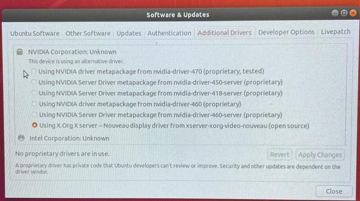
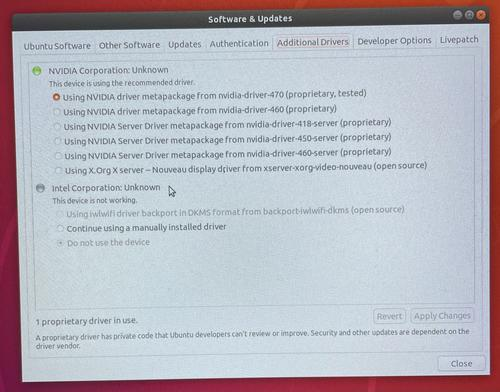
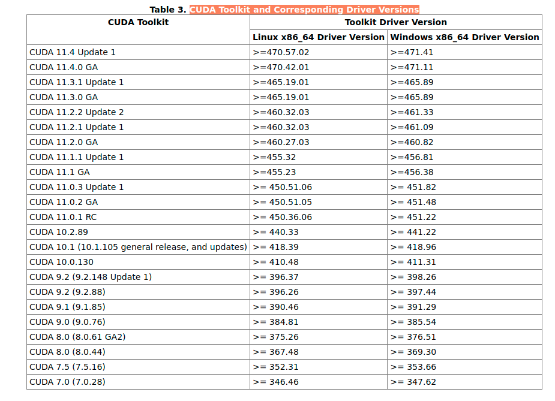
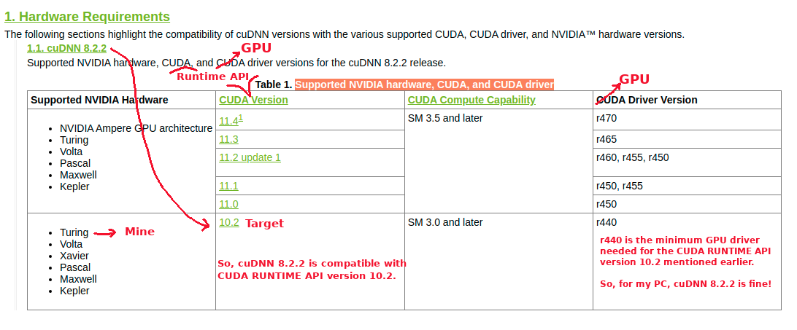
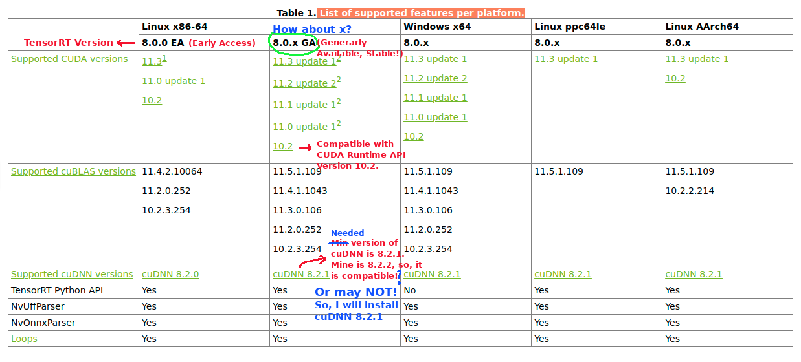
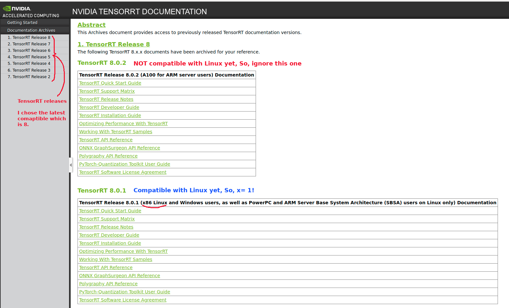
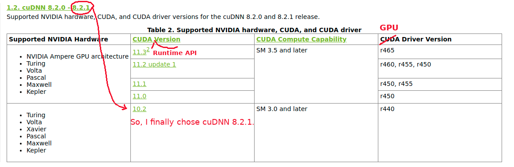
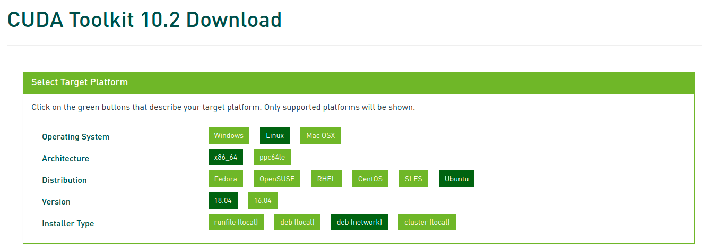
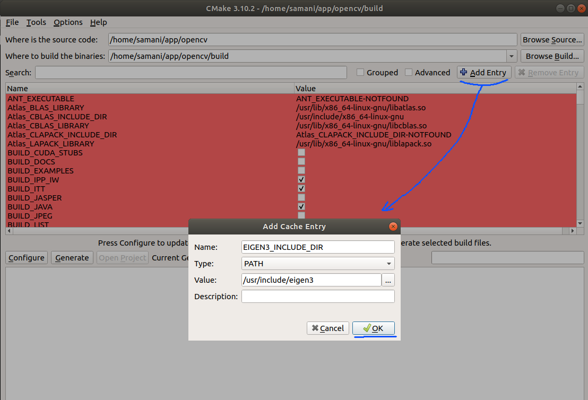
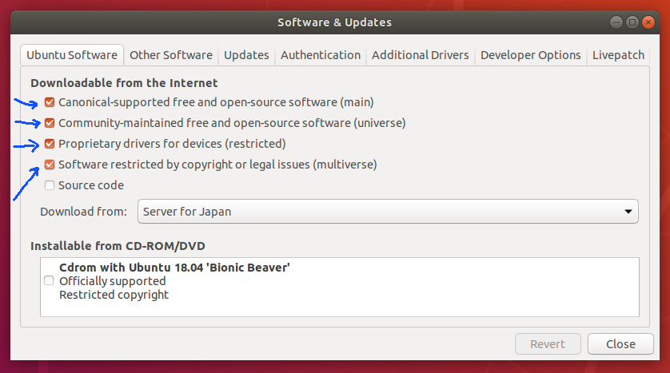

# setup_my_pc_for_my_work
This is how I setup my PC config (fresh Ubuntu 18.04.5 installed) in order to use for my work developments.

## Pc Info
Name: Dell Alienware;\
CPU:  Intel(R) Core(TM) i7-9750H @2.60 GHz;\
GPU:  Geforce RTX 2070 with Max-Q Design ([Turing NVIDIA GPU architecture/Hardware](https://en.wikipedia.org/wiki/CUDA));\
RAM:  16.0 GB;\
OS type: 64-bit;\
Disk: 1Tb SSD;\
OS names: Ubuntu 18.04.5 & Windows 10.

## Target:
Current: Have just installed Ubuntu 18.04.5 LTS.  
Target:  Setup all the Apps and settings for my work developments.

## Reference:
[configMyPC](https://github.com/jinshengye-git/configMyPC)


## Procedure
### Make "app" folder:
A good habbit is to keep all the "git" cloned folder in a directory named **app**. I usually keep it under my home directory.
1.  `mkdir /home/$USER/app`.

### Setup Nvidia Driver and Reboot PC:
1. Activities ➡️ Software & Updates ➡️ Additional Drivers ➡️ Using Nvidia driver metapackage from nvidia-driver-470 (open source/proprietary , better to use latest tested one) ➡️ Apply Changes ➡️ Restart PC
2. Also, if there is a part said "Intel Corporation: Unknown". You can ignore it.

Before



After




### Install git:
```
sudo add-apt-repository ppa:git-core/ppa
sudo apt install git git-lfs
git config --global user.email "you@example.com"
git config --global user.name "Your Name"
git config --global credential.helper 'cache --timeout=604800' # for one week: 604800 seconds
```

### Install useful things
```
sudo apt update
sudo apt upgrade
sudo apt -y install  cmake cmake-gui zsh snap vim htop terminator gimp gawk build-essential dkms ccze
sudo snap install ttyplot
sudo snap install chromium
sudo snap install code --classic
sudo snap install slack --classic
sudo snap install skype
sudo snap install brave
sudo apt autoremove
```
### Add the languages you want
1. Activities ➡️ Language Setup

### Install CUDA and cuDNN, and TensorRT

**Target:**  install "zed sdk 3.4.2" (needs CUDA 10.2) ➡️ So, install "CUDA Toolkit 10.2" ➡️ install "cuDNN" & TensorRT (should be compatible with "CUDA Toolkit 10.2")

For installing CUDA, I usually check which version we currenty use on the robots we have. This gives me a feeling to not be worry about the possible future problems while I am working with the packages installed/used on the robots we have. Currently, we are using "zed sdk 3.4.2" on the robots. "[zed sdk 3.4.2](https://www.stereolabs.com/developers/release/3.4/)" depends on the (>= CUDA 10.2). I will use "CUDA 10.2" but you can install other versions. However, on the robots, we are using "CUDA 10.2" now (Aug 20, 2021).

However, I will explain a more general way here to be used by more cases. I mean to show how to choose a proper CUDA version for your **customized** settings on your PC. Let's start.

First, run the followings:

```
nvidia-smi

    Thu Aug 19 14:55:49 2021       
    +-----------------------------------------------------------------------------+
    | NVIDIA-SMI 470.57.02    Driver Version: 470.57.02    CUDA Version: 11.4     |
    |-------------------------------+----------------------+----------------------+
    | GPU  Name        Persistence-M| Bus-Id        Disp.A | Volatile Uncorr. ECC |
    | Fan  Temp  Perf  Pwr:Usage/Cap|         Memory-Usage | GPU-Util  Compute M. |
    |                               |                      |               MIG M. |
    |===============================+======================+======================|
    |   0  NVIDIA GeForce ...  Off  | 00000000:01:00.0 Off |                  N/A |
    | N/A   52C    P0    31W /  N/A |    448MiB /  7982MiB |     23%      Default |
    |                               |                      |                  N/A |
    +-------------------------------+----------------------+----------------------+

    +-----------------------------------------------------------------------------+
    | Processes:                                                                  |
    |  GPU   GI   CI        PID   Type   Process name                  GPU Memory |
    |        ID   ID                                                   Usage      |
    |=============================================================================|
    |    0   N/A  N/A      1564      G   /usr/lib/xorg/Xorg                199MiB |
    |    0   N/A  N/A      1735      G   /usr/bin/gnome-shell              157MiB |
    |    0   N/A  N/A     16092      G   ...AAAAAAAAA= --shared-files       30MiB |
    |    0   N/A  N/A     16758      G   ...AAAAAAAAA= --shared-files       57MiB |
    +-----------------------------------------------------------------------------+
```
```

nvcc --version

    Command 'nvcc' not found, but can be installed with:
    sudo apt install nvidia-cuda-toolkit

```
As you can see:
  - Top panel: shows **"CUDA Version: 11.4"**. It's ok if it's not shown. But at least, you should see "Driver Version: XX" here. If not, you did not installed Nvidia dirvers correctly.
  - Bottom panel: shows **"Command 'nvcc' not found"**. This is because "nvcc" is coming by installing "CUDA Toolkit" which I have not installed upto this point!

👉 _nvidia-smi:_   (also NVSMI) stands for the "[NVIDIA System Management Interface](https://developer.nvidia.com/nvidia-system-management-interface)" and is a command line utility which provides monitoring and management capabilities for each of NVIDIA's Tesla, Quadro, GRID and GeForce GPU Cards from Fermi and higher architecture families.

👉 _nvcc:_   is the [NVIDIA CUDA Compiler](https://en.wikipedia.org/wiki/Nvidia_CUDA_Compiler). It is a proprietary (main) compiler by Nvidia intended for use with CUDA. CUDA code runs on both the CPU and GPU. NVCC separates these two parts and sends host code (the part of code which will be run on the CPU) to a C compiler like GCC or Intel C++ Compiler (ICC) or Microsoft Visual C Compiler, and sends the device code (the part which will run on the GPU) to the GPU. The device code is further compiled by NVCC. Any source file containing CUDA language extensions (.cu) must be compiled with nvcc.

The following is important to read: 
  - [Different CUDA versions shown by nvcc and NVIDIA-smi](https://stackoverflow.com/questions/53422407/different-cuda-versions-shown-by-nvcc-and-nvidia-smi)
  
    1. CUDA has 2 primary APIs, the "CUDA **Runtime** API" and the "CUDA **Driver** API". Both have a corresponding version (e.g. 8.0, 9.0, etc.)
    2. The necessary support for the "CUDA Driver API" (e.g. `libcuda.so` on linux, and also `nvidia-smi` tool) is installed by the `GPU Driver` installer. (We installed the `GPU Driver` in _"Setup Nvidia Driver and Reboot PC"_  part.)
    3. The necessary support for the "CUDA Runtime API" (e.g. `libcudart.so` on linux, and also `nvcc`) is installed by the `CUDA Toolkit` installer (which may also have a `GPU Driver` installer bundled in it). For my case, it was not installed by `GPU Driver` installer. So, I will install it here. 
    4. In any event, the (installed) "CUDA Driver API" version may not always match the (installed) "CUDA Runtime API" version, especially if you install a `GPU Driver` independently from installing CUDA (i.e. the `CUDA Toolkit` installer).
    5. The `nvidia-smi` tool gets installed by the `GPU Driver` installer, and generally has the `GPU Driver` in view, **NOT** anything installed by the `CUDA Toolkit` installer.
    6. Recently (somewhere between 410.48 and 410.73 GPU driver version on linux) the NVIDIA decided to add reporting of the "CUDA Driver API" version installed by the `GPU Driver` installer, in the output from `nvidia-smi`.
    7. This has no connection to the installed "CUDA Runtime API" version.
    8. `nvcc`, the NVIDIA CUDA Compiler tool that is installed with the `CUDA Toolkit`, will always report the "CUDA Runtime API" version that it was built to recognize. It doesn't know anything about what `GPU Driver` version is installed, or even if a `GPU Driver` is installed.
    9. Therefore, by design, these two numbers (**CUDA Driver API** version shown in `nvidia-smi` & **CUDA Runtime API** version shown in `nvcc`) don't necessarily match, as they are reflective of two different things.
    10. In most cases, if `nvidia-smi` reports a "CUDA Driver API" version that is numerically equal to or higher than the "CUDA Runtime API" reported by `nvcc -V`, this is not a cause for concern. 

So, we need to install the "CUDA Runtime API" using `CUDA Toolkit` installer.

**BUT, how to know which "CUDA Toolkit" should be installed?** 💁💁💁

The version of the [NVIDIA GPU Driver packaged in each CUDA Toolkit release](https://docs.nvidia.com/cuda/cuda-toolkit-release-notes/) is shown below: (you can also google this: _"CUDA Toolkit and Corresponding Driver Versions"_)



Base on the installed "NVIDIA GPU Driver", we can find the compatible "CUDA Toolkit" we can install. For example, my target **CUDA Toolkit** version is **10.2** today to match the version of the robots we have. I can see that the **CUDA Toolkit** version **10.2** is comaptible with my installed **"NVIDIA GPU Driver" (470.57.02)** (which is >= 440.33) on my PC.

You can check the above table to find the suitable "CUDA Toolkit" version for your installed "NVIDIA GPU Driver" version.

For cuDNN version compatible with your "CUDA Toolkit" version (CUDA Runtime API version), google this: [Supported NVIDIA hardware, CUDA, and CUDA driver](https://docs.nvidia.com/deeplearning/cudnn/support-matrix/index.html).\
Something like this can be found:



Based on the above image, cuDNN version 8.2.2 is compatible with my CUDA Toolkit version 10.2 and my NVIDIA GPU Driver 470.57.02.

Let's check the verison of "TensorRT" compatible with my config.\
If you google these terms [the latest TensorRT List of supported features per platform](https://docs.nvidia.com/deeplearning/tensorrt/support-matrix/index.html) and [Released TensorRT Archives](https://docs.nvidia.com/deeplearning/tensorrt/archives/index.html), you will probably find somethings like these:

TensorRT List of supported features per platform\


Released TensorRT Archives\


I found out that I may not be able to use the cuDNN version 8.2.2. So, I decided use cuDNN version 8.2.1 to be compatible with TenosrRT 8.0.1.\
I checked cuDNN version 8.2.1 is also compatible with CUDA Runtime API version 10.2. 



**Conclusion:**\
I will install:
  1. CUDA Runtime API 10.2 using CUDA Toolkit 10.2 installer
  2. cuDNN 8.2.1
  3. TenosrRT 8.0.1
  4. Zed SDK 3.4.2


#### 1. CUDA Runtime API 10.2 using CUDA Toolkit 10.2 installer
- You can download and install CUDA Runtime API from the [CUDA Toolkit](https://developer.nvidia.com/cuda-toolkit-archive) archive.
- Check the [CUDA Toolkit Archive](https://developer.nvidia.com/cuda-toolkit-archive) ➡️ "Versioned Online Documentation" ➡️ "Installation Guide Linux" ➡️ "[Pre-installation Actions](https://docs.nvidia.com/cuda/archive/10.2/cuda-installation-guide-linux/index.html#pre-installation-actions)"  
    - Especially, verify the System has the Correct Kernel Headers and Development Packages Installed. The version of the kernel your system must be the same as the version of the kernel headers and development packages prior to installing the CUDA Drivers. The following commands make it sure you have all you need:
        - `uname -r` 👉 The version of the kernel your system 
        - `sudo apt-get install linux-headers-$(uname -r)` 👇    
                ```
                $ Reading package lists... Done  
                Building dependency tree       
                Reading state information... Done  
                linux-headers-5.4.0-81-generic is already the newest version (5.4.0-81.91~18.04.1).  
                linux-headers-5.4.0-81-generic set to manually installed.  
                0 upgraded, 0 newly installed, 0 to remove and 0 not upgraded.
                ```

- Click "CUDA Toolkit 10.2" from the [CUDA Toolkit Archive](https://developer.nvidia.com/cuda-toolkit-archive). 
- On the CUDA download page, select the following options to see the "Installation Instructions". It's recommend to download a deb (network) version if you have a good internet connection. The difference between "deb (local)" and "deb (network)" is whether you download them all at once or during installation. 

 

- Install these options which are not necessary to use the CUDA Toolkit, but are available to provide additional features: 
```
sudo apt install g++ freeglut3-dev build-essential libx11-dev libxmu-dev libxi-dev libglu1-mesa libglu1-mesa-dev
```

- Then, do:
```
wget https://developer.download.nvidia.com/compute/cuda/repos/ubuntu1804/x86_64/cuda-ubuntu1804.pin
sudo mv cuda-ubuntu1804.pin /etc/apt/preferences.d/cuda-repository-pin-600
sudo apt-key adv --fetch-keys https://developer.download.nvidia.com/compute/cuda/repos/ubuntu1804/x86_64/7fa2af80.pub
sudo add-apt-repository "deb https://developer.download.nvidia.com/compute/cuda/repos/ubuntu1804/x86_64/ /"
sudo apt update
sudo apt -y install cuda-10-2
```
- Then restart.

- Hold the `cuda` packages at this version to prevent cuda and Nvidia Driver from being updated to the latest version. 
- Find them by:
```
dpkg -l |grep cuda
```
```
sudo apt-mark hold cuda-10-2 cuda-command-line-tools-10-2 cuda-compiler-10-2 cuda-cudart-10-2 cuda-cudart-dev-10-2 cuda-cufft-10-2 cuda-cufft-dev-10-2 cuda-cuobjdump-10-2 cuda-cupti-10-2 cuda-cupti-dev-10-2 cuda-curand-10-2 cuda-curand-dev-10-2 cuda-cusolver-10-2 cuda-cusolver-dev-10-2 cuda-cusparse-10-2 cuda-cusparse-dev-10-2 cuda-demo-suite-10-2 cuda-documentation-10-2 cuda-driver-dev-10-2 cuda-drivers cuda-drivers-470 cuda-gdb-10-2 cuda-libraries-10-2 cuda-libraries-dev-10-2 cuda-license-10-2 cuda-memcheck-10-2 cuda-misc-headers-10-2 cuda-npp-10-2 cuda-npp-dev-10-2 cuda-nsight-10-2 cuda-nsight-compute-10-2 cuda-nsight-systems-10-2 cuda-nvcc-10-2 cuda-nvdisasm-10-2 cuda-nvgraph-10-2 cuda-nvgraph-dev-10-2 cuda-nvjpeg-10-2 cuda-nvjpeg-dev-10-2 cuda-nvml-dev-10-2 cuda-nvprof-10-2 cuda-nvprune-10-2 cuda-nvrtc-10-2 cuda-nvrtc-dev-10-2 cuda-nvtx-10-2 cuda-nvvp-10-2 cuda-runtime-10-2 cuda-samples-10-2 cuda-sanitizer-api-10-2 cuda-toolkit-10-2 cuda-tools-10-2 cuda-visual-tools-10-2
dpkg --get-selections|grep hold   ➡️ to check
```  
  - (SKIPPED) NOTE: If you want to upgrade to the latest version of cuDNN or the latest version of CUDA, then you can unhold the `libcudnn8` package using the following command.
    ```
    sudo apt-mark unhold libcudnn8 libcudnn8-dev
    ```

- There are some [post-installation actions](https://docs.nvidia.com/cuda/archive/10.2/cuda-installation-guide-linux/index.html#post-installation-actions) that must be manually performed:
    1. Environment Setup: Add these lines to your ".bashrc" or other bash environment config files:
    ```
    CUDA_VERSION=10.2
    export PATH=/usr/local/cuda-$CUDA_VERSION/bin${PATH:+:${PATH}}
    export LD_LIBRARY_PATH=/usr/lib/x86_64-linux-gnu:/usr/local/cuda-$CUDA_VERSION/lib64${LD_LIBRARY_PATH:+:${LD_LIBRARY_PATH}}
    ```
    - 👉 I use [${PATH:+:${PATH}}](https://unix.stackexchange.com/questions/267506/what-does-pathpath-mean/267548) instead of "`:${PATH}`" to avoid adding an extra `:` when `$PATH` is not set. The same way I apply for "LD_LIBRARY_PATH".
    - 👉 The default installation locations for the toolkit and samples are: CUDA Toolkit `/usr/local/cuda-10.2` and CUDA Samples (NOT Installed here) `$(HOME)/NVIDIA_CUDA-10.2_Samples`.
    - 👉 As of CUDA 10.1 some libraries will be installed in the system standard locations rather than in the Toolkit installation directory. Depending on your distribution these installed locations can be either: `/usr/lib/x84_64-linux-gnu`, or `/usr/lib64`, or `/usr/lib`. For me, it is `/usr/lib/x84_64-linux-gnu`. You can check using `ls | grep cu`in those directories (if exists) if anything related to CUDA is available or not. If yes, you should include it.

    2. Also, the installation guide section pertaining to POWER 9 can be skipped/ignored. Power 9 is a high-end server CPU made by IBM. There are no laptops based on the Power 9 processor as of today (Aug 23, 2021). [Ref](https://forums.developer.nvidia.com/t/power9-for-ubuntu16-04/56795)

    3.  The installaion verification and the version of the CUDA Toolkit can be checked by running `nvcc -V` in a terminal window. The `nvcc` command runs the compiler driver that compiles CUDA programs. It calls the gcc compiler for C code and the NVIDIA PTX compiler for the CUDA code.
    ```
        nvcc -V   👇
        nvcc: NVIDIA (R) Cuda compiler driver
        Copyright (c) 2005-2019 NVIDIA Corporation
        Built on Wed_Oct_23_19:24:38_PDT_2019
        Cuda compilation tools, release 10.2, V10.2.89
    ```

    - **NOTE:** I did not use the "Nsight Eclipse Plugins". But If one day I decide to use these plugins, I first need to install the "standard Eclipse IDE for C++". Then, [intsall those plugins using scripts](https://docs.nvidia.com/cuda/nsightee-plugins-install-guide/index.html#script-install). This is because there is no longer a standalone fork of Eclipse for the Nsight IDE. Instead plugins are shipped which run inside in the standard Eclipse IDE for C++. Also, you need to include `/usr/local/cuda-10.2/NsightCompute-2019.1` to you [`PATH`variable](https://docs.nvidia.com/cuda/archive/10.2/cuda-installation-guide-linux/index.html#environment-setup) in `.bashrc`. e.g:
        - `$ export PATH=/usr/local/cuda-10.2/bin:/usr/local/cuda-10.2/NsightCompute-2019.1${PATH:+:${PATH}}`
            -  where `2019.1` is the `<tool-version>` refers to the version of Nsight Compute that ships with the CUDA toolkit you installed.

#### 2. cuDNN 8.2.1
- Check the [cuDNN Documentation Archives](https://docs.nvidia.com/deeplearning/cudnn/archives/index.html)
- Check "Release 8.2.1" ➡️ "[cuDNN Installation Guide](https://docs.nvidia.com/deeplearning/cudnn/archives/cudnn-821/install-guide/index.html#cudnn-package-manager-installation-overview)"

```
OS=ubuntu1804
wget https://developer.download.nvidia.com/compute/cuda/repos/${OS}/x86_64/cuda-${OS}.pin
sudo mv cuda-${OS}.pin /etc/apt/preferences.d/cuda-repository-pin-600
sudo apt-key adv --fetch-keys https://developer.download.nvidia.com/compute/cuda/repos/${OS}/x86_64/7fa2af80.pub
sudo add-apt-repository "deb https://developer.download.nvidia.com/compute/cuda/repos/${OS}/x86_64/ /"
sudo apt update

cudnn_version=8.2.1.*
cuda_version=cuda10.2

sudo apt install libcudnn8=${cudnn_version}-1+${cuda_version}
sudo apt install libcudnn8-dev=${cudnn_version}-1+${cuda_version}
```
- Hold the `libcudnn8` package at this version to prevent cuDNN from being updated to the latest CUDA version. 
```
sudo apt-mark hold libcudnn8 libcudnn8-dev
dpkg --get-selections|grep hold   ➡️ to check
```  
  - (SKIPPED) NOTE: If you want to upgrade to the latest version of cuDNN or the latest version of CUDA, then you can unhold the `libcudnn8` package using the following command.
    ```
    sudo apt-mark unhold libcudnn8 libcudnn8-dev
    ```

- The installaion verification and the version of the cuDNN can be checked by running:
```
cat /usr/include/x86_64-linux-gnu/cudnn_v*.h | grep CUDNN_MAJOR -A 2    👇
    #define CUDNN_MAJOR 8
    #define CUDNN_MINOR 2
    #define CUDNN_PATCHLEVEL 1
    --
    #define CUDNN_VERSION (CUDNN_MAJOR * 1000 + CUDNN_MINOR * 100 + CUDNN_PATCHLEVEL)

    #endif /* CUDNN_VERSION_H */
```

#### 3. TenosrRT 8.0.1
Because we have installed "CUDA Toolkit" and "cuDNN", then the NVIDIA CUDA network repository will already be set up and you can [skip step 1 below](https://docs.nvidia.com/deeplearning/tensorrt/archives/tensorrt-801/install-guide/index.html#maclearn-net-repo-install).\
1. (SKIPPED) This is the same as the installing part for "CUDA Toolkit 10.2":\ 
```
wget https://developer.download.nvidia.com/compute/cuda/repos/ubuntu1804/x86_64/cuda-ubuntu1804.pin
sudo mv cuda-ubuntu1804.pin /etc/apt/preferences.d/cuda-repository-pin-600
sudo apt-key adv --fetch-keys https://developer.download.nvidia.com/compute/cuda/repos/ubuntu1804/x86_64/7fa2af80.pub
sudo add-apt-repository "deb https://developer.download.nvidia.com/compute/cuda/repos/ubuntu1804/x86_64/ /"
sudo apt update
```
2. The following commands will install `libnvinfer8` for an specific CUDA version and hold the `libnvinfer8` package at this version. Replace `8.x.x` with your version of TensorRT and `cudax.x` with your CUDA version for your install.
```
version="8.0.1-1+cuda10.2"
sudo apt install libnvinfer8=${version} libnvonnxparsers8=${version} libnvparsers8=${version} libnvinfer-plugin8=${version} libnvinfer-dev=${version} libnvonnxparsers-dev=${version} libnvparsers-dev=${version} libnvinfer-plugin-dev=${version} python3-libnvinfer=${version}

sudo apt-mark hold libnvinfer8 libnvonnxparsers8 libnvparsers8 libnvinfer-plugin8 libnvinfer-dev libnvonnxparsers-dev libnvparsers-dev libnvinfer-plugin-dev python3-libnvinfer
dpkg --get-selections|grep hold   ➡️ to check
```  
  - (SKIPPED) NOTE: If you want to upgrade to the latest version of TensorRT or the latest version of CUDA, then you can unhold the `libnvinfer8` package using the following command.
    ```
    sudo apt-mark unhold libnvinfer8 libnvonnxparsers8 libnvparsers8 libnvinfer-plugin8 libnvinfer-dev libnvonnxparsers-dev libnvparsers-dev libnvinfer-plugin-dev python3-libnvinfer
    ```

3. The installaion verification and the version of the TenosrRT can be checked by running:
```
dpkg -l | grep TensorRT    👇
    hi  libnvinfer-dev                             8.0.1-1+cuda10.2                                 amd64        TensorRT development libraries and headers
    hi  libnvinfer-plugin-dev                      8.0.1-1+cuda10.2                                 amd64        TensorRT plugin libraries
    hi  libnvinfer-plugin8                         8.0.1-1+cuda10.2                                 amd64        TensorRT plugin libraries
    hi  libnvinfer8                                8.0.1-1+cuda10.2                                 amd64        TensorRT runtime libraries
    hi  libnvonnxparsers-dev                       8.0.1-1+cuda10.2                                 amd64        TensorRT ONNX libraries
    hi  libnvonnxparsers8                          8.0.1-1+cuda10.2                                 amd64        TensorRT ONNX libraries
    hi  libnvparsers-dev                           8.0.1-1+cuda10.2                                 amd64        TensorRT parsers libraries
    hi  libnvparsers8                              8.0.1-1+cuda10.2                                 amd64        TensorRT parsers libraries
    hi  python3-libnvinfer                         8.0.1-1+cuda10.2                                 amd64        Python 3 bindings for TensorRT
```

I run the following commands again:

```
nvidia-smi

    Thu Aug 19 14:55:49 2021       
    +-----------------------------------------------------------------------------+
    | NVIDIA-SMI 470.57.02    Driver Version: 470.57.02    CUDA Version: 11.4     |
    |-------------------------------+----------------------+----------------------+
    | GPU  Name        Persistence-M| Bus-Id        Disp.A | Volatile Uncorr. ECC |
    | Fan  Temp  Perf  Pwr:Usage/Cap|         Memory-Usage | GPU-Util  Compute M. |
    |                               |                      |               MIG M. |
    |===============================+======================+======================|
    |   0  NVIDIA GeForce ...  Off  | 00000000:01:00.0 Off |                  N/A |
    | N/A   52C    P0    31W /  N/A |    448MiB /  7982MiB |     23%      Default |
    |                               |                      |                  N/A |
    +-------------------------------+----------------------+----------------------+

    +-----------------------------------------------------------------------------+
    | Processes:                                                                  |
    |  GPU   GI   CI        PID   Type   Process name                  GPU Memory |
    |        ID   ID                                                   Usage      |
    |=============================================================================|
    |    0   N/A  N/A      1564      G   /usr/lib/xorg/Xorg                199MiB |
    |    0   N/A  N/A      1735      G   /usr/bin/gnome-shell              157MiB |
    |    0   N/A  N/A     16092      G   ...AAAAAAAAA= --shared-files       30MiB |
    |    0   N/A  N/A     16758      G   ...AAAAAAAAA= --shared-files       57MiB |
    +-----------------------------------------------------------------------------+
```
```
nvcc --version

    nvcc: NVIDIA (R) Cuda compiler driver
    Copyright (c) 2005-2019 NVIDIA Corporation
    Built on Wed_Oct_23_19:24:38_PDT_2019
    Cuda compilation tools, release 10.2, V10.2.89
```

```
dpkg -l |grep cuda   ➡️ List all installed cuda packages, along with package version and short description

    ii  cuda-10-2                                  10.2.89-1                                        amd64        CUDA 10.2 meta-package
    ii  cuda-command-line-tools-10-2               10.2.89-1                                        amd64        CUDA command-line tools
    ii  cuda-compiler-10-2                         10.2.89-1                                        amd64        CUDA compiler
    ii  cuda-cudart-10-2                           10.2.89-1                                        amd64        CUDA Runtime native Libraries
    ii  cuda-cudart-dev-10-2                       10.2.89-1                                        amd64        CUDA Runtime native dev links, headers
    ii  cuda-cufft-10-2                            10.2.89-1                                        amd64        CUFFT native runtime libraries
    ii  cuda-cufft-dev-10-2                        10.2.89-1                                        amd64        CUFFT native dev links, headers
    ii  cuda-cuobjdump-10-2                        10.2.89-1                                        amd64        CUDA cuobjdump
    ii  cuda-cupti-10-2                            10.2.89-1                                        amd64        CUDA profiling tools runtime libs.
    ii  cuda-cupti-dev-10-2                        10.2.89-1                                        amd64        CUDA profiling tools interface.
    ii  cuda-curand-10-2                           10.2.89-1                                        amd64        CURAND native runtime libraries
    ii  cuda-curand-dev-10-2                       10.2.89-1                                        amd64        CURAND native dev links, headers
    ii  cuda-cusolver-10-2                         10.2.89-1                                        amd64        CUDA solver native runtime libraries
    ii  cuda-cusolver-dev-10-2                     10.2.89-1                                        amd64        CUDA solver native dev links, headers
    ii  cuda-cusparse-10-2                         10.2.89-1                                        amd64        CUSPARSE native runtime libraries
    ii  cuda-cusparse-dev-10-2                     10.2.89-1                                        amd64        CUSPARSE native dev links, headers
    ii  cuda-demo-suite-10-2                       10.2.89-1                                        amd64        Demo suite for CUDA
    ii  cuda-documentation-10-2                    10.2.89-1                                        amd64        CUDA documentation
    ii  cuda-driver-dev-10-2                       10.2.89-1                                        amd64        CUDA Driver native dev stub library
    ii  cuda-drivers                               470.57.02-1                                      amd64        CUDA Driver meta-package, branch-agnostic
    ii  cuda-drivers-470                           470.57.02-1                                      amd64        CUDA Driver meta-package, branch-specific
    ii  cuda-gdb-10-2                              10.2.89-1                                        amd64        CUDA-GDB
    ii  cuda-libraries-10-2                        10.2.89-1                                        amd64        CUDA Libraries 10.2 meta-package
    ii  cuda-libraries-dev-10-2                    10.2.89-1                                        amd64        CUDA Libraries 10.2 development meta-package
    ii  cuda-license-10-2                          10.2.89-1                                        amd64        CUDA licenses
    ii  cuda-memcheck-10-2                         10.2.89-1                                        amd64        CUDA-MEMCHECK
    ii  cuda-misc-headers-10-2                     10.2.89-1                                        amd64        CUDA miscellaneous headers
    ii  cuda-npp-10-2                              10.2.89-1                                        amd64        NPP native runtime libraries
    ii  cuda-npp-dev-10-2                          10.2.89-1                                        amd64        NPP native dev links, headers
    ii  cuda-nsight-10-2                           10.2.89-1                                        amd64        CUDA nsight
    ii  cuda-nsight-compute-10-2                   10.2.89-1                                        amd64        NVIDIA Nsight Compute
    ii  cuda-nsight-systems-10-2                   10.2.89-1                                        amd64        NVIDIA Nsight Systems
    ii  cuda-nvcc-10-2                             10.2.89-1                                        amd64        CUDA nvcc
    ii  cuda-nvdisasm-10-2                         10.2.89-1                                        amd64        CUDA disassembler
    ii  cuda-nvgraph-10-2                          10.2.89-1                                        amd64        NVGRAPH native runtime libraries
    ii  cuda-nvgraph-dev-10-2                      10.2.89-1                                        amd64        NVGRAPH native dev links, headers
    ii  cuda-nvjpeg-10-2                           10.2.89-1                                        amd64        NVJPEG native runtime libraries
    ii  cuda-nvjpeg-dev-10-2                       10.2.89-1                                        amd64        NVJPEG native dev links, headers
    ii  cuda-nvml-dev-10-2                         10.2.89-1                                        amd64        NVML native dev links, headers
    ii  cuda-nvprof-10-2                           10.2.89-1                                        amd64        CUDA Profiler tools
    ii  cuda-nvprune-10-2                          10.2.89-1                                        amd64        CUDA nvprune
    ii  cuda-nvrtc-10-2                            10.2.89-1                                        amd64        NVRTC native runtime libraries
    ii  cuda-nvrtc-dev-10-2                        10.2.89-1                                        amd64        NVRTC native dev links, headers
    ii  cuda-nvtx-10-2                             10.2.89-1                                        amd64        NVIDIA Tools Extension
    ii  cuda-nvvp-10-2                             10.2.89-1                                        amd64        CUDA nvvp
    ii  cuda-runtime-10-2                          10.2.89-1                                        amd64        CUDA Runtime 10.2 meta-package
    ii  cuda-samples-10-2                          10.2.89-1                                        amd64        CUDA example applications
    ii  cuda-sanitizer-api-10-2                    10.2.89-1                                        amd64        CUDA Sanitizer API
    ii  cuda-toolkit-10-2                          10.2.89-1                                        amd64        CUDA Toolkit 10.2 meta-package
    ii  cuda-tools-10-2                            10.2.89-1                                        amd64        CUDA Tools meta-package
    ii  cuda-visual-tools-10-2                     10.2.89-1                                        amd64        CUDA visual tools
    ii  libcudnn8                                  8.2.1.32-1+cuda10.2                              amd64        cuDNN runtime libraries
    ii  libcudnn8-dev                              8.2.1.32-1+cuda10.2                              amd64        cuDNN development libraries and headers
    hi  libnvinfer-dev                             8.0.1-1+cuda10.2                                 amd64        TensorRT development libraries and headers
    hi  libnvinfer-plugin-dev                      8.0.1-1+cuda10.2                                 amd64        TensorRT plugin libraries
    hi  libnvinfer-plugin8                         8.0.1-1+cuda10.2                                 amd64        TensorRT plugin libraries
    hi  libnvinfer8                                8.0.1-1+cuda10.2                                 amd64        TensorRT runtime libraries
    hi  libnvonnxparsers-dev                       8.0.1-1+cuda10.2                                 amd64        TensorRT ONNX libraries
    hi  libnvonnxparsers8                          8.0.1-1+cuda10.2                                 amd64        TensorRT ONNX libraries
    hi  libnvparsers-dev                           8.0.1-1+cuda10.2                                 amd64        TensorRT parsers libraries
    hi  libnvparsers8                              8.0.1-1+cuda10.2                                 amd64        TensorRT parsers libraries
    hi  python3-libnvinfer                         8.0.1-1+cuda10.2                                 amd64        Python 3 bindings for TensorRT

```

Nice, let's continue. ☑️

### [Install](https://www.stereolabs.com/docs/installation/linux/) Zed SDK 3.4.2
- [Download](https://www.stereolabs.com/developers/release/3.4/) the Zed SDK 3.4.2 considering the correct version of CUDA and your Ubuntu.
- Go to the folder where the installer has been downloaded.
- Add execution permission to the installer using the chmod +x command. Make sure to replace the installer name with the version you downloaded.
```
chmod +x ZED_SDK_Ubuntu18_cuda10.2_v3.4.2.run
```
- Run the ZED SDK installer.
```
./ZED_SDK_Ubuntu18_cuda10.2_v3.4.2.run
```
- At the beginning of the installation, the Software License will be displayed, hit `q` after reading it.
- During the installation, you might have to answer some questions on dependencies, tools and samples installation. Type `y` for yes and `n` for no and hit `Enter`. Hit `Enter` to pick the default option.
- The important questions that I answered:
```
Do you want to install the Object Detection module (recommended), cuDNN 8.0 and TensorRT 7.1 will be installed [Y/n] ?n  ➡️ because I did not want to install cuDNN 8.0 and TensorRT 7.1! 
Install samples (recommended) [Y/n] ?n
Do you want to auto-install dependencies (recommended) ? following packet will be installed via the package manager : libjpeg-turbo8 libturbojpeg libusb-1.0 libopenblas-dev libv4l-0 curl unzip libpng16-16 libpng-dev libturbojpeg0-dev python3-dev python3-pip python3-setuptools qt5-default libqt5opengl5 libqt5svg5 [Y/n] ?Y
...
...
Do you want to install the Python API (recommended) [Y/n] ?Y
Please specify your python executable: python3
Collecting numpy
  Downloading https://files.pythonhosted.org/packages/45/b2/6c7545bb7a38754d63048c7696804a0d947328125d81bf12beaa692c3ae3/numpy-1.19.5-cp36-cp36m-manylinux1_x86_64.whl (13.4MB)
    100% |████████████████████████████████| 13.4MB 154kB/s 
Installing collected packages: numpy
Successfully installed numpy-1.19.5
-> Downloading to '/tmp/selfgz2152'
Detected platform: 
	 ubuntu18
	 Python 3.6
	 CUDA 10.2
	 ZED SDK 3.4 (requiring CUDA 10.2)
-> Checking if https://download.stereolabs.com/zedsdk/3.4/ubuntu18/cu102/py36 exists and is available
-> Found ! Downloading python package into /tmp/selfgz2152/pyzed-3.4-cp36-cp36m-linux_x86_64.whl
-> Installing necessary dependencies
Collecting numpy
  Using cached https://files.pythonhosted.org/packages/45/b2/6c7545bb7a38754d63048c7696804a0d947328125d81bf12beaa692c3ae3/numpy-1.19.5-cp36-cp36m-manylinux1_x86_64.whl
Installing collected packages: numpy
Successfully installed numpy-1.19.5
Processing ./pyzed-3.4-cp36-cp36m-linux_x86_64.whl
Installing collected packages: pyzed
Successfully installed pyzed-3.4
Done
  To install it later or on a different environment run : 
 python -m pip install --ignore-installed /tmp/selfgz2152/pyzed-3.4-cp36-cp36m-linux_x86_64.whl
The ZED Python API was installed for 'python3', when using conda environement or virtualenv, the ZED Python API may need to be resetup to be available (using 'python /usr/local/zed/get_python_api.py')

ZED SDK installation complete !
```

### Install OpenCV 4.1.1
[Installation in Linux](https://docs.opencv.org/4.1.1/d7/d9f/tutorial_linux_install.html) e.g. Ubuntu 18.04.5 LTS is as follow:
```
sudo apt -y remove x264 libx264-dev
sudo apt autoremove
sudo apt -y install checkinstall pkg-config yasm gfortran
sudo apt -y install libgstreamer-plugins-base1.0-dev libgstreamer1.0-dev
sudo apt -y install libjpeg8-dev libjasper-dev libpng12-dev   --> Error: Unable to locate package libjasper-dev, E: Package 'libpng12-dev' has no installation candidate --> These pkgs are not available for Ubuntu 18.04.
	sudo add-apt-repository "deb http://security.ubuntu.com/ubuntu xenial-security main"
	sudo apt update
	sudo apt -y install libjpeg8-dev libjasper-dev libpng12-dev   --> OK
sudo apt -y install libtiff5-dev
sudo apt -y install libtiff-dev
sudo apt -y install libavcodec-dev libavformat-dev libswscale-dev libdc1394-22-dev
sudo apt -y install libxine2-dev libv4l-dev
sudo apt -y install libgtk2.0-dev libtbb-dev qt5-default
sudo apt -y install libatlas-base-dev
sudo apt -y install libfaac-dev libmp3lame-dev libtheora-dev
sudo apt -y install libvorbis-dev libxvidcore-dev
sudo apt -y install libopencore-amrnb-dev libopencore-amrwb-dev
sudo apt -y install libavresample-dev
sudo apt -y install x264 v4l-utils
sudo apt -y install libprotobuf-dev protobuf-compiler
sudo apt -y install libgoogle-glog-dev libgflags-dev
sudo apt -y install libgphoto2-dev libeigen3-dev libhdf5-dev doxygen
sudo apt -y install python3-dev python3-pip python3-venv python-dev python-pip
sudo apt -y install libopenblas-dev libopenblas-base
sudo apt -y install libgtk-3-dev
sudo -H pip install numpy==1.19
sudo -H pip3 install numpy==1.19
sudo -H pip3 install cython
sudo -H pip install cython
sudo apt -y install libsqlite3-dev
sudo apt -y install libpcl-dev
sudo apt -y install libboost-all-dev
sudo apt -y install libproj-dev
sudo apt -y install libqt5svg5-dev
sudo apt -y install libvtk6-qt-dev
sudo ap -y install libsuitesparse-dev
sudo apt -y install python-dev python-numpy libtbb2 libtbb-dev libjpeg-dev libpng-dev libtiff-dev libjasper-dev libdc1394-22-dev  --> Important to show the "BUILD_opencv_python2" option later!
sudo apt install cmake git libgtk2.0-dev pkg-config libavcodec-dev libavformat-dev libswscale-dev --> Important to show the "BUILD_opencv_python2" option later!
sudo apt -y install cmake git libgtk2.0-dev pkg-config libavcodec-dev libavformat-dev libswscale-dev
sudo apt -y install python-dev python-numpy libtbb2 libtbb-dev libjpeg-dev libpng-dev libtiff-dev libjasper-dev libdc1394-22-dev
sudo updatedb
cd ~
mkdir app  &&  cd app
git clone https://github.com/opencv/opencv.git
git clone https://github.com/opencv/opencv_contrib.git
cd opencv
git checkout 4.1.1
cd ../opencv_contrib
git checkout 4.1.1
cd ../opencv
mkdir build
cd build

```
It is better use `cmake-gui` to configure, suppose you are in folder: `opencv/build/`

```
cmake-gui ..

```
- Click button: Configure
- Choose "Unix CMake" & "Default native compiler" options

Things you need to checkout:

- make sure python2 python3 for cv2 available...
- make sure sfm available(if exists, it should be ON)  --> Also, after generation --> in the generated configured file --> check you can see "sfm"
- make sure CUDA IS ON
- make sure NONFREE off  --> since openCV version 4 is not for comercial
- make sure MODULE path e.g. /home/$USER/opencv_contrib/modules
- make sure uncheck codec of cuda
- make sure WITH_QT ON
- make sure WITH_OPENGL OFF 
- make sure ENABLE_PRECOMPILED_HEADER  OFF
- in cmake-gui click "add entry"
	- then a in the pop up:
	- "name:" EIGEN_INCLUDE_PATH"
	- "type":PATH
	- "value": /usr/include/eigen3   --> check this with "locate -i eigen" command. it should be under "usr" directory.

	

- Then click "Generate" , after it finished, close cmake-gui

The generated CMake Configuring file:  👇
<details>
  <summary>Click to expand!🔽</summary>
  
  ```
	Detected processor: x86_64
	Looking for ccache - not found
	Found ZLIB: /usr/lib/x86_64-linux-gnu/libz.so (found suitable version "1.2.11", minimum required is "1.2.3") 
	Found ZLIB: /usr/lib/x86_64-linux-gnu/libz.so (found version "1.2.11") 
	found Intel IPP (ICV version): 2019.0.0 [2019.0.0 Gold]
	at: /home/samani/app/opencv/build/3rdparty/ippicv/ippicv_lnx/icv
	found Intel IPP Integration Wrappers sources: 2019.0.0
	at: /home/samani/app/opencv/build/3rdparty/ippicv/ippicv_lnx/iw
	Could NOT find CUDNN: Found unsuitable version "..", but required is at least "6" (found /usr/lib/x86_64-linux-gnu/libcudnn.so)
	CUDA detected: 10.2
	CUDA NVCC target flags: -gencode;arch=compute_30,code=sm_30;-gencode;arch=compute_35,code=sm_35;-gencode;arch=compute_37,code=sm_37;-gencode;arch=compute_50,code=sm_50;-gencode;arch=compute_52,code=sm_52;-gencode;arch=compute_60,code=sm_60;-gencode;arch=compute_61,code=sm_61;-gencode;arch=compute_70,code=sm_70;-gencode;arch=compute_75,code=sm_75;-D_FORCE_INLINES
	Could not find OpenBLAS include. Turning OpenBLAS_FOUND off
	Could not find OpenBLAS lib. Turning OpenBLAS_FOUND off
	Could NOT find Atlas (missing: Atlas_CLAPACK_INCLUDE_DIR) 
	A library with BLAS API found.
	A library with LAPACK API found.
	Could NOT find JNI (missing: JAVA_INCLUDE_PATH JAVA_INCLUDE_PATH2 JAVA_AWT_INCLUDE_PATH) 
	The imported target "vtkRenderingPythonTkWidgets" references the file
	   "/usr/lib/x86_64-linux-gnu/libvtkRenderingPythonTkWidgets.so"
	but this file does not exist.  Possible reasons include:
	* The file was deleted, renamed, or moved to another location.
	* An install or uninstall procedure did not complete successfully.
	* The installation package was faulty and contained
	   "/usr/lib/cmake/vtk-6.3/VTKTargets.cmake"
	but not all the files it references.

	The imported target "vtk" references the file
	   "/usr/bin/vtk"
	but this file does not exist.  Possible reasons include:
	* The file was deleted, renamed, or moved to another location.
	* An install or uninstall procedure did not complete successfully.
	* The installation package was faulty and contained
	   "/usr/lib/cmake/vtk-6.3/VTKTargets.cmake"
	but not all the files it references.

	Found VTK 6.3.0 (/usr/lib/cmake/vtk-6.3/UseVTK.cmake)
	OpenCV Python: during development append to PYTHONPATH: /home/samani/app/opencv/build/python_loader
	Caffe:   NO
	Protobuf:   NO
	Glog:   YES
	freetype2:   YES (ver 21.0.15)
	harfbuzz:    YES (ver 1.7.2)
	HDF5: Using hdf5 compiler wrapper to determine C configuration
	Module opencv_ovis disabled because OGRE3D was not found
	No preference for use of exported gflags CMake configuration set, and no hints for include/library directories provided. Defaulting to preferring an installed/exported gflags CMake configuration if available.
	Found installed version of gflags: /usr/lib/x86_64-linux-gnu/cmake/gflags
	Detected gflags version: 2.2.1
	Checking SFM deps... TRUE
	CERES support is disabled. Ceres Solver for reconstruction API is required.
	HDF5: Using hdf5 compiler wrapper to determine C configuration
	Registering hook 'INIT_MODULE_SOURCES_opencv_dnn': /home/samani/app/opencv/modules/dnn/cmake/hooks/INIT_MODULE_SOURCES_opencv_dnn.cmake
	opencv_dnn: filter out cuda4dnn source code
	Checking for module 'tesseract'
	  No package 'tesseract' found
	Tesseract:   NO
	No preference for use of exported gflags CMake configuration set, and no hints for include/library directories provided. Defaulting to preferring an installed/exported gflags CMake configuration if available.
	Found installed version of gflags: /usr/lib/x86_64-linux-gnu/cmake/gflags
	Detected gflags version: 2.2.1
	Checking SFM deps... TRUE
	CERES support is disabled. Ceres Solver for reconstruction API is required.

	General configuration for OpenCV 4.1.1 =====================================
	  Version control:               4.1.1

	  Extra modules:
	    Location (extra):            /home/samani/app/opencv_contrib/modules
	    Version control (extra):     4.1.1

	  Platform:
	    Timestamp:                   2021-08-24T02:23:15Z
	    Host:                        Linux 5.4.0-81-generic x86_64
	    CMake:                       3.10.2
	    CMake generator:             Unix Makefiles
	    CMake build tool:            /usr/bin/make
	    Configuration:               Release

	  CPU/HW features:
	    Baseline:                    SSE SSE2 SSE3
	      requested:                 SSE3
	    Dispatched code generation:  SSE4_1 SSE4_2 FP16 AVX AVX2 AVX512_SKX
	      requested:                 SSE4_1 SSE4_2 AVX FP16 AVX2 AVX512_SKX
	      SSE4_1 (15 files):         + SSSE3 SSE4_1
	      SSE4_2 (2 files):          + SSSE3 SSE4_1 POPCNT SSE4_2
	      FP16 (1 files):            + SSSE3 SSE4_1 POPCNT SSE4_2 FP16 AVX
	      AVX (5 files):             + SSSE3 SSE4_1 POPCNT SSE4_2 AVX
	      AVX2 (29 files):           + SSSE3 SSE4_1 POPCNT SSE4_2 FP16 FMA3 AVX AVX2
	      AVX512_SKX (5 files):      + SSSE3 SSE4_1 POPCNT SSE4_2 FP16 FMA3 AVX AVX2 AVX_512F AVX512_COMMON AVX512_SKX

	  C/C++:
	    Built as dynamic libs?:      YES
	    C++ Compiler:                /usr/bin/c++  (ver 7.5.0)
	    C++ flags (Release):         -fsigned-char -W -Wall -Werror=return-type -Werror=non-virtual-dtor -Werror=address -Werror=sequence-point -Wformat -Werror=format-security -Wmissing-declarations -Wundef -Winit-self -Wpointer-arith -Wshadow -Wsign-promo -Wuninitialized -Winit-self -Wno-delete-non-virtual-dtor -Wno-comment -Wimplicit-fallthrough=3 -Wno-strict-overflow -fdiagnostics-show-option -Wno-long-long -pthread -fomit-frame-pointer -ffunction-sections -fdata-sections  -msse -msse2 -msse3 -fvisibility=hidden -fvisibility-inlines-hidden -O3 -DNDEBUG  -DNDEBUG
	    C++ flags (Debug):           -fsigned-char -W -Wall -Werror=return-type -Werror=non-virtual-dtor -Werror=address -Werror=sequence-point -Wformat -Werror=format-security -Wmissing-declarations -Wundef -Winit-self -Wpointer-arith -Wshadow -Wsign-promo -Wuninitialized -Winit-self -Wno-delete-non-virtual-dtor -Wno-comment -Wimplicit-fallthrough=3 -Wno-strict-overflow -fdiagnostics-show-option -Wno-long-long -pthread -fomit-frame-pointer -ffunction-sections -fdata-sections  -msse -msse2 -msse3 -fvisibility=hidden -fvisibility-inlines-hidden -g  -O0 -DDEBUG -D_DEBUG
	    C Compiler:                  /usr/bin/cc
	    C flags (Release):           -fsigned-char -W -Wall -Werror=return-type -Werror=non-virtual-dtor -Werror=address -Werror=sequence-point -Wformat -Werror=format-security -Wmissing-declarations -Wmissing-prototypes -Wstrict-prototypes -Wundef -Winit-self -Wpointer-arith -Wshadow -Wuninitialized -Winit-self -Wno-comment -Wimplicit-fallthrough=3 -Wno-strict-overflow -fdiagnostics-show-option -Wno-long-long -pthread -fomit-frame-pointer -ffunction-sections -fdata-sections  -msse -msse2 -msse3 -fvisibility=hidden -O3 -DNDEBUG  -DNDEBUG
	    C flags (Debug):             -fsigned-char -W -Wall -Werror=return-type -Werror=non-virtual-dtor -Werror=address -Werror=sequence-point -Wformat -Werror=format-security -Wmissing-declarations -Wmissing-prototypes -Wstrict-prototypes -Wundef -Winit-self -Wpointer-arith -Wshadow -Wuninitialized -Winit-self -Wno-comment -Wimplicit-fallthrough=3 -Wno-strict-overflow -fdiagnostics-show-option -Wno-long-long -pthread -fomit-frame-pointer -ffunction-sections -fdata-sections  -msse -msse2 -msse3 -fvisibility=hidden -g  -O0 -DDEBUG -D_DEBUG
	    Linker flags (Release):      -Wl,--gc-sections  
	    Linker flags (Debug):        -Wl,--gc-sections  
	    ccache:                      NO
	    Precompiled headers:         YES
	    Extra dependencies:          m pthread cudart_static dl rt /usr/lib/x86_64-linux-gnu/libcuda.so nppc nppial nppicc nppicom nppidei nppif nppig nppim nppist nppisu nppitc npps cublas cufft -L/usr/local/cuda-10.2/lib64 -L/usr/lib/x86_64-linux-gnu
	    3rdparty dependencies:

	  OpenCV modules:
	    To be built:                 aruco bgsegm bioinspired calib3d ccalib core cudaarithm cudabgsegm cudafeatures2d cudafilters cudaimgproc cudalegacy cudaobjdetect cudaoptflow cudastereo cudawarping cudev cvv datasets dnn dnn_objdetect dpm face features2d flann freetype fuzzy gapi hdf hfs highgui img_hash imgcodecs imgproc line_descriptor ml objdetect optflow phase_unwrapping photo plot python2 python3 quality reg rgbd saliency sfm shape stereo stitching structured_light superres surface_matching text tracking ts video videoio videostab viz xfeatures2d ximgproc xobjdetect xphoto
	    Disabled:                    cudacodec world
	    Disabled by dependency:      -
	    Unavailable:                 cnn_3dobj java js matlab ovis
	    Applications:                tests perf_tests apps
	    Documentation:               NO
	    Non-free algorithms:         NO

	  GUI: 
	    QT:                          YES (ver 5.9.5)
	      QT OpenGL support:         NO
	    GTK+:                        NO
	    VTK support:                 YES (ver 6.3.0)

	  Media I/O: 
	    ZLib:                        /usr/lib/x86_64-linux-gnu/libz.so (ver 1.2.11)
	    JPEG:                        /usr/lib/x86_64-linux-gnu/libjpeg.so (ver 80)
	    WEBP:                        /usr/lib/x86_64-linux-gnu/libwebp.so (ver encoder: 0x020e)
	    PNG:                         /usr/lib/x86_64-linux-gnu/libpng.so (ver 1.6.34)
	    TIFF:                        /usr/lib/x86_64-linux-gnu/libtiff.so (ver 42 / 4.0.9)
	    JPEG 2000:                   /usr/lib/x86_64-linux-gnu/libjasper.so (ver 1.900.1)
	    OpenEXR:                     build (ver 2.3.0)
	    HDR:                         YES
	    SUNRASTER:                   YES
	    PXM:                         YES
	    PFM:                         YES

	  Video I/O:
	    DC1394:                      YES (2.2.5)
	    FFMPEG:                      YES
	      avcodec:                   YES (57.107.100)
	      avformat:                  YES (57.83.100)
	      avutil:                    YES (55.78.100)
	      swscale:                   YES (4.8.100)
	      avresample:                YES (3.7.0)
	    GStreamer:                   YES (1.14.5)
	    v4l/v4l2:                    YES (linux/videodev2.h)

	  Parallel framework:            pthreads

	  Trace:                         YES (with Intel ITT)

	  Other third-party libraries:
	    Intel IPP:                   2019.0.0 Gold [2019.0.0]
		   at:                   /home/samani/app/opencv/build/3rdparty/ippicv/ippicv_lnx/icv
	    Intel IPP IW:                sources (2019.0.0)
		      at:                /home/samani/app/opencv/build/3rdparty/ippicv/ippicv_lnx/iw
	    Lapack:                      NO
	    Eigen:                       YES (ver 3.3.4)
	    Custom HAL:                  NO
	    Protobuf:                    build (3.5.1)

	  NVIDIA CUDA:                   YES (ver 10.2, CUFFT CUBLAS)
	    NVIDIA GPU arch:             30 35 37 50 52 60 61 70 75
	    NVIDIA PTX archs:

	  cuDNN:                         NO

	  OpenCL:                        YES (no extra features)
	    Include path:                /home/samani/app/opencv/3rdparty/include/opencl/1.2
	    Link libraries:              Dynamic load

	  Python 2:
	    Interpreter:                 /usr/bin/python2.7 (ver 2.7.17)
	    Libraries:                   /usr/lib/x86_64-linux-gnu/libpython2.7.so (ver 2.7.17)
	    numpy:                       /usr/lib/python2.7/dist-packages/numpy/core/include (ver 1.13.3)
	    install path:                lib/python2.7/dist-packages/cv2/python-2.7

	  Python 3:
	    Interpreter:                 /usr/bin/python3 (ver 3.6.9)
	    Libraries:                   /usr/lib/x86_64-linux-gnu/libpython3.6m.so (ver 3.6.9)
	    numpy:                       /home/samani/.local/lib/python3.6/site-packages/numpy/core/include (ver 1.19.5)
	    install path:                lib/python3.6/dist-packages/cv2/python-3.6

	  Python (for build):            /usr/bin/python2.7

	  Java:                          
	    ant:                         NO
	    JNI:                         NO
	    Java wrappers:               NO
	    Java tests:                  NO

	  Install to:                    /usr/local
	-----------------------------------------------------------------

	Configuring done
	Generating done
  ```
</details>

- Then, run:
```
make -j6
sudo make install
```
- The installaion verification and the version of the OpenCV 4.1.1 can be checked by running:
```
cd ~/app
git clone https://github.com/opencv/opencv_extra.git   --> Get the required test data for checking
cd opencv_extra/testdata/
pwd
OPENCV_TEST_DATA_PATH="/home/samani/app/opencv_extra/testdata"
cd ../../opencv/build/bin/
./opencv_test_core    👇
```
<details>
  <summary>Click to expand!🔽</summary>
  
  ```
	CTEST_FULL_OUTPUT
	OpenCV version: 4.1.1
	OpenCV VCS version: 4.1.1
	Build type: Release
	Compiler: /usr/bin/c++  (ver 7.5.0)
	Parallel framework: pthreads
	CPU features: SSE SSE2 SSE3 *SSE4.1 *SSE4.2 *FP16 *AVX *AVX2 *AVX512-SKX?
	Intel(R) IPP version: ippIP AVX2 (l9) 2019.0.0 Gold (-) Jul 24 2018
	OpenCL Platforms: 
	    NVIDIA CUDA
		dGPU: NVIDIA GeForce RTX 2070 with Max-Q Design (OpenCL 3.0 CUDA)
	Current OpenCL device: 
	    Type = dGPU
	    Name = NVIDIA GeForce RTX 2070 with Max-Q Design
	    Version = OpenCL 3.0 CUDA
	    Driver version = 470.57.02
	    ...
	    TEST: Skip tests with tags: 'mem_6gb', 'verylong'
		[==========] Running 11437 tests from 238 test cases.
		[----------] Global test environment set-up.
		[----------] 1 test from OCL_MeanStdDev_
		[ RUN      ] OCL_MeanStdDev_.ZeroMask
		[       OK ] OCL_MeanStdDev_.ZeroMask (371 ms)
		[----------] 1 test from OCL_MeanStdDev_ (371 ms total)
  ```
</details>


### Install GTSAM [SKIPPED]
Because this is used for "RTAB-Map" and it is not going to be used, I do NOT install it.
However, this is how to install it if one day I want it:
```
cd ~/app
git clone --branch 4.0.0-alpha2 https://github.com/borglab/gtsam.git gtsam-4.0.0-alpha2
cd gtsam-4.0.0-alpha2
mkdir build
cd build
cmake -DGTSAM_USE_SYSTEM_EIGEN=ON -DGTSAM_BUILD_EXAMPLES_ALWAYS=OFF -DGTSAM_BUILD_TESTS=OFF -DGTSAM_BUILD_UNSTABLE=OFF ..
make -j4
sudo make install
```

### Install cvsba [SKIPPED]
Because this is used for "RTAB-Map" and it is not going to be used, I do NOT install it.
However, this is how to install it if one day I want it:
- Follow installation instructions from [here](http://www.uco.es/investiga/grupos/ava/node/39). Their installation is not standard CMake, you need these extra steps so "RTAB-Map" can find it:
```
sudo mkdir /usr/local/lib/cmake/cvsba 
sudo mv /usr/local/lib/cmake/Findcvsba.cmake /usr/local/lib/cmake/cvsba/cvsbaConfig.cmake
```

### Install apriltags
```
cd ~/app
git clone https://github.com/SeaosRobotics/apriltag.git 
cd apriltag
git checkout master  --> [7564236]
cmake .
make
sudo make install
```

### Install libpointmatcher [SKIPPED]
Because this is used for "RTAB-Map" and it is not going to be used, I do NOT install it.
However, this is how to install it if one day I want it:
```
git clone git://github.com/ethz-asl/libnabo.git
cd libnabo
SRC_DIR=`pwd`
BUILD_DIR=${SRC_DIR}/build
mkdir -p ${BUILD_DIR} && cd ${BUILD_DIR}
cmake -DCMAKE_BUILD_TYPE=RelWithDebInfo ${SRC_DIR}
# if Eigen or Boost are not available system-wide, run at that point: 
#   cmake-gui .
# cmake-gui allows you to tell the location of Eigen or Boost
make
sudo make install


git clone https://github.com/ethz-asl/libpointmatcher.git
cd libpointmatcher
mkdir build && cd build
cmake ..
make
sudo make install

```

### Install ROS Melodic
I will follow [this](http://wiki.ros.org/melodic/Installation/Ubuntu#Installation) toturial. Here is what I did:
- Configure your [Ubuntu repositories](https://help.ubuntu.com/community/Repositories/Ubuntu) to allow "restricted," "universe," and "multiverse.
	- if they are not ticked, just click on each box to activate them. Mine were active.
	 
	

- Setup your sources.list: Setup your computer to accept software from packages.ros.org.
```
sudo sh -c 'echo "deb http://packages.ros.org/ros/ubuntu $(lsb_release -sc) main" > /etc/apt/sources.list.d/ros-latest.list'
```
- Set up your keys
```
sudo apt install curl # if you haven't already installed curl
curl -s https://raw.githubusercontent.com/ros/rosdistro/master/ros.asc | sudo apt-key add -
```
- Make sure your Debian package index is up-to-date:
```
sudo apt update
```
- Desktop-Full Install: (Recommended) : ROS, rqt, rviz, robot-generic libraries, 2D/3D simulators and 2D/3D perception
```
sudo apt install ros-melodic-desktop-full 👇
```
<details>
  <summary>Click to expand!🔽</summary>
  
  ```
	Reading package lists... Done
	Building dependency tree       
	Reading state information... Done
	The following package was automatically installed and is no longer required:
	  libpng12-0
	Use 'sudo apt autoremove' to remove it.
	The following additional packages will be installed:
	  binfmt-support blt bzip2-doc docutils-common docutils-doc fltk1.3-doc fluid fonts-lato fonts-lyx
	  gazebo9 gazebo9-common gazebo9-plugin-base google-mock googletest graphviz hddtemp libann0
	  libapr1 libapr1-dev libaprutil1 libaprutil1-dev libassimp-dev libassimp4 libassuan-dev
	  libavdevice-dev libavdevice57 libavfilter-dev libbullet-dev libbullet2.87 libbz2-dev libccd-dev
	  libccd2 libcdt5 libcgraph6 libcharls1 libconsole-bridge-dev libconsole-bridge0.4
	  libcurl4-openssl-dev libfltk-cairo1.3 libfltk-forms1.3 libfltk-gl1.3 libfltk-images1.3 libfltk1.3
	  libfltk1.3-dev libfreeimage-dev libfreeimage3 libgazebo9 libgazebo9-dev libgdcm2-dev libgdcm2.8
	  libgpg-error-dev libgpgme-dev libgraphviz-dev libgtest-dev libgts-0.7-5 libgts-bin libgts-dev
	  libgvc6 libgvc6-plugins-gtk libgvpr2 libignition-cmake-dev libignition-common
	  libignition-common-dev libignition-fuel-tools1-1 libignition-fuel-tools1-dev libignition-math4
	  libignition-math4-dev libignition-msgs libignition-msgs-dev libignition-transport4
	  libignition-transport4-dev libilmbase-dev libjs-jquery-ui libjxr0 liblab-gamut1 liblapack-dev
	  libldap2-dev liblept5 liblog4cxx-dev liblog4cxx10v5 liblz4-dev libogre-1.9-dev libogre-1.9.0v5
	  libopenal-data libopenal-dev libopenal1 libopencv-calib3d-dev libopencv-calib3d3.2
	  libopencv-contrib-dev libopencv-contrib3.2 libopencv-core-dev libopencv-core3.2 libopencv-dev
	  libopencv-features2d-dev libopencv-features2d3.2 libopencv-flann-dev libopencv-flann3.2
	  libopencv-highgui-dev libopencv-highgui3.2 libopencv-imgcodecs-dev libopencv-imgcodecs3.2
	  libopencv-imgproc-dev libopencv-imgproc3.2 libopencv-ml-dev libopencv-ml3.2
	  libopencv-objdetect-dev libopencv-objdetect3.2 libopencv-photo-dev libopencv-photo3.2
	  libopencv-shape-dev libopencv-shape3.2 libopencv-stitching-dev libopencv-stitching3.2
	  libopencv-superres-dev libopencv-superres3.2 libopencv-ts-dev libopencv-video-dev
	  libopencv-video3.2 libopencv-videoio-dev libopencv-videoio3.2 libopencv-videostab-dev
	  libopencv-videostab3.2 libopencv-viz-dev libopencv-viz3.2 libopencv3.2-java libopencv3.2-jni
	  libopenexr-dev libpathplan4 libpoco-dev libpococrypto50 libpocodata50 libpocodatamysql50
	  libpocodataodbc50 libpocodatasqlite50 libpocofoundation50 libpocojson50 libpocomongodb50
	  libpoconet50 libpoconetssl50 libpocoredis50 libpocoutil50 libpocoxml50 libpocozip50
	  libpostproc-dev libprotoc-dev libqtpropertybrowser4 libqwt-headers libqwt-qt5-6 libqwt-qt5-dev
	  libruby2.5 libsctp-dev libsctp1 libsdformat6 libsdformat6-dev libsdl2-2.0-0 libsimbody-dev
	  libsimbody3.5v5 libsndio6.1 libsocket++1 libspnav0 libtar-dev libtar0 libtesseract4
	  libtinyxml-dev libtinyxml2-6 libtinyxml2-dev liburdfdom-dev liburdfdom-headers-dev
	  liburdfdom-model liburdfdom-model-state liburdfdom-sensor liburdfdom-world libwxbase3.0-0v5
	  libwxgtk3.0-gtk3-0v5 libxdot4 libyaml-cpp-dev libyaml-cpp0.5v5 libyaml-dev libzip-dev libzip4
	  libzmq3-dev libzzip-0-13 opencv-data pyqt5-dev python-backports.functools-lru-cache
	  python-catkin-pkg python-catkin-pkg-modules python-chardet python-cycler python-dateutil
	  python-defusedxml python-docutils python-empy python-gnupg python-matplotlib
	  python-matplotlib-data python-netifaces python-nose python-opencv python-opengl python-paramiko
	  python-pycryptodome python-pydot python-pygments python-pyparsing python-pyqt5
	  python-pyqt5.qtopengl python-pyqt5.qtsvg python-pyqt5.qtwebkit python-roman python-rosdep-modules
	  python-rosdistro python-rosdistro-modules python-rospkg python-rospkg-modules python-sip
	  python-sip-dev python-subprocess32 python-tk python-tz python-wxgtk3.0 python-wxtools
	  python-wxversion python-yaml rake ros-melodic-actionlib ros-melodic-actionlib-msgs
	  ros-melodic-actionlib-tutorials ros-melodic-angles ros-melodic-bond ros-melodic-bond-core
	  ros-melodic-bondcpp ros-melodic-bondpy ros-melodic-camera-calibration
	  ros-melodic-camera-calibration-parsers ros-melodic-camera-info-manager ros-melodic-catkin
	  ros-melodic-class-loader ros-melodic-cmake-modules ros-melodic-common-msgs
	  ros-melodic-common-tutorials ros-melodic-compressed-depth-image-transport
	  ros-melodic-compressed-image-transport ros-melodic-control-msgs ros-melodic-control-toolbox
	  ros-melodic-controller-interface ros-melodic-controller-manager
	  ros-melodic-controller-manager-msgs ros-melodic-cpp-common ros-melodic-cv-bridge
	  ros-melodic-depth-image-proc ros-melodic-desktop ros-melodic-diagnostic-aggregator
	  ros-melodic-diagnostic-analysis ros-melodic-diagnostic-common-diagnostics
	  ros-melodic-diagnostic-msgs ros-melodic-diagnostic-updater ros-melodic-diagnostics
	  ros-melodic-diff-drive-controller ros-melodic-dynamic-reconfigure ros-melodic-eigen-conversions
	  ros-melodic-executive-smach ros-melodic-filters ros-melodic-forward-command-controller
	  ros-melodic-gazebo-dev ros-melodic-gazebo-msgs ros-melodic-gazebo-plugins ros-melodic-gazebo-ros
	  ros-melodic-gazebo-ros-control ros-melodic-gazebo-ros-pkgs ros-melodic-gencpp ros-melodic-geneus
	  ros-melodic-genlisp ros-melodic-genmsg ros-melodic-gennodejs ros-melodic-genpy
	  ros-melodic-geometry ros-melodic-geometry-msgs ros-melodic-geometry-tutorials
	  ros-melodic-gl-dependency ros-melodic-hardware-interface ros-melodic-image-common
	  ros-melodic-image-geometry ros-melodic-image-pipeline ros-melodic-image-proc
	  ros-melodic-image-publisher ros-melodic-image-rotate ros-melodic-image-transport
	  ros-melodic-image-transport-plugins ros-melodic-image-view
	  ros-melodic-interactive-marker-tutorials ros-melodic-interactive-markers
	  ros-melodic-joint-limits-interface ros-melodic-joint-state-controller
	  ros-melodic-joint-state-publisher ros-melodic-kdl-conversions ros-melodic-kdl-parser
	  ros-melodic-kdl-parser-py ros-melodic-laser-assembler ros-melodic-laser-filters
	  ros-melodic-laser-geometry ros-melodic-laser-pipeline ros-melodic-librviz-tutorial
	  ros-melodic-map-msgs ros-melodic-media-export ros-melodic-message-filters
	  ros-melodic-message-generation ros-melodic-message-runtime ros-melodic-mk ros-melodic-nav-msgs
	  ros-melodic-nodelet ros-melodic-nodelet-core ros-melodic-nodelet-topic-tools
	  ros-melodic-nodelet-tutorial-math ros-melodic-orocos-kdl ros-melodic-pcl-conversions
	  ros-melodic-pcl-msgs ros-melodic-pcl-ros ros-melodic-perception ros-melodic-perception-pcl
	  ros-melodic-pluginlib ros-melodic-pluginlib-tutorials ros-melodic-polled-camera
	  ros-melodic-position-controllers ros-melodic-python-orocos-kdl ros-melodic-python-qt-binding
	  ros-melodic-qt-dotgraph ros-melodic-qt-gui ros-melodic-qt-gui-cpp ros-melodic-qt-gui-py-common
	  ros-melodic-qwt-dependency ros-melodic-realtime-tools ros-melodic-resource-retriever
	  ros-melodic-robot ros-melodic-robot-state-publisher ros-melodic-ros ros-melodic-ros-base
	  ros-melodic-ros-comm ros-melodic-ros-core ros-melodic-ros-environment ros-melodic-ros-tutorials
	  ros-melodic-rosbag ros-melodic-rosbag-migration-rule ros-melodic-rosbag-storage
	  ros-melodic-rosbash ros-melodic-rosboost-cfg ros-melodic-rosbuild ros-melodic-rosclean
	  ros-melodic-rosconsole ros-melodic-rosconsole-bridge ros-melodic-roscpp ros-melodic-roscpp-core
	  ros-melodic-roscpp-serialization ros-melodic-roscpp-traits ros-melodic-roscpp-tutorials
	  ros-melodic-roscreate ros-melodic-rosgraph ros-melodic-rosgraph-msgs ros-melodic-roslang
	  ros-melodic-roslaunch ros-melodic-roslib ros-melodic-roslint ros-melodic-roslisp
	  ros-melodic-roslz4 ros-melodic-rosmake ros-melodic-rosmaster ros-melodic-rosmsg
	  ros-melodic-rosnode ros-melodic-rosout ros-melodic-rospack ros-melodic-rosparam ros-melodic-rospy
	  ros-melodic-rospy-tutorials ros-melodic-rosservice ros-melodic-rostest ros-melodic-rostime
	  ros-melodic-rostopic ros-melodic-rosunit ros-melodic-roswtf ros-melodic-rqt-action
	  ros-melodic-rqt-bag ros-melodic-rqt-bag-plugins ros-melodic-rqt-common-plugins
	  ros-melodic-rqt-console ros-melodic-rqt-dep ros-melodic-rqt-graph ros-melodic-rqt-gui
	  ros-melodic-rqt-gui-cpp ros-melodic-rqt-gui-py ros-melodic-rqt-image-view ros-melodic-rqt-launch
	  ros-melodic-rqt-logger-level ros-melodic-rqt-moveit ros-melodic-rqt-msg ros-melodic-rqt-nav-view
	  ros-melodic-rqt-plot ros-melodic-rqt-pose-view ros-melodic-rqt-publisher
	  ros-melodic-rqt-py-common ros-melodic-rqt-py-console ros-melodic-rqt-reconfigure
	  ros-melodic-rqt-robot-dashboard ros-melodic-rqt-robot-monitor ros-melodic-rqt-robot-plugins
	  ros-melodic-rqt-robot-steering ros-melodic-rqt-runtime-monitor ros-melodic-rqt-rviz
	  ros-melodic-rqt-service-caller ros-melodic-rqt-shell ros-melodic-rqt-srv ros-melodic-rqt-tf-tree
	  ros-melodic-rqt-top ros-melodic-rqt-topic ros-melodic-rqt-web ros-melodic-rviz
	  ros-melodic-rviz-plugin-tutorials ros-melodic-rviz-python-tutorial ros-melodic-self-test
	  ros-melodic-sensor-msgs ros-melodic-shape-msgs ros-melodic-simulators ros-melodic-smach
	  ros-melodic-smach-msgs ros-melodic-smach-ros ros-melodic-smclib ros-melodic-stage
	  ros-melodic-stage-ros ros-melodic-std-msgs ros-melodic-std-srvs ros-melodic-stereo-image-proc
	  ros-melodic-stereo-msgs ros-melodic-tf ros-melodic-tf-conversions ros-melodic-tf2
	  ros-melodic-tf2-eigen ros-melodic-tf2-geometry-msgs ros-melodic-tf2-kdl ros-melodic-tf2-msgs
	  ros-melodic-tf2-py ros-melodic-tf2-ros ros-melodic-theora-image-transport ros-melodic-topic-tools
	  ros-melodic-trajectory-msgs ros-melodic-transmission-interface ros-melodic-turtle-actionlib
	  ros-melodic-turtle-tf ros-melodic-turtle-tf2 ros-melodic-turtlesim ros-melodic-urdf
	  ros-melodic-urdf-parser-plugin ros-melodic-urdf-sim-tutorial ros-melodic-urdf-tutorial
	  ros-melodic-urdfdom-py ros-melodic-vision-opencv ros-melodic-visualization-marker-tutorials
	  ros-melodic-visualization-msgs ros-melodic-visualization-tutorials ros-melodic-viz
	  ros-melodic-webkit-dependency ros-melodic-xacro ros-melodic-xmlrpcpp ruby ruby-did-you-mean
	  ruby-minitest ruby-net-telnet ruby-power-assert ruby-test-unit ruby2.5 rubygems-integration sbcl
	  sdformat-sdf sgml-base sip-dev tango-icon-theme tk8.6-blt2.5 ttf-bitstream-vera ttf-dejavu-core
	  xml-core
	Suggested packages:
	  blt-demo gazebo9-doc graphviz-doc libcurl4-doc libidn11-dev libkrb5-dev librtmp-dev libssh2-1-dev
	  libgts-doc libjs-jquery-ui-docs liblapack-doc liblog4cxx-doc ogre-1.9-doc libogre-1.9.0v5-dbg
	  libportaudio2 opencv-doc lksctp-tools sndiod spacenavd libtinyxml-doc libyaml-doc
	  python-cycler-doc fonts-linuxlibertine | ttf-linux-libertine texlive-lang-french
	  texlive-latex-base texlive-latex-recommended dvipng ffmpeg inkscape ipython python-cairocffi
	  python-configobj python-excelerator python-gobject python-matplotlib-doc python-qt4 python-scipy
	  python-tornado python-traits texlive-extra-utils texlive-latex-extra ttf-staypuft python-coverage
	  python-nose-doc libgle3 python-gssapi python-pyparsing-doc python-pyqt5-dbg python-sip-doc tix
	  python-tk-dbg wx3.0-doc ri ruby-dev bundler sbcl-doc sbcl-source slime sgml-base-doc
	  gnome-icon-theme kdelibs-data
	The following packages will be REMOVED:
	  libcurl4-gnutls-dev
	The following NEW packages will be installed:
	  binfmt-support blt bzip2-doc docutils-common docutils-doc fltk1.3-doc fluid fonts-lato fonts-lyx
	  gazebo9 gazebo9-common gazebo9-plugin-base google-mock googletest graphviz hddtemp libann0
	  libapr1 libapr1-dev libaprutil1 libaprutil1-dev libassimp-dev libassimp4 libassuan-dev
	  libavdevice-dev libavdevice57 libavfilter-dev libbullet-dev libbullet2.87 libbz2-dev libccd-dev
	  libccd2 libcdt5 libcgraph6 libcharls1 libconsole-bridge-dev libconsole-bridge0.4
	  libcurl4-openssl-dev libfltk-cairo1.3 libfltk-forms1.3 libfltk-gl1.3 libfltk-images1.3 libfltk1.3
	  libfltk1.3-dev libfreeimage-dev libfreeimage3 libgazebo9 libgazebo9-dev libgdcm2-dev libgdcm2.8
	  libgpg-error-dev libgpgme-dev libgraphviz-dev libgtest-dev libgts-0.7-5 libgts-bin libgts-dev
	  libgvc6 libgvc6-plugins-gtk libgvpr2 libignition-cmake-dev libignition-common
	  libignition-common-dev libignition-fuel-tools1-1 libignition-fuel-tools1-dev libignition-math4
	  libignition-math4-dev libignition-msgs libignition-msgs-dev libignition-transport4
	  libignition-transport4-dev libilmbase-dev libjs-jquery-ui libjxr0 liblab-gamut1 liblapack-dev
	  libldap2-dev liblept5 liblog4cxx-dev liblog4cxx10v5 liblz4-dev libogre-1.9-dev libogre-1.9.0v5
	  libopenal-data libopenal-dev libopenal1 libopencv-calib3d-dev libopencv-calib3d3.2
	  libopencv-contrib-dev libopencv-contrib3.2 libopencv-core-dev libopencv-core3.2 libopencv-dev
	  libopencv-features2d-dev libopencv-features2d3.2 libopencv-flann-dev libopencv-flann3.2
	  libopencv-highgui-dev libopencv-highgui3.2 libopencv-imgcodecs-dev libopencv-imgcodecs3.2
	  libopencv-imgproc-dev libopencv-imgproc3.2 libopencv-ml-dev libopencv-ml3.2
	  libopencv-objdetect-dev libopencv-objdetect3.2 libopencv-photo-dev libopencv-photo3.2
	  libopencv-shape-dev libopencv-shape3.2 libopencv-stitching-dev libopencv-stitching3.2
	  libopencv-superres-dev libopencv-superres3.2 libopencv-ts-dev libopencv-video-dev
	  libopencv-video3.2 libopencv-videoio-dev libopencv-videoio3.2 libopencv-videostab-dev
	  libopencv-videostab3.2 libopencv-viz-dev libopencv-viz3.2 libopencv3.2-java libopencv3.2-jni
	  libopenexr-dev libpathplan4 libpoco-dev libpococrypto50 libpocodata50 libpocodatamysql50
	  libpocodataodbc50 libpocodatasqlite50 libpocofoundation50 libpocojson50 libpocomongodb50
	  libpoconet50 libpoconetssl50 libpocoredis50 libpocoutil50 libpocoxml50 libpocozip50
	  libpostproc-dev libprotoc-dev libqtpropertybrowser4 libqwt-headers libqwt-qt5-6 libqwt-qt5-dev
	  libruby2.5 libsctp-dev libsctp1 libsdformat6 libsdformat6-dev libsdl2-2.0-0 libsimbody-dev
	  libsimbody3.5v5 libsndio6.1 libsocket++1 libspnav0 libtar-dev libtar0 libtesseract4
	  libtinyxml-dev libtinyxml2-6 libtinyxml2-dev liburdfdom-dev liburdfdom-headers-dev
	  liburdfdom-model liburdfdom-model-state liburdfdom-sensor liburdfdom-world libwxbase3.0-0v5
	  libwxgtk3.0-gtk3-0v5 libxdot4 libyaml-cpp-dev libyaml-cpp0.5v5 libyaml-dev libzip-dev libzip4
	  libzmq3-dev libzzip-0-13 opencv-data pyqt5-dev python-backports.functools-lru-cache
	  python-catkin-pkg python-catkin-pkg-modules python-chardet python-cycler python-dateutil
	  python-defusedxml python-docutils python-empy python-gnupg python-matplotlib
	  python-matplotlib-data python-netifaces python-nose python-opencv python-opengl python-paramiko
	  python-pycryptodome python-pydot python-pygments python-pyparsing python-pyqt5
	  python-pyqt5.qtopengl python-pyqt5.qtsvg python-pyqt5.qtwebkit python-roman python-rosdep-modules
	  python-rosdistro python-rosdistro-modules python-rospkg python-rospkg-modules python-sip
	  python-sip-dev python-subprocess32 python-tk python-tz python-wxgtk3.0 python-wxtools
	  python-wxversion python-yaml rake ros-melodic-actionlib ros-melodic-actionlib-msgs
	  ros-melodic-actionlib-tutorials ros-melodic-angles ros-melodic-bond ros-melodic-bond-core
	  ros-melodic-bondcpp ros-melodic-bondpy ros-melodic-camera-calibration
	  ros-melodic-camera-calibration-parsers ros-melodic-camera-info-manager ros-melodic-catkin
	  ros-melodic-class-loader ros-melodic-cmake-modules ros-melodic-common-msgs
	  ros-melodic-common-tutorials ros-melodic-compressed-depth-image-transport
	  ros-melodic-compressed-image-transport ros-melodic-control-msgs ros-melodic-control-toolbox
	  ros-melodic-controller-interface ros-melodic-controller-manager
	  ros-melodic-controller-manager-msgs ros-melodic-cpp-common ros-melodic-cv-bridge
	  ros-melodic-depth-image-proc ros-melodic-desktop ros-melodic-desktop-full
	  ros-melodic-diagnostic-aggregator ros-melodic-diagnostic-analysis
	  ros-melodic-diagnostic-common-diagnostics ros-melodic-diagnostic-msgs
	  ros-melodic-diagnostic-updater ros-melodic-diagnostics ros-melodic-diff-drive-controller
	  ros-melodic-dynamic-reconfigure ros-melodic-eigen-conversions ros-melodic-executive-smach
	  ros-melodic-filters ros-melodic-forward-command-controller ros-melodic-gazebo-dev
	  ros-melodic-gazebo-msgs ros-melodic-gazebo-plugins ros-melodic-gazebo-ros
	  ros-melodic-gazebo-ros-control ros-melodic-gazebo-ros-pkgs ros-melodic-gencpp ros-melodic-geneus
	  ros-melodic-genlisp ros-melodic-genmsg ros-melodic-gennodejs ros-melodic-genpy
	  ros-melodic-geometry ros-melodic-geometry-msgs ros-melodic-geometry-tutorials
	  ros-melodic-gl-dependency ros-melodic-hardware-interface ros-melodic-image-common
	  ros-melodic-image-geometry ros-melodic-image-pipeline ros-melodic-image-proc
	  ros-melodic-image-publisher ros-melodic-image-rotate ros-melodic-image-transport
	  ros-melodic-image-transport-plugins ros-melodic-image-view
	  ros-melodic-interactive-marker-tutorials ros-melodic-interactive-markers
	  ros-melodic-joint-limits-interface ros-melodic-joint-state-controller
	  ros-melodic-joint-state-publisher ros-melodic-kdl-conversions ros-melodic-kdl-parser
	  ros-melodic-kdl-parser-py ros-melodic-laser-assembler ros-melodic-laser-filters
	  ros-melodic-laser-geometry ros-melodic-laser-pipeline ros-melodic-librviz-tutorial
	  ros-melodic-map-msgs ros-melodic-media-export ros-melodic-message-filters
	  ros-melodic-message-generation ros-melodic-message-runtime ros-melodic-mk ros-melodic-nav-msgs
	  ros-melodic-nodelet ros-melodic-nodelet-core ros-melodic-nodelet-topic-tools
	  ros-melodic-nodelet-tutorial-math ros-melodic-orocos-kdl ros-melodic-pcl-conversions
	  ros-melodic-pcl-msgs ros-melodic-pcl-ros ros-melodic-perception ros-melodic-perception-pcl
	  ros-melodic-pluginlib ros-melodic-pluginlib-tutorials ros-melodic-polled-camera
	  ros-melodic-position-controllers ros-melodic-python-orocos-kdl ros-melodic-python-qt-binding
	  ros-melodic-qt-dotgraph ros-melodic-qt-gui ros-melodic-qt-gui-cpp ros-melodic-qt-gui-py-common
	  ros-melodic-qwt-dependency ros-melodic-realtime-tools ros-melodic-resource-retriever
	  ros-melodic-robot ros-melodic-robot-state-publisher ros-melodic-ros ros-melodic-ros-base
	  ros-melodic-ros-comm ros-melodic-ros-core ros-melodic-ros-environment ros-melodic-ros-tutorials
	  ros-melodic-rosbag ros-melodic-rosbag-migration-rule ros-melodic-rosbag-storage
	  ros-melodic-rosbash ros-melodic-rosboost-cfg ros-melodic-rosbuild ros-melodic-rosclean
	  ros-melodic-rosconsole ros-melodic-rosconsole-bridge ros-melodic-roscpp ros-melodic-roscpp-core
	  ros-melodic-roscpp-serialization ros-melodic-roscpp-traits ros-melodic-roscpp-tutorials
	  ros-melodic-roscreate ros-melodic-rosgraph ros-melodic-rosgraph-msgs ros-melodic-roslang
	  ros-melodic-roslaunch ros-melodic-roslib ros-melodic-roslint ros-melodic-roslisp
	  ros-melodic-roslz4 ros-melodic-rosmake ros-melodic-rosmaster ros-melodic-rosmsg
	  ros-melodic-rosnode ros-melodic-rosout ros-melodic-rospack ros-melodic-rosparam ros-melodic-rospy
	  ros-melodic-rospy-tutorials ros-melodic-rosservice ros-melodic-rostest ros-melodic-rostime
	  ros-melodic-rostopic ros-melodic-rosunit ros-melodic-roswtf ros-melodic-rqt-action
	  ros-melodic-rqt-bag ros-melodic-rqt-bag-plugins ros-melodic-rqt-common-plugins
	  ros-melodic-rqt-console ros-melodic-rqt-dep ros-melodic-rqt-graph ros-melodic-rqt-gui
	  ros-melodic-rqt-gui-cpp ros-melodic-rqt-gui-py ros-melodic-rqt-image-view ros-melodic-rqt-launch
	  ros-melodic-rqt-logger-level ros-melodic-rqt-moveit ros-melodic-rqt-msg ros-melodic-rqt-nav-view
	  ros-melodic-rqt-plot ros-melodic-rqt-pose-view ros-melodic-rqt-publisher
	  ros-melodic-rqt-py-common ros-melodic-rqt-py-console ros-melodic-rqt-reconfigure
	  ros-melodic-rqt-robot-dashboard ros-melodic-rqt-robot-monitor ros-melodic-rqt-robot-plugins
	  ros-melodic-rqt-robot-steering ros-melodic-rqt-runtime-monitor ros-melodic-rqt-rviz
	  ros-melodic-rqt-service-caller ros-melodic-rqt-shell ros-melodic-rqt-srv ros-melodic-rqt-tf-tree
	  ros-melodic-rqt-top ros-melodic-rqt-topic ros-melodic-rqt-web ros-melodic-rviz
	  ros-melodic-rviz-plugin-tutorials ros-melodic-rviz-python-tutorial ros-melodic-self-test
	  ros-melodic-sensor-msgs ros-melodic-shape-msgs ros-melodic-simulators ros-melodic-smach
	  ros-melodic-smach-msgs ros-melodic-smach-ros ros-melodic-smclib ros-melodic-stage
	  ros-melodic-stage-ros ros-melodic-std-msgs ros-melodic-std-srvs ros-melodic-stereo-image-proc
	  ros-melodic-stereo-msgs ros-melodic-tf ros-melodic-tf-conversions ros-melodic-tf2
	  ros-melodic-tf2-eigen ros-melodic-tf2-geometry-msgs ros-melodic-tf2-kdl ros-melodic-tf2-msgs
	  ros-melodic-tf2-py ros-melodic-tf2-ros ros-melodic-theora-image-transport ros-melodic-topic-tools
	  ros-melodic-trajectory-msgs ros-melodic-transmission-interface ros-melodic-turtle-actionlib
	  ros-melodic-turtle-tf ros-melodic-turtle-tf2 ros-melodic-turtlesim ros-melodic-urdf
	  ros-melodic-urdf-parser-plugin ros-melodic-urdf-sim-tutorial ros-melodic-urdf-tutorial
	  ros-melodic-urdfdom-py ros-melodic-vision-opencv ros-melodic-visualization-marker-tutorials
	  ros-melodic-visualization-msgs ros-melodic-visualization-tutorials ros-melodic-viz
	  ros-melodic-webkit-dependency ros-melodic-xacro ros-melodic-xmlrpcpp ruby ruby-did-you-mean
	  ruby-minitest ruby-net-telnet ruby-power-assert ruby-test-unit ruby2.5 rubygems-integration sbcl
	  sdformat-sdf sgml-base sip-dev tango-icon-theme tk8.6-blt2.5 ttf-bitstream-vera ttf-dejavu-core
	  xml-core
	0 upgraded, 479 newly installed, 1 to remove and 28 not upgraded.
	Need to get 180 MB of archives.
	After this operation, 775 MB of additional disk space will be used.
	Do you want to continue? [Y/n] Y

  ```
</details>

- Environment setup: It's convenient if the ROS environment variables are automatically added to your bash session every time a new shell is launched:
```
gedit ~/.bashrc
ADD this --> source /opt/ros/melodic/setup.bash
source ~/.bashrc
```
- Dependencies for building packages: Up to now you have installed what you need to run the core ROS packages. To create and manage your own ROS workspaces, there are various tools and requirements that are distributed separately. For example, [rosinstall](http://wiki.ros.org/rosinstall) is a frequently used command-line tool that enables you to easily download many source trees for ROS packages with one command. To install this tool and other dependencies for building ROS packages, run:
```
sudo apt install python-rosdep python-rosinstall python-rosinstall-generator python-wstool build-essential
sudo apt -y install pyqt5-dev-tools
```
- Initialize rosdep: Before you can use many ROS tools, you will need to initialize rosdep. rosdep enables you to easily install system dependencies for source you want to compile and is required to run some core components in ROS. With the following, you can initialize rosdep:
```
sudo rosdep init
rosdep update
```
- Make the catkin workspace:
```
mkdir -p ~/ros/catkin_ws_rmc/src	-->  -p means: create the directory and, if required, all parent directories.
ln -s /home/$USER/ros/catkin_ws_rmc /home/$USER/catkin_ws
```

### Install robot_pose_publisher:
```
cd catkin_ws/src
git clone https://github.com/GT-RAIL/robot_pose_publisher.git
cd robot_pose_publisher
git checkout develop  --> [b51d2d0] 
cd ../..
catkin_make  --> NOTE: If you want to use python3 "catkin_make -DPYTHON_EXECUTABLE=/usr/bin/python3"

gedit ~/.bashrc
	ADD:
	# set ROS Melodic
	source /opt/ros/melodic/setup.bash  --> already added.
	source ~/catkin_ws/devel/setup.bash
source ~/.bashrc
```

### Install Logger:
Install logger with both python2 and python3 version
```
cd ~/app
git clone https://github.com/SeaosRobotics/logger.git
	- [optional]: git config --global credential.helper 'cache --timeout=604800'      --> Git securely store your password for 604800 s (1 week)
cd logger
git checkout master  --> [5667596] 
python2 setup.py bdist_egg --exclude-source-files
python3 setup.py bdist_egg --exclude-source-files

```

### Install more ROS pkgs:
```
sudo apt -y install ros-melodic-urdf ros-melodic-roslint ros-melodic-robot-pose-ekf ros-melodic-image-transport 
sudo apt -y install ros-melodic-velodyne-pointcloud ros-melodic-costmap-2d ros-melodic-rqt-gui ros-melodic-rqt-gui-cpp 
sudo apt -y install ros-melodic-joy ros-melodic-xacro ros-melodic-controller-manager ros-melodic-transmission-interface
sudo apt -y install ros-melodic-joint-limits-interface ros-melodic-global-planner ros-melodic-gmapping 
sudo apt -y install ros-melodic-robot-state-publisher ros-melodic-kobuki-driver
sudo apt -y install ros-melodic-nav-core ros-melodic-navfn ros-melodic-move-base-msgs ros-melodic-tf-conversions
sudo apt -y install ros-melodic-eigen-conversions ros-melodic-tf2-geometry-msgs ros-melodic-base-local-planner 
sudo apt -y install ros-melodic-interactive-markers ros-melodic-rqt-robot-dashboard ros-melodic-gazebo-dev 
sudo apt -y install ros-melodic-ecl-exceptions ros-melodic-ecl-threads ros-melodic-kobuki-msgs ros-melodic-yocs-controllers
sudo apt -y install ros-melodic-ecl-geometry ros-melodic-kobuki-dock-drive ros-melodic-polled-camera 
sudo apt -y install ros-melodic-camera-info-manager ros-melodic-control-toolbox ros-melodic-move-base
sudo apt -y install ros-melodic-ecl-streams ros-melodic-yocs-cmd-vel-mux ros-melodic-map-server
sudo apt -y install ros-melodic-rqt*
sudo apt -y install ros-melodic-rviz ros-melodic-yocs-velocity-smoother ros-melodic-amcl ros-melodic-rosbridge-suite
```

### Set ROS alias command:
```
gedit ~/.bashrc
	ADD:
	# set ROS alias command 
	alias cw='cd ~/catkin_ws'
	alias cs='cd ~/catkin_ws/src'
	alias cm='cd ~/catkin_ws && catkin_make'
source ~/.bashrc
```

### Install [pipeline_planner](https://github.com/SeaosRobotics/pipeline_planner/tree/develop-orchestration) & [obstacle_msgs](https://github.com/SeaosRobotics/obstacle_msgs/tree/develop) & [ros_orchestration_pkg](https://github.com/SeaosRobotics/ros_orchestration_pkg/tree/develop) :
You can use the "pkgs_config" file on our Google Drive, and the "Github repo" final update date to find the version you need to install here. However, it's better to confirm with your team about the versions. 
```
cd catkin_ws/src
git clone https://github.com/SeaosRobotics/pipeline_planner.git
git checkout develop-orchestration
cm

cs
git clone https://github.com/SeaosRobotics/obstacle_msgs.git
git checkout develop
cd ..
git clone https://github.com/SeaosRobotics/ros_orchestration_pkg.git
git checkout develop
cm
```

### Install [rmc-sdk](https://github.com/SeaosRobotics/rmc-sdk/wiki/Installation) and Install [rmc-keycart](https://github.com/SeaosRobotics/rmc-keycart/wiki/Installation)
- **BLE**: Install the development headers for the bluetooth library
```
sudo apt install libbluetooth-dev
```
- Enable compatibility mode by making sure that the service located in `/lib/systemd/system/bluetooth.service` include the following lines
```
ExecStart=/usr/lib/bluetooth/bluetoothd --compat
ExecStartPost=/bin/chmod 666 /var/run/sdp
```
- Restart the service
```
sudo systemctl daemon-reload
sudo systemctl restart bluetooth.service
```
- Download "rmc-sdk"
```
cd ~/app
git clone https://github.com/SeaosRobotics/rmc-sdk.git
cd rmc-sdk
git checkout feature/rms  --> [5b8f0ae]
```
- Configure your PYTHONPATH
```
PYTHONPATH='[ROS_WS]/devel/lib/python2.7/dist-packages:/opt/ros/[DISTRO]/lib/python2.7/dist-packages'
e.g: PYTHONPATH='/home/samani/catkin_ws/devel/lib/python2.7/dist-packages:/opt/ros/melodic/lib/python2.7/dist-packages'
```
- Install open-source dependencies via pip
```
cd ~/app/rmc-sdk/rmc-core
python3 -m pip install -r requirements.txt
```
- **"rmc-sdk"** installation can be done either as an egg (no source code left behind) or as pip package (the source code remain on the pip folder, useful for development). I use "Pip" installation.
```
cd ~/app/rmc-sdk/rmc-core
python3 -m pip install --user --retries 0 ~/app/rmc-sdk/rmc-core  --> FAILD: ModuleNotFoundError: No module named 'apriltag_ros' 👇(fix it)
	cs
	git clone https://github.com/SeaosRobotics/apriltag_ros.git
	cd apriltag_ros
	git checkout master  --> [21f27ce] --> also for size of tags, open config --> tags.yaml --> standalone_tags --> e.g. {id: 1,  size: 0.168}
	cm
	cd ~/app/rmc-sdk/rmc-core
	python3 -m pip install --user --retries 0 ~/app/rmc-sdk/rmc-core --> FAILD: ModuleNotFoundError: No module named 'roboline'
	cs
	git clone https://github.com/SeaosRobotics/roboline.git
	cd roboline
	git checkout develop  --> [909f314]
	cm
	cd ~/app/rmc-sdk/rmc-core
	python3 -m pip install --user --retries 0 ~/app/rmc-sdk/rmc-core  👇
```
<details>
  <summary>Click to expand!🔽</summary>
  
  ```
		  ...
		  Running setup.py install for psutil ... done
		  Running setup.py install for pybluez ... done
		  Running setup.py install for termcolor ... done
		  Running setup.py install for grpcio ... done
		  Running setup.py install for grpcio-tools ... done
		  Running setup.py install for rmc-core ... done
		Successfully installed Jinja2-3.0.1 MarkupSafe-2.0.1 Werkzeug-2.0.1 aniso8601-9.0.1 attrs-21.2.0 bidict-0.21.2 catkin-pkg-0.4.23 certifi-2021.5.30 charset-normalizer-2.0.4 click-8.0.1 dataclasses-0.8 distro-1.6.0 docutils-0.17.1 flask-2.0.1 flask-restx-0.5.0 grpcio-1.39.0 grpcio-tools-1.39.0 idna-3.2 importlib-metadata-4.6.4 itsdangerous-2.0.1 jsonschema-3.2.0 numpy-1.19.5 protobuf-3.17.3 psutil-5.8.0 pybluez-0.23 pyee-8.2.2 pyparsing-2.4.7 pyrsistent-0.18.0 pyserial-3.5 python-dateutil-2.8.2 python-engineio-4.2.1 python-socketio-5.4.0 pytz-2021.1 pyyaml-5.4.1 requests-2.26.0 rmc-core-0.1.6 rospkg-1.3.0 setuptools-57.4.0 six-1.16.0 termcolor-1.1.0 typing-extensions-3.10.0.0 urllib3-1.26.6 websockets-9.1 zipp-3.5.0
  ```
</details>

- The service is handled by the specific robot's driver (currently the [rmc-keycart](https://github.com/SeaosRobotics/rmc-keycart/wiki/Installation), and the [rmc-tugbot](https://github.com/SeaosRobotics/rmc-tugbot)).
- When the "rmc-sdk" core source is updated, the service should be restarted in order to reflect the latest changes.

- Install ROS packages for "rmc-keycart": [key_cart](https://github.com/SeaosRobotics/key_cart)
```
sudo apt install libftdi-dev

cs
git clone https://github.com/SeaosRobotics/key_cart.git
cd key_cart
git checkout develop  --> [ee4101f] 
cm
```
- Download "rmc-keycart" and install its open-source dependencies via pip
```
cd ~/app
git clone https://github.com/SeaosRobotics/rmc-keycart.git
cd rmc-keycart
git checkout develop  --> [1f310b6]
python3 -m pip install -r requirements.txt
```
- **"rmc-keycart"** installation can be done either as an egg (no source code left behind) or as pip package (the source code remain on the pip folder, useful for development). I use "Pip" installation.
```
cd ~/app/rmc-keycart
python3 -m pip install --user --retries 0 ~/app/rmc-keycart  👇
```
<details>
  <summary>Click to expand!🔽</summary>
  
  ```
		  ...
		  Running setup.py install for psutil ... done
		  Running setup.py install for pybluez ... done
		  Running setup.py install for pytools ... done
		  Running setup.py install for pycuda ... done
		  Running setup.py install for termcolor ... done
		  Running setup.py install for rmc-keycart ... done
		Successfully installed Jinja2-3.0.1 MarkupSafe-2.0.1 Werkzeug-2.0.1 aniso8601-9.0.1 appdirs-1.4.4 attrs-21.2.0 bidict-0.21.2 catkin-pkg-0.4.23 certifi-2021.5.30 charset-normalizer-2.0.4 click-8.0.1 dataclasses-0.8 distro-1.6.0 docutils-0.17.1 flask-2.0.1 flask-restplus-0.13.0 idna-3.2 importlib-metadata-4.6.4 itsdangerous-2.0.1 jsonschema-3.2.0 mako-1.1.5 numpy-1.19.5 psutil-5.8.0 pybluez-0.23 pycuda-2021.1 pyee-8.2.2 pyparsing-2.4.7 pyrsistent-0.18.0 pyserial-3.5 python-dateutil-2.8.2 python-engineio-4.2.1 python-socketio-5.4.0 pytools-2021.2.8 pytz-2021.1 pyyaml-5.4.1 requests-2.26.0 rmc-keycart-0.1.2 rospkg-1.3.0 setuptools-57.4.0 six-1.16.0 termcolor-1.1.0 typing-extensions-3.10.0.0 urllib3-1.26.6 websockets-9.1 zipp-3.5.0
  ```
</details>

- **Service:** When the rmc-keycart is updated the `systemctl` service should be restarted in order to reflect the latest changes.
```
sudo systemctl restart rmc_keycart.service
```
- **Monitoring:** The standard installation of the rmc-keycart uses a standard `systemctl` installation and as such uses the standard `journalctl` log.
```
sudo journalctl -u rmc_keycart.service -f --all| ccze -A
```
- For convenience an alias can be made on the `~/.bash_aliases` file with the following line in order to call the journal easier.
```
# journal for rmc-keycart
alias rmc-journal-keycart='sudo journalctl -u rmc_keycart.service -f --all | ccze -A'
```

- Install ROS packages for "rmc-tugbot": [tb_factory](https://github.com/SeaosRobotics/tb_factory)
```
cs
git clone https://github.com/SeaosRobotics/tb_factory.git
cd tb_factory
git checkout develop  --> [31e9e4b]  --> later I will push my changes to a branch named "amani"
cm
```
- Download "rmc-tugbot" and install its open-source dependencies via pip
```
cd ~/app
git clone https://github.com/SeaosRobotics/rmc-tugbot.git
cd rmc-tugbot
git checkout feature/rms  --> [2e33ade]
python3 -m pip install -r requirements.txt
```
- **"rmc-tugbot"** installation can be done either as an egg (no source code left behind) or as pip package (the source code remain on the pip folder, useful for development). I use "Pip" installation.
```
cd ~/app/rmc-tugbot
python3 -m pip install --user --retries 0 ~/app/rmc-tugbot  👇
```
<details>
  <summary>Click to expand!🔽</summary>
  
  ```
		  ...
		  Running setup.py install for psutil ... done
		  Running setup.py install for termcolor ... done
		  Running setup.py install for rmc-tb ... done
		Successfully installed Jinja2-3.0.1 MarkupSafe-2.0.1 Werkzeug-2.0.1 aniso8601-9.0.1 attrs-21.2.0 bidict-0.21.2 catkin-pkg-0.4.23 certifi-2021.5.30 charset-normalizer-2.0.4 click-8.0.1 dataclasses-0.8 distro-1.6.0 docutils-0.17.1 flask-2.0.1 flask-restx-0.5.0 idna-3.2 importlib-metadata-4.6.4 itsdangerous-2.0.1 jsonschema-3.2.0 numpy-1.19.5 psutil-5.8.0 pyee-8.2.2 pyparsing-2.4.7 pyrsistent-0.18.0 pyserial-3.5 python-dateutil-2.8.2 python-engineio-4.2.1 python-socketio-5.4.0 pytz-2021.1 pyyaml-5.4.1 requests-2.26.0 rmc-tb-0.0.2 rospkg-1.3.0 setuptools-57.4.0 six-1.16.0 termcolor-1.1.0 typing-extensions-3.10.0.0 urllib3-1.26.6 websockets-9.1 zipp-3.5.0
  ```
</details>

- **[NOT ready yet] Service:** When the rmc-tugbot is updated the `systemctl` service should be restarted in order to reflect the latest changes.
```
sudo systemctl restart rmc_tugbot.service
```
- **[NOT ready yet] Monitoring:** The standard installation of the rmc-tugbot uses a standard `systemctl` installation and as such uses the standard `journalctl` log.
```
sudo journalctl -u rmc_tugbot.service -f --all| ccze -A
```
- For convenience an alias can be made on the `~/.bash_aliases` file with the following line in order to call the journal easier.
```
# journal for rmc-tugbot
alias rmc-journal-tugbot='sudo journalctl -u rmc_tugbot.service -f --all | ccze -A'
```

### Install [RTAB-Map's ROS](http://wiki.ros.org/rtabmap_ros) package.
RTAB-MAP can be installed on different systems ([ref](https://github.com/introlab/rtabmap/wiki/Installation)).

- If `ROS` is already installed ([ref](https://github.com/introlab/rtabmap/wiki/Installation#if-ros-is-already-installed)), dependencies should already be satisfied.
- Base on the [rtabmap_ros](https://github.com/introlab/rtabmap_ros#installation):  
```  
sudo apt install ros-melodic-rtabmap-ros
```  
- NOTE:	When launching `rtabmap_ros`'s nodes, if you have the error `error while loading shared libraries...`, try `ldconfig` or add the next line at the end of your `~/.bashrc` to fix it:  
	```
	export LD_LIBRARY_PATH=$LD_LIBRARY_PATH:/opt/ros/noetic/lib/x86_64-linux-gnu
	```  
- For the standalone, execute the application (`rtabmap`) in a terminal.
- See [Tutorials](https://github.com/introlab/rtabmap/wiki/Tutorials) for a simple example of usage.


### Install other ros packages that I need:
```
# costmap_converter
cs
git clone https://github.com/rst-tu-dortmund/costmap_converter.git 
cd costmap_converter
git checkout master  --> [e8c1d2c]
cm

# depthimage_to_laserscan
cs
git clone https://github.com/ros-perception/depthimage_to_laserscan.git
cd depthimage_to_laserscan
git checkout melodic-devel  --> [b0e48bf]
cm

# kobuki & kobuki_desktop
cs
git clone https://github.com/yujinrobot/kobuki.git
cd kobuki
git checkout melodic  --> [23748ed3]
cs
git clone https://github.com/yujinrobot/kobuki_desktop.git
git checkout melodic  --> [ea5b728]
cm

# casep (I need to push my local repo to remote->casep->amani branch)
cs
git clone https://github.com/SeaosRobotics/casep.git
cd casep
git checkout amani  --> [the latest]
cm

# Turtlebot3 & turtlebot3_autorace & turtlebot3_msgs & turtlebot_simulator
cs
git clone https://github.com/ROBOTIS-GIT/turtlebot3.git
cd turtlebot3
git checkout master  --> [c89e366]
cd turtlebot3_teleop
	# NOTE: Copy my changes to here "node", and "launch files"
cs
git clone https://github.com/ROBOTIS-GIT/turtlebot3_autorace.git
cd turtlebot3_autorace
git checkout master  --> [391144a]
cs
git clone https://github.com/ROBOTIS-GIT/turtlebot3_msgs.git
cd turtlebot3_msgs
git checkout master  --> [c39bfe6]
cs
git clone https://github.com/turtlebot/turtlebot_simulator.git
cd turtlebot_simulator
git checkout melodic  --> [beae4b3]
cm

# logiler_description
cs
git clone https://github.com/SeaosRobotics/logiler_description.git
cd logiler_description
git checkout master  --> [9fadc12]
cm

# USB Video Camera
cs
git clone https://github.com/ros-drivers/camera_umd.git
cd camera_umd
git checkout master  --> [d88418b]
cm

# logiler_sim
cs
git clone https://github.com/SeaosRobotics/logiler_sim.git
cd logiler_sim
git checkout feature/gazebo  --> [6125365] --> I will push my changes later.
cm

# zed-ros-wrapper for zed skd 3.4.2
cs
git clone https://github.com/stereolabs/zed-ros-wrapper.git
cd zed-ros-wrapper
git pull --recurse-submodules
git checkout v3.4.x  --> [55df6d0]  --> check the compatible version with your "zed skd" version from here "https://github.com/stereolabs/zed-ros-wrapper/tags" 
cw
rosdep install --from-paths src --ignore-src -r -y
rm -rf devel/ build/
catkin_make -DCMAKE_BUILD_TYPE=Release

# TimSim  --> not now
```

### Install other packages that I need in "~/app":
```
#gazebo_apriltag
gazebo --> open gazebo, then close it.
cd ~/app
git clone https://github.com/koide3/gazebo_apriltag.git
cd gazebo_apriltag
git checkout master  --> [872685a] 
cp -R ./models/* ~/.gazebo/models/   --> create it if it's not there


# usbWifi
cd ~/app
sudo apt update
sudo apt install -y dkms
mkdir usbWifi
cd usbWifi
git clone https://github.com/morrownr/8821au.git
cd 8821au
git checkout main  --> [077612c]
sudo ./install-driver.sh    --> A file called "8821au.conf" will be created at "/etc/modprobe.d/8821au.conf".
	Do you want to edit the driver options file now? [y/n] y  --> I did NOT change it. I just wanted to see it.
	Do you want to reboot now? [y/n] y
sudo reboot    --> if you did NOT reboot in the previous step.
	# NOTE: For more info about the "Driver Options" & "Removal of the Driver", check the git repo.
	# NOTE: Avoid USB 3.1 Gen 2 ports if possible as almost all currently available adapters have been tested with USB 3.1 Gen 1 (aka USB 3) and not with USB 3.1 Gen 2.

# ROSIntegration  --> not now, it's for TimSim

# ROSIntegrationVision  --> not now, it's for TimSim
```

### [Optional] Install/Add other things
```
# for intalling ifconfig
sudo apt install net-tools

# Add ROS Network
gedit ~/.bashrc
ADD:
	# set ROS Network in ~/.bashrc
	export ROS_HOSTNAME=X.Y.Z.W    --> get it using "ifconfig" command. e.g. X.Y.Z.W = 192.168.1.10
	export ROS_MASTER_URI=http://A.B.C.D:11311  --> it can be different. e.g. A.B.C.D = ${ROS_HOSTNAME}

# test that your gazebo is connected to your ros (http://gazebosim.org/tutorials?tut=ros_installing&cat=connect_ros)
roscore
rosrun gazebo_ros gazebo
	# You should see within the lists topics such as:
	/gazebo/link_states
	/gazebo/model_states
	/gazebo/parameter_descriptions
	/gazebo/parameter_updates
	/gazebo/set_link_state
	/gazebo/set_model_state

# install Teb-local-planner
sudo apt install ros-melodic-teb-local-planner
	...
	The following NEW packages will be installed:
	  ros-melodic-costmap-converter ros-melodic-mbf-abstract-core
	  ros-melodic-mbf-costmap-core ros-melodic-mbf-msgs ros-melodic-mbf-utility
	  ros-melodic-teb-local-planner
	0 upgraded, 6 newly installed, 0 to remove and 28 not upgraded.

# Add Simulation Environment params
gedit ~/.bashrc
ADD:
	# set environment variable 'LOGILER_BASE'
	export LOGILER_STACKS=carry
	export LOGILER_OBSERVATION_SOURCES=2d_bump
	export LOGILER_3D_SENSOR=r200
	export LOGILER_2D_SENSOR=sick
	export LOGILER_BASE=keycart

	# for logiler sim tugbot
	#export LOGILER_BASE=tugbot # tugbot keycart
	#export LOGILER_STACKS=default
	#export LOGILER_3D_SENSOR=zed
	#export LOGILER_2D_SENSOR=velodyne
	
# Searching previous command history with PageUp/Down:
gedit ~/.inputrc
ADD:
	"\e[5~":history-search-backward   
	"\e[6~":history-search-forward 

NOTE: To test what a key is, run cat and then press the key:
	^[[5~  --> PageUp
	^[[6~  --> PageDown	

# ShellTile: A tiling window extension for GNOME Shell.
Not installed now. Later, I may install it: https://extensions.gnome.org/extension/657/shelltile/

# Install tree
sudo apt install tree

# Install fonts:
sudo apt update && sudo apt -y install font-manager
	# Open the font manager and from it select the font file using the + bottom to be installed.
	# The font format is in ttf.

# Install nvm
curl -o- https://raw.githubusercontent.com/creationix/nvm/v0.33.8/install.sh | bash
nvm install node  --> run this in a new terminal
	# should download and install the latest version of node.
	# To update node later on just do
	nvm install node
	nvm alias default node
	
# Install "User-Agent Switcher for Chrome" extension
With this extension, you can quickly and easily switch between user-agent strings. 
Install from here: https://chrome.google.com/webstore/detail/user-agent-switcher-for-c/djflhoibgkdhkhhcedjiklpkjnoahfmg
```

### Linking ROS workspace to use the opencv 4.1.1:
Earlier, I installed opencv 4.1.1 from the source and then, I installed opencv 3.2.0 from the apt when I was installing the "ros-melodic-desktop-full".
In my ROS workspace I want to use opencv version 4.1.1. As a solution for this, I need to install the "vision_opencv" pkg which includes "cv_bridge", "image_geometry" pkgs for interfacing ROS with OpenCV. However, I need to modify "catkin_ws/src/vision_opencv" pkg to consider opencv 4.1.1.

NOTE: pkgs installed in the "catkin_ws" will override the current same pkgs from the apt one (if any exits) because of the setup lines I added for ROS Melodic in my `~/.bashrc`.
```
# vision_opencv
cs
git clone https://github.com/ros-perception/vision_opencv.git
cd vision_opencv
git checkout melodic  --> [578af4d]
	NOTE: if you do "catkin_make" right here, you may see some confilits about the wrong opencv linkage. e.g.:
	...
	Found OpenCV: /usr/local (found version "4.1.1")
	...
	/usr/bin/ld: warning: libopencv_imgcodecs.so.3.2, needed by /opt/ros/melodic/lib/libcv_bridge.so, may conflict with libopencv_imgcodecs.so.4.1
	/usr/bin/ld: warning: libopencv_core.so.4.1, needed by /usr/local/lib/libopencv_highgui.so.4.1.1, may conflict with libopencv_core.so.3.2
	...
	OR
	...
	Found OpenCV: /usr (found suitable version "3.2.0", minimum required is "3")
	...
Edit cv_bridge/CMakeLists.txt
	find_package(OpenCV 3 REQUIRED  -->  find_package(OpenCV  REQUIRED


Edit cv_bridge/src/CMakeLists.txt
	if (OpenCV_VERSION_MAJOR VERSION_EQUAL 3)
	  --> 
	if (OpenCV_VERSION_MAJOR VERSION_EQUAL 4)
	add_library(${PROJECT_NAME}_boost module.cpp module_opencv4.cpp)
	elseif(OpenCV_VERSION_MAJOR VERSION_EQUAL 3)

Copy "src/module_opencv4.cpp" from this repo (setup_my_pc_for_my_work) to your "cv_bridge/src/module_opencv4.cpp".
 	NOTE: "module_opencv4.cpp" is similar to the "noetic" branch "cv_bridge/src/module_opencv4.cpp" file.
cw
rm -rf build/ devel/
sudo updatedb
rospack profile
cm  👇
```
<details>
  <summary>Click to expand!🔽</summary>
  
  ```
	Base path: /home/samani/catkin_ws
	Source space: /home/samani/catkin_ws/src
	Build space: /home/samani/catkin_ws/build
	Devel space: /home/samani/catkin_ws/devel
	Install space: /home/samani/catkin_ws/install
	####
	#### Running command: "cmake /home/samani/catkin_ws/src -DCATKIN_DEVEL_PREFIX=/home/samani/catkin_ws/devel -DCMAKE_INSTALL_PREFIX=/home/samani/catkin_ws/install -G Unix Makefiles" in "/home/samani/catkin_ws/build"
	####
	-- The C compiler identification is GNU 7.5.0
	-- The CXX compiler identification is GNU 7.5.0
	-- Check for working C compiler: /usr/bin/cc
	-- Check for working C compiler: /usr/bin/cc -- works
	-- Detecting C compiler ABI info
	-- Detecting C compiler ABI info - done
	-- Detecting C compile features
	-- Detecting C compile features - done
	-- Check for working CXX compiler: /usr/bin/c++
	-- Check for working CXX compiler: /usr/bin/c++ -- works
	-- Detecting CXX compiler ABI info
	-- Detecting CXX compiler ABI info - done
	-- Detecting CXX compile features
	-- Detecting CXX compile features - done
	-- Using CATKIN_DEVEL_PREFIX: /home/samani/catkin_ws/devel
	-- Using CMAKE_PREFIX_PATH: /home/samani/catkin_ws/devel;/opt/ros/melodic
	-- This workspace overlays: /home/samani/catkin_ws/devel;/opt/ros/melodic
	-- Found PythonInterp: /usr/bin/python2 (found suitable version "2.7.17", minimum required is "2") 
	-- Using PYTHON_EXECUTABLE: /usr/bin/python2
	-- Using Debian Python package layout
	-- Using empy: /usr/bin/empy
	-- Using CATKIN_ENABLE_TESTING: ON
	-- Call enable_testing()
	-- Using CATKIN_TEST_RESULTS_DIR: /home/samani/ros/catkin_ws_rmc/build/test_results
	-- Found gtest sources under '/usr/src/googletest': gtests will be built
	-- Found gmock sources under '/usr/src/googletest': gmock will be built
	-- Found PythonInterp: /usr/bin/python2 (found version "2.7.17") 
	-- Looking for pthread.h
	-- Looking for pthread.h - found
	-- Looking for pthread_create
	-- Looking for pthread_create - not found
	-- Looking for pthread_create in pthreads
	-- Looking for pthread_create in pthreads - not found
	-- Looking for pthread_create in pthread
	-- Looking for pthread_create in pthread - found
	-- Found Threads: TRUE  
	-- Using Python nosetests: /usr/bin/nosetests-2.7
	-- catkin 0.7.29
	-- BUILD_SHARED_LIBS is on
	-- BUILD_SHARED_LIBS is on
	-- ~~~~~~~~~~~~~~~~~~~~~~~~~~~~~~~~~~~~~~~~~~~~~~~~~
	-- ~~  traversing 72 packages in topological order:
	-- ~~  - camera_umd (metapackage)
	-- ~~  - casep_viz
	-- ~~  - key_mod
	-- ~~  - keycart (metapackage)
	-- ~~  - keycart_core (metapackage)
	-- ~~  - keycart_gazebo
	-- ~~  - kobuki (metapackage)
	-- ~~  - kobuki_capabilities
	-- ~~  - kobuki_desktop (metapackage)
	-- ~~  - kobuki_gazebo
	-- ~~  - kobuki_rapps
	-- ~~  - kobuki_rviz_launchers
	-- ~~  - opencv_tests
	-- ~~  - casep_up
	-- ~~  - logiler_sim
	-- ~~  - keycart_msgs
	-- ~~  - turtlebot3 (metapackage)
	-- ~~  - turtlebot3_autorace (metapackage)
	-- ~~  - turtlebot3_autorace_control
	-- ~~  - turtlebot3_autorace_core
	-- ~~  - turtlebot3_msgs
	-- ~~  - turtlebot3_navigation
	-- ~~  - turtlebot_gazebo
	-- ~~  - turtlebot_simulator (metapackage)
	-- ~~  - turtlebot_stage
	-- ~~  - turtlebot_stdr
	-- ~~  - vision_opencv (metapackage)
	-- ~~  - kobuki_keyop
	-- ~~  - kobuki_auto_docking
	-- ~~  - cv_bridge
	-- ~~  - image_geometry
	-- ~~  - depthimage_to_laserscan
	-- ~~  - jpeg_streamer
	-- ~~  - kobuki_bumper2pc
	-- ~~  - obstacle_msgs
	-- ~~  - roboline
	-- ~~  - ros_orchestration_pkg
	-- ~~  - apriltag_ros
	-- ~~  - casep_nav
	-- ~~  - keycart_driver
	-- ~~  - keycart_node
	-- ~~  - keycart_testsuite
	-- ~~  - kobuki_dashboard
	-- ~~  - robot_pose_publisher
	-- ~~  - turtlebot3_autorace_camera
	-- ~~  - turtlebot3_autorace_detect
	-- ~~  - turtlebot3_bringup
	-- ~~  - turtlebot3_example
	-- ~~  - turtlebot3_slam
	-- ~~  - turtlebot3_teleop
	-- ~~  - turtlebot_navigation
	-- ~~  - turtlebot_teleop
	-- ~~  - kobuki_gazebo_plugins
	-- ~~  - tb_factory
	-- ~~  - uvc_camera
	-- ~~  - costmap_converter
	-- ~~  - pipeline_planner
	-- ~~  - casep_desc
	-- ~~  - kobuki_description
	-- ~~  - logiler_description
	-- ~~  - turtlebot3_description
	-- ~~  - turtlebot_description
	-- ~~  - kobuki_controller_tutorial
	-- ~~  - kobuki_random_walker
	-- ~~  - kobuki_safety_controller
	-- ~~  - kobuki_node
	-- ~~  - kobuki_testsuite
	-- ~~  - kobuki_qtestsuite
	-- ~~  - zed_interfaces
	-- ~~  - zed_nodelets
	-- ~~  - zed_ros (metapackage)
	-- ~~  - zed_wrapper
	-- ~~~~~~~~~~~~~~~~~~~~~~~~~~~~~~~~~~~~~~~~~~~~~~~~~
	-- +++ processing catkin metapackage: 'camera_umd'
	-- ==> add_subdirectory(camera_umd/camera_umd)
	-- +++ processing catkin package: 'casep_viz'
	-- ==> add_subdirectory(casep/casep_viz)
	-- +++ processing catkin package: 'key_mod'
	-- ==> add_subdirectory(key_cart/key_mod)
	-- +++ processing catkin metapackage: 'keycart'
	-- ==> add_subdirectory(key_cart/_cart_/keycart)
	-- +++ processing catkin metapackage: 'keycart_core'
	-- ==> add_subdirectory(key_cart/_cart_core_/keycart_core)
	-- +++ processing catkin package: 'keycart_gazebo'
	-- ==> add_subdirectory(casep/sim)
	-- +++ processing catkin metapackage: 'kobuki'
	-- ==> add_subdirectory(kobuki/kobuki)
	-- +++ processing catkin package: 'kobuki_capabilities'
	-- ==> add_subdirectory(kobuki/kobuki_capabilities)
	-- +++ processing catkin metapackage: 'kobuki_desktop'
	-- ==> add_subdirectory(kobuki_desktop/kobuki_desktop)
	-- +++ processing catkin package: 'kobuki_gazebo'
	-- ==> add_subdirectory(kobuki_desktop/kobuki_gazebo)
	-- +++ processing catkin package: 'kobuki_rapps'
	-- ==> add_subdirectory(kobuki/kobuki_rapps)
	-- +++ processing catkin package: 'kobuki_rviz_launchers'
	-- ==> add_subdirectory(kobuki_desktop/kobuki_rviz_launchers)
	-- +++ processing catkin package: 'opencv_tests'
	-- ==> add_subdirectory(vision_opencv/opencv_tests)
	-- +++ processing catkin package: 'casep_up'
	-- ==> add_subdirectory(casep/casep_up)
	-- +++ processing catkin package: 'logiler_sim'
	-- ==> add_subdirectory(logiler_sim)
	-- +++ processing catkin package: 'keycart_msgs'
	-- ==> add_subdirectory(key_cart/keycart_msgs)
	-- Using these message generators: gencpp;geneus;genlisp;gennodejs;genpy
	-- Generating .msg files for action keycart_msgs/AutoDocking /home/samani/catkin_ws/src/key_cart/keycart_msgs/action/AutoDocking.action
	Generating for action AutoDocking
	-- keycart_msgs: 27 messages, 0 services
	-- +++ processing catkin metapackage: 'turtlebot3'
	-- ==> add_subdirectory(turtlebot3/turtlebot3)
	-- +++ processing catkin metapackage: 'turtlebot3_autorace'
	-- ==> add_subdirectory(turtlebot3_autorace/turtlebot3_autorace)
	-- +++ processing catkin package: 'turtlebot3_autorace_control'
	-- ==> add_subdirectory(turtlebot3_autorace/turtlebot3_autorace_control)
	-- +++ processing catkin package: 'turtlebot3_autorace_core'
	-- ==> add_subdirectory(turtlebot3_autorace/turtlebot3_autorace_core)
	-- +++ processing catkin package: 'turtlebot3_msgs'
	-- ==> add_subdirectory(turtlebot3_msgs)
	-- Using these message generators: gencpp;geneus;genlisp;gennodejs;genpy
	-- turtlebot3_msgs: 3 messages, 0 services
	-- +++ processing catkin package: 'turtlebot3_navigation'
	-- ==> add_subdirectory(turtlebot3/turtlebot3_navigation)
	-- +++ processing catkin package: 'turtlebot_gazebo'
	-- ==> add_subdirectory(turtlebot_simulator/turtlebot_gazebo)
	-- +++ processing catkin metapackage: 'turtlebot_simulator'
	-- ==> add_subdirectory(turtlebot_simulator/turtlebot_simulator)
	-- +++ processing catkin package: 'turtlebot_stage'
	-- ==> add_subdirectory(turtlebot_simulator/turtlebot_stage)
	-- +++ processing catkin package: 'turtlebot_stdr'
	-- ==> add_subdirectory(turtlebot_simulator/turtlebot_stdr)
	-- +++ processing catkin metapackage: 'vision_opencv'
	-- ==> add_subdirectory(vision_opencv/vision_opencv)
	-- +++ processing catkin package: 'kobuki_keyop'
	-- ==> add_subdirectory(kobuki/kobuki_keyop)
	-- Using these message generators: gencpp;geneus;genlisp;gennodejs;genpy
	-- +++ processing catkin package: 'kobuki_auto_docking'
	-- ==> add_subdirectory(kobuki/kobuki_auto_docking)
	-- Using these message generators: gencpp;geneus;genlisp;gennodejs;genpy
	-- +++ processing catkin package: 'cv_bridge'
	-- ==> add_subdirectory(vision_opencv/cv_bridge)
	-- Found PythonLibs: /usr/lib/x86_64-linux-gnu/libpython2.7.so (found version "2.7.17") 
	-- Boost version: 1.65.1
	-- Found the following Boost libraries:
	--   python
	-- Found CUDA: /usr/local/cuda-10.2 (found suitable exact version "10.2") 
	-- Found OpenCV: /usr/local (found version "4.1.1") found components:  opencv_core opencv_imgproc opencv_imgcodecs 
	-- Found PythonLibs: /usr/lib/x86_64-linux-gnu/libpython2.7.so (found suitable version "2.7.17", minimum required is "2.7") 
	-- +++ processing catkin package: 'image_geometry'
	-- ==> add_subdirectory(vision_opencv/image_geometry)
	-- Found OpenCV: /usr/local (found version "4.1.1") 
	-- +++ processing catkin package: 'depthimage_to_laserscan'
	-- ==> add_subdirectory(depthimage_to_laserscan)
	-- +++ processing catkin package: 'jpeg_streamer'
	-- ==> add_subdirectory(camera_umd/jpeg_streamer)
	-- Boost version: 1.65.1
	-- Found the following Boost libraries:
	--   system
	--   thread
	--   chrono
	--   date_time
	--   atomic
	-- +++ processing catkin package: 'kobuki_bumper2pc'
	-- ==> add_subdirectory(kobuki/kobuki_bumper2pc)
	-- Using these message generators: gencpp;geneus;genlisp;gennodejs;genpy
	-- +++ processing catkin package: 'obstacle_msgs'
	-- ==> add_subdirectory(obstacle_msgs)
	-- Using these message generators: gencpp;geneus;genlisp;gennodejs;genpy
	-- obstacle_msgs: 5 messages, 0 services
	-- +++ processing catkin package: 'roboline'
	-- ==> add_subdirectory(roboline)
	-- Using these message generators: gencpp;geneus;genlisp;gennodejs;genpy
	-- roboline: 2 messages, 2 services
	-- +++ processing catkin package: 'ros_orchestration_pkg'
	-- ==> add_subdirectory(ros_orchestration_pkg)
	-- Using these message generators: gencpp;geneus;genlisp;gennodejs;genpy
	-- ros_orchestration_pkg: 8 messages, 3 services
	-- +++ processing catkin package: 'apriltag_ros'
	-- ==> add_subdirectory(apriltag_ros/apriltag_ros)
	-- Using these message generators: gencpp;geneus;genlisp;gennodejs;genpy
	-- Found PkgConfig: /usr/bin/pkg-config (found version "0.29.1") 
	-- Checking for one of the modules 'apriltag'
	-- Setting build type to 'Release' as none was specified.
	-- apriltag_ros: 2 messages, 1 services
	-- +++ processing catkin package: 'casep_nav'
	-- ==> add_subdirectory(casep/casep_nav)
	-- Using these message generators: gencpp;geneus;genlisp;gennodejs;genpy
	-- +++ processing catkin package: 'keycart_driver'
	-- ==> add_subdirectory(key_cart/_cart_core_/keycart_driver)
	-- Using these message generators: gencpp;geneus;genlisp;gennodejs;genpy
	-- +++ processing catkin package: 'keycart_node'
	-- ==> add_subdirectory(key_cart/_cart_/keycart_node)
	-- Using these message generators: gencpp;geneus;genlisp;gennodejs;genpy
	-- +++ processing catkin package: 'keycart_testsuite'
	-- ==> add_subdirectory(key_cart/_cart_/keycart_testsuite)
	-- Using these message generators: gencpp;geneus;genlisp;gennodejs;genpy
	-- +++ processing catkin package: 'kobuki_dashboard'
	-- ==> add_subdirectory(kobuki_desktop/kobuki_dashboard)
	-- Using these message generators: gencpp;geneus;genlisp;gennodejs;genpy
	-- +++ processing catkin package: 'robot_pose_publisher'
	-- ==> add_subdirectory(robot_pose_publisher)
	-- Using these message generators: gencpp;geneus;genlisp;gennodejs;genpy
	-- +++ processing catkin package: 'turtlebot3_autorace_camera'
	-- ==> add_subdirectory(turtlebot3_autorace/turtlebot3_autorace_camera)
	-- +++ processing catkin package: 'turtlebot3_autorace_detect'
	-- ==> add_subdirectory(turtlebot3_autorace/turtlebot3_autorace_detect)
	-- +++ processing catkin package: 'turtlebot3_bringup'
	-- ==> add_subdirectory(turtlebot3/turtlebot3_bringup)
	-- +++ processing catkin package: 'turtlebot3_example'
	-- ==> add_subdirectory(turtlebot3/turtlebot3_example)
	-- Using these message generators: gencpp;geneus;genlisp;gennodejs;genpy
	-- Generating .msg files for action turtlebot3_example/Turtlebot3 /home/samani/catkin_ws/src/turtlebot3/turtlebot3_example/action/Turtlebot3.action
	Generating for action Turtlebot3
	-- turtlebot3_example: 7 messages, 0 services
	-- +++ processing catkin package: 'turtlebot3_slam'
	-- ==> add_subdirectory(turtlebot3/turtlebot3_slam)
	-- +++ processing catkin package: 'turtlebot3_teleop'
	-- ==> add_subdirectory(turtlebot3/turtlebot3_teleop)
	-- +++ processing catkin package: 'turtlebot_navigation'
	-- ==> add_subdirectory(casep/turtlebot_navigation)
	-- Using these message generators: gencpp;geneus;genlisp;gennodejs;genpy
	-- +++ processing catkin package: 'turtlebot_teleop'
	-- ==> add_subdirectory(key_cart/_cart_essentials_/turtlebot_teleop)
	-- +++ processing catkin package: 'kobuki_gazebo_plugins'
	-- ==> add_subdirectory(kobuki_desktop/kobuki_gazebo_plugins)
	-- Checking for module 'bullet>=2.82'
	--   Found bullet, version 2.87
	-- Found Simbody: /usr/include/simbody  
	-- Boost version: 1.65.1
	-- Found the following Boost libraries:
	--   thread
	--   signals
	--   system
	--   filesystem
	--   program_options
	--   regex
	--   iostreams
	--   date_time
	--   chrono
	--   atomic
	-- Found Protobuf: /usr/lib/x86_64-linux-gnu/libprotobuf.so;-lpthread (found version "3.0.0") 
	-- Boost version: 1.65.1
	-- Looking for OGRE...
	-- OGRE_PREFIX_WATCH changed.
	-- Checking for module 'OGRE'
	--   Found OGRE, version 1.9.0
	-- Found Ogre Ghadamon (1.9.0)
	-- Found OGRE: optimized;/usr/lib/x86_64-linux-gnu/libOgreMain.so;debug;/usr/lib/x86_64-linux-gnu/libOgreMain.so
	CMake Warning (dev) at /usr/share/cmake-3.10/Modules/FindBoost.cmake:911 (if):
	  Policy CMP0054 is not set: Only interpret if() arguments as variables or
	  keywords when unquoted.  Run "cmake --help-policy CMP0054" for policy
	  details.  Use the cmake_policy command to set the policy and suppress this
	  warning.

	  Quoted variables like "chrono" will no longer be dereferenced when the
	  policy is set to NEW.  Since the policy is not set the OLD behavior will be
	  used.
	Call Stack (most recent call first):
	  /usr/share/cmake-3.10/Modules/FindBoost.cmake:1558 (_Boost_MISSING_DEPENDENCIES)
	  /usr/share/OGRE/cmake/modules/FindOGRE.cmake:318 (find_package)
	  /usr/lib/x86_64-linux-gnu/cmake/gazebo/gazebo-config.cmake:175 (find_package)
	  kobuki_desktop/kobuki_gazebo_plugins/CMakeLists.txt:4 (find_package)
	This warning is for project developers.  Use -Wno-dev to suppress it.

	-- Looking for OGRE_Paging...
	-- Found OGRE_Paging: optimized;/usr/lib/x86_64-linux-gnu/libOgrePaging.so;debug;/usr/lib/x86_64-linux-gnu/libOgrePaging.so
	-- Looking for OGRE_Terrain...
	-- Found OGRE_Terrain: optimized;/usr/lib/x86_64-linux-gnu/libOgreTerrain.so;debug;/usr/lib/x86_64-linux-gnu/libOgreTerrain.so
	-- Looking for OGRE_Property...
	-- Found OGRE_Property: optimized;/usr/lib/x86_64-linux-gnu/libOgreProperty.so;debug;/usr/lib/x86_64-linux-gnu/libOgreProperty.so
	-- Looking for OGRE_RTShaderSystem...
	-- Found OGRE_RTShaderSystem: optimized;/usr/lib/x86_64-linux-gnu/libOgreRTShaderSystem.so;debug;/usr/lib/x86_64-linux-gnu/libOgreRTShaderSystem.so
	-- Looking for OGRE_Volume...
	-- Found OGRE_Volume: optimized;/usr/lib/x86_64-linux-gnu/libOgreVolume.so;debug;/usr/lib/x86_64-linux-gnu/libOgreVolume.so
	-- Looking for OGRE_Overlay...
	-- Found OGRE_Overlay: optimized;/usr/lib/x86_64-linux-gnu/libOgreOverlay.so;debug;/usr/lib/x86_64-linux-gnu/libOgreOverlay.so
	-- Found Protobuf: /usr/lib/x86_64-linux-gnu/libprotobuf.so;-lpthread;-lpthread (found suitable version "3.0.0", minimum required is "2.3.0") 
	-- Config-file not installed for ZeroMQ -- checking for pkg-config
	-- Checking for module 'libzmq >= 4'
	--   Found libzmq , version 4.2.5
	-- Found ZeroMQ: TRUE (Required is at least version "4") 
	-- Checking for module 'uuid'
	--   Found uuid, version 2.31.1
	-- Found UUID: TRUE  
	-- Checking for module 'tinyxml2'
	--   Found tinyxml2, version 6.0.0
	-- Looking for dlfcn.h - found
	-- Looking for libdl - found
	-- Found DL: TRUE  
	-- FreeImage.pc not found, we will search for FreeImage_INCLUDE_DIRS and FreeImage_LIBRARIES
	-- Checking for module 'gts'
	--   Found gts, version 0.7.6
	-- Found GTS: TRUE  
	-- Checking for module 'libswscale'
	--   Found libswscale, version 4.8.100
	-- Found SWSCALE: TRUE  
	-- Checking for module 'libavdevice >= 56.4.100'
	--   Found libavdevice , version 57.10.100
	-- Found AVDEVICE: TRUE (Required is at least version "56.4.100") 
	-- Checking for module 'libavformat'
	--   Found libavformat, version 57.83.100
	-- Found AVFORMAT: TRUE  
	-- Checking for module 'libavcodec'
	--   Found libavcodec, version 57.107.100
	-- Found AVCODEC: TRUE  
	-- Checking for module 'libavutil'
	--   Found libavutil, version 55.78.100
	-- Found AVUTIL: TRUE  
	-- Found CURL: /usr/lib/x86_64-linux-gnu/libcurl.so (found version "7.58.0") 
	-- Checking for module 'jsoncpp'
	--   Found jsoncpp, version 1.7.4
	-- Found JSONCPP: TRUE  
	-- Checking for module 'yaml-0.1'
	--   Found yaml-0.1, version 0.1.7
	-- Found YAML: TRUE  
	-- Checking for module 'libzip'
	--   Found libzip, version 1.1.2
	-- Found ZIP: TRUE  
	-- Using these message generators: gencpp;geneus;genlisp;gennodejs;genpy
	-- +++ processing catkin package: 'tb_factory'
	-- ==> add_subdirectory(tb_factory)
	-- Using these message generators: gencpp;geneus;genlisp;gennodejs;genpy
	-- +++ processing catkin package: 'uvc_camera'
	-- ==> add_subdirectory(camera_umd/uvc_camera)
	-- Boost version: 1.65.1
	-- Found the following Boost libraries:
	--   thread
	--   system
	--   chrono
	--   date_time
	--   atomic
	-- +++ processing catkin package: 'costmap_converter'
	-- ==> add_subdirectory(costmap_converter)
	-- Using these message generators: gencpp;geneus;genlisp;gennodejs;genpy
	-- Performing Test COMPILER_SUPPORTS_CXX11
	-- Performing Test COMPILER_SUPPORTS_CXX11 - Success
	-- Performing Test COMPILER_SUPPORTS_CXX0X
	-- Performing Test COMPILER_SUPPORTS_CXX0X - Success
	-- costmap_converter: 2 messages, 0 services
	-- +++ processing catkin package: 'pipeline_planner'
	-- ==> add_subdirectory(pipeline_planner)
	-- Found CUDA: /usr/local/cuda-10.2 (found version "10.2") 
	-- CUDA found
	-- Using these message generators: gencpp;geneus;genlisp;gennodejs;genpy
	-- pipeline_planner: 4 messages, 16 services
	-- +++ processing catkin package: 'casep_desc'
	-- ==> add_subdirectory(casep/casep_desc)
	-- +++ processing catkin package: 'kobuki_description'
	-- ==> add_subdirectory(kobuki/kobuki_description)
	-- +++ processing catkin package: 'logiler_description'
	-- ==> add_subdirectory(logiler_description)
	-- +++ processing catkin package: 'turtlebot3_description'
	-- ==> add_subdirectory(turtlebot3/turtlebot3_description)
	-- +++ processing catkin package: 'turtlebot_description'
	-- ==> add_subdirectory(casep/turtlebot_description)
	-- +++ processing catkin package: 'kobuki_controller_tutorial'
	-- ==> add_subdirectory(kobuki/kobuki_controller_tutorial)
	-- Using these message generators: gencpp;geneus;genlisp;gennodejs;genpy
	-- +++ processing catkin package: 'kobuki_random_walker'
	-- ==> add_subdirectory(kobuki/kobuki_random_walker)
	-- Using these message generators: gencpp;geneus;genlisp;gennodejs;genpy
	-- +++ processing catkin package: 'kobuki_safety_controller'
	-- ==> add_subdirectory(kobuki/kobuki_safety_controller)
	-- Using these message generators: gencpp;geneus;genlisp;gennodejs;genpy
	-- +++ processing catkin package: 'kobuki_node'
	-- ==> add_subdirectory(kobuki/kobuki_node)
	-- Using these message generators: gencpp;geneus;genlisp;gennodejs;genpy
	-- +++ processing catkin package: 'kobuki_testsuite'
	-- ==> add_subdirectory(kobuki/kobuki_testsuite)
	-- Using these message generators: gencpp;geneus;genlisp;gennodejs;genpy
	-- +++ processing catkin package: 'kobuki_qtestsuite'
	-- ==> add_subdirectory(kobuki_desktop/kobuki_qtestsuite)
	-- Using these message generators: gencpp;geneus;genlisp;gennodejs;genpy
	-- +++ processing catkin package: 'zed_interfaces'
	-- ==> add_subdirectory(zed-ros-wrapper/zed_interfaces)
	-- Using these message generators: gencpp;geneus;genlisp;gennodejs;genpy
	-- zed_interfaces: 11 messages, 13 services
	-- +++ processing catkin package: 'zed_nodelets'
	-- ==> add_subdirectory(zed-ros-wrapper/zed_nodelets)
	-- Looking for sgemm_
	-- Looking for sgemm_ - found
	-- A library with BLAS API found.
	-- Found CUDA: /usr/local/cuda-10.2 (found suitable version "10.2", minimum required is "10.2") 
	-- Found TensorRT (found version "8.0")
	-- Found CUDA: /usr/local/cuda-10.2 (found version "10.2") 
	-- Found OpenMP_C: -fopenmp (found version "4.5") 
	-- Found OpenMP_CXX: -fopenmp (found version "4.5") 
	-- Found OpenMP: TRUE (found version "4.5")  
	-- Using these message generators: gencpp;geneus;genlisp;gennodejs;genpy
	-- +++ processing catkin metapackage: 'zed_ros'
	-- ==> add_subdirectory(zed-ros-wrapper/zed_ros)
	-- +++ processing catkin package: 'zed_wrapper'
	-- ==> add_subdirectory(zed-ros-wrapper/zed_wrapper)
	-- Configuring done
	-- Generating done
	-- Build files have been written to: /home/samani/ros/catkin_ws_rmc/build
	####
	#### Running command: "make -j12 -l12" in "/home/samani/catkin_ws/build"
	####
	Scanning dependencies of target _keycart_msgs_generate_messages_check_deps_PowerSystemEvent
	Scanning dependencies of target _keycart_msgs_generate_messages_check_deps_AutoDockingResult
	Scanning dependencies of target _keycart_msgs_generate_messages_check_deps_RobotStateEvent
	Scanning dependencies of target _keycart_msgs_generate_messages_check_deps_ControllerInfo
	Scanning dependencies of target _keycart_msgs_generate_messages_check_deps_SensorState
	Scanning dependencies of target _keycart_msgs_generate_messages_check_deps_CliffEvent
	Scanning dependencies of target actionlib_msgs_generate_messages_nodejs
	Scanning dependencies of target _keycart_msgs_generate_messages_check_deps_ExternalPower
	Scanning dependencies of target _keycart_msgs_generate_messages_check_deps_Led
	Scanning dependencies of target _keycart_msgs_generate_messages_check_deps_AutoDockingFeedback
	Scanning dependencies of target _keycart_msgs_generate_messages_check_deps_DigitalInputEvent
	Scanning dependencies of target _keycart_msgs_generate_messages_check_deps_KeyboardInput
	[  0%] Built target actionlib_msgs_generate_messages_nodejs
	Scanning dependencies of target _keycart_msgs_generate_messages_check_deps_Sound
	[  0%] Built target _keycart_msgs_generate_messages_check_deps_AutoDockingResult
	[  0%] Built target _keycart_msgs_generate_messages_check_deps_ExternalPower
	[  0%] Built target _keycart_msgs_generate_messages_check_deps_SensorState
	[  0%] Built target _keycart_msgs_generate_messages_check_deps_ControllerInfo
	[  0%] Built target _keycart_msgs_generate_messages_check_deps_PowerSystemEvent
	[  0%] Built target _keycart_msgs_generate_messages_check_deps_CliffEvent
	[  0%] Built target _keycart_msgs_generate_messages_check_deps_RobotStateEvent
	[  0%] Built target _keycart_msgs_generate_messages_check_deps_AutoDockingFeedback
	[  0%] Built target _keycart_msgs_generate_messages_check_deps_Led
	[  0%] Built target _keycart_msgs_generate_messages_check_deps_KeyboardInput
	Scanning dependencies of target _keycart_msgs_generate_messages_check_deps_BumperEvent
	[  0%] Built target _keycart_msgs_generate_messages_check_deps_DigitalInputEvent
	Scanning dependencies of target _keycart_msgs_generate_messages_check_deps_AutoDockingAction
	Scanning dependencies of target std_msgs_generate_messages_nodejs
	Scanning dependencies of target _keycart_msgs_generate_messages_check_deps_ScanAngle
	Scanning dependencies of target _keycart_msgs_generate_messages_check_deps_ButtonEvent
	Scanning dependencies of target _keycart_msgs_generate_messages_check_deps_AutoDockingGoal
	Scanning dependencies of target _keycart_msgs_generate_messages_check_deps_AutoDockingActionFeedback
	Scanning dependencies of target _keycart_msgs_generate_messages_check_deps_DockInfraRed
	Scanning dependencies of target _keycart_msgs_generate_messages_check_deps_WheelDropEvent
	Scanning dependencies of target _keycart_msgs_generate_messages_check_deps_KeyCartLed
	Scanning dependencies of target _keycart_msgs_generate_messages_check_deps_DigitalOutput
	[  0%] Built target std_msgs_generate_messages_nodejs
	[  0%] Built target _keycart_msgs_generate_messages_check_deps_Sound
	Scanning dependencies of target _keycart_msgs_generate_messages_check_deps_VersionInfo
	[  0%] Built target _keycart_msgs_generate_messages_check_deps_ScanAngle
	Scanning dependencies of target _keycart_msgs_generate_messages_check_deps_AutoDockingActionGoal
	[  0%] Built target _keycart_msgs_generate_messages_check_deps_BumperEvent
	[  0%] Built target _keycart_msgs_generate_messages_check_deps_ButtonEvent
	[  0%] Built target _keycart_msgs_generate_messages_check_deps_WheelDropEvent
	[  0%] Built target _keycart_msgs_generate_messages_check_deps_DockInfraRed
	[  0%] Built target _keycart_msgs_generate_messages_check_deps_AutoDockingGoal
	[  0%] Built target _keycart_msgs_generate_messages_check_deps_AutoDockingAction
	[  0%] Built target _keycart_msgs_generate_messages_check_deps_AutoDockingActionFeedback
	Scanning dependencies of target _keycart_msgs_generate_messages_check_deps_MotorPower
	[  0%] Built target _keycart_msgs_generate_messages_check_deps_KeyCartLed
	Scanning dependencies of target _keycart_msgs_generate_messages_check_deps_KeyCart
	Scanning dependencies of target _keycart_msgs_generate_messages_check_deps_AutoDockingActionResult
	Scanning dependencies of target std_msgs_generate_messages_py
	Scanning dependencies of target std_msgs_generate_messages_lisp
	Scanning dependencies of target std_msgs_generate_messages_cpp
	Scanning dependencies of target actionlib_msgs_generate_messages_py
	Scanning dependencies of target actionlib_msgs_generate_messages_cpp
	Scanning dependencies of target actionlib_msgs_generate_messages_lisp
	[  0%] Built target _keycart_msgs_generate_messages_check_deps_DigitalOutput
	[  0%] Built target std_msgs_generate_messages_lisp
	[  0%] Built target std_msgs_generate_messages_py
	[  0%] Built target std_msgs_generate_messages_cpp
	[  0%] Built target actionlib_msgs_generate_messages_py
	[  0%] Built target actionlib_msgs_generate_messages_lisp
	[  0%] Built target actionlib_msgs_generate_messages_cpp
	Scanning dependencies of target actionlib_msgs_generate_messages_eus
	[  0%] Built target _keycart_msgs_generate_messages_check_deps_VersionInfo
	[  0%] Built target _keycart_msgs_generate_messages_check_deps_AutoDockingActionGoal
	Scanning dependencies of target _turtlebot3_msgs_generate_messages_check_deps_SensorState
	Scanning dependencies of target _turtlebot3_msgs_generate_messages_check_deps_VersionInfo
	Scanning dependencies of target std_msgs_generate_messages_eus
	Scanning dependencies of target _turtlebot3_msgs_generate_messages_check_deps_Sound
	Scanning dependencies of target rosgraph_msgs_generate_messages_cpp
	[  0%] Built target actionlib_msgs_generate_messages_eus
	Scanning dependencies of target kobuki_msgs_generate_messages_nodejs
	[  0%] Built target _keycart_msgs_generate_messages_check_deps_MotorPower
	[  0%] Built target _keycart_msgs_generate_messages_check_deps_KeyCart
	Scanning dependencies of target kobuki_msgs_generate_messages_lisp
	Scanning dependencies of target kobuki_msgs_generate_messages_eus
	[  0%] Built target std_msgs_generate_messages_eus
	[  0%] Built target rosgraph_msgs_generate_messages_cpp
	[  0%] Built target _keycart_msgs_generate_messages_check_deps_AutoDockingActionResult
	Scanning dependencies of target rosgraph_msgs_generate_messages_py
	Scanning dependencies of target rosgraph_msgs_generate_messages_lisp
	[  0%] Built target kobuki_msgs_generate_messages_nodejs
	Scanning dependencies of target rosgraph_msgs_generate_messages_nodejs
	[  0%] Built target kobuki_msgs_generate_messages_lisp
	[  0%] Built target kobuki_msgs_generate_messages_eus
	Scanning dependencies of target kobuki_msgs_generate_messages_py
	[  0%] Built target rosgraph_msgs_generate_messages_py
	Scanning dependencies of target rosgraph_msgs_generate_messages_eus
	Scanning dependencies of target std_srvs_generate_messages_cpp
	Scanning dependencies of target geometry_msgs_generate_messages_py
	[  0%] Built target rosgraph_msgs_generate_messages_lisp
	[  0%] Built target rosgraph_msgs_generate_messages_nodejs
	Scanning dependencies of target geometry_msgs_generate_messages_nodejs
	[  0%] Built target _turtlebot3_msgs_generate_messages_check_deps_Sound
	[  0%] Built target kobuki_msgs_generate_messages_py
	[  0%] Built target _turtlebot3_msgs_generate_messages_check_deps_SensorState
	Scanning dependencies of target roscpp_generate_messages_lisp
	[  0%] Built target rosgraph_msgs_generate_messages_eus
	Scanning dependencies of target geometry_msgs_generate_messages_cpp
	[  0%] Built target std_srvs_generate_messages_cpp
	[  0%] Built target geometry_msgs_generate_messages_py
	Scanning dependencies of target roscpp_generate_messages_cpp
	[  0%] Built target _turtlebot3_msgs_generate_messages_check_deps_VersionInfo
	Scanning dependencies of target geometry_msgs_generate_messages_lisp
	Scanning dependencies of target kobuki_msgs_generate_messages_cpp
	Scanning dependencies of target std_srvs_generate_messages_py
	Scanning dependencies of target std_srvs_generate_messages_nodejs
	[  0%] Built target geometry_msgs_generate_messages_nodejs
	[  0%] Built target geometry_msgs_generate_messages_cpp
	Scanning dependencies of target std_srvs_generate_messages_eus
	Scanning dependencies of target roscpp_generate_messages_eus
	[  0%] Built target roscpp_generate_messages_lisp
	Scanning dependencies of target std_srvs_generate_messages_lisp
	[  0%] Built target roscpp_generate_messages_cpp
	Scanning dependencies of target roscpp_generate_messages_nodejs
	[  0%] Built target geometry_msgs_generate_messages_lisp
	Scanning dependencies of target roscpp_generate_messages_py
	Scanning dependencies of target geometry_msgs_generate_messages_eus
	[  0%] Built target kobuki_msgs_generate_messages_cpp
	[  0%] Built target std_srvs_generate_messages_nodejs
	[  0%] Built target std_srvs_generate_messages_py
	[  0%] Built target std_srvs_generate_messages_eus
	[  0%] Built target std_srvs_generate_messages_lisp
	[  0%] Built target roscpp_generate_messages_eus
	Scanning dependencies of target actionlib_generate_messages_py
	[  0%] Built target roscpp_generate_messages_nodejs
	Scanning dependencies of target nav_msgs_generate_messages_nodejs
	Scanning dependencies of target nav_msgs_generate_messages_lisp
	Scanning dependencies of target nodelet_generate_messages_lisp
	Scanning dependencies of target nav_msgs_generate_messages_eus
	[  0%] Built target roscpp_generate_messages_py
	[  0%] Built target geometry_msgs_generate_messages_eus
	Scanning dependencies of target nav_msgs_generate_messages_py
	Scanning dependencies of target bond_generate_messages_cpp
	Scanning dependencies of target actionlib_generate_messages_eus
	Scanning dependencies of target nodelet_generate_messages_nodejs
	[  0%] Built target actionlib_generate_messages_py
	Scanning dependencies of target nodelet_generate_messages_cpp
	[  0%] Built target nav_msgs_generate_messages_nodejs
	[  0%] Built target nav_msgs_generate_messages_lisp
	Scanning dependencies of target bond_generate_messages_eus
	[  0%] Built target nodelet_generate_messages_lisp
	Scanning dependencies of target bond_generate_messages_py
	[  0%] Built target nav_msgs_generate_messages_eus
	[  0%] Built target bond_generate_messages_cpp
	[  0%] Built target nav_msgs_generate_messages_py
	[  0%] Built target actionlib_generate_messages_eus
	[  0%] Built target nodelet_generate_messages_nodejs
	Scanning dependencies of target bond_generate_messages_lisp
	[  0%] Built target nodelet_generate_messages_cpp
	Scanning dependencies of target nav_msgs_generate_messages_cpp
	Scanning dependencies of target nodelet_generate_messages_py
	Scanning dependencies of target bond_generate_messages_nodejs
	Scanning dependencies of target actionlib_generate_messages_cpp
	[  0%] Built target bond_generate_messages_eus
	[  0%] Built target bond_generate_messages_py
	Scanning dependencies of target nodelet_generate_messages_eus
	Scanning dependencies of target actionlib_generate_messages_nodejs
	Scanning dependencies of target actionlib_generate_messages_lisp
	Scanning dependencies of target sensor_msgs_generate_messages_py
	[  0%] Built target bond_generate_messages_lisp
	Scanning dependencies of target sensor_msgs_generate_messages_eus
	[  0%] Built target actionlib_generate_messages_cpp
	[  0%] Built target nodelet_generate_messages_py
	[  0%] Built target nav_msgs_generate_messages_cpp
	[  0%] Built target bond_generate_messages_nodejs
	[  0%] Built target nodelet_generate_messages_eus
	Scanning dependencies of target sensor_msgs_generate_messages_lisp
	Scanning dependencies of target sensor_msgs_generate_messages_nodejs
	[  0%] Built target actionlib_generate_messages_nodejs
	Scanning dependencies of target sensor_msgs_generate_messages_cpp
	[  0%] Built target sensor_msgs_generate_messages_py
	[  0%] Built target actionlib_generate_messages_lisp
	[  0%] Built target sensor_msgs_generate_messages_eus
	Scanning dependencies of target depthimage_to_laserscan_gencfg
	[  0%] Built target sensor_msgs_generate_messages_nodejs
	Scanning dependencies of target jpeg_streamer
	Scanning dependencies of target _obstacle_msgs_generate_messages_check_deps_sensors
	[  0%] Built target sensor_msgs_generate_messages_lisp
	Scanning dependencies of target _obstacle_msgs_generate_messages_check_deps_sensors_range
	Scanning dependencies of target _obstacle_msgs_generate_messages_check_deps_obstacles
	Scanning dependencies of target _obstacle_msgs_generate_messages_check_deps_asensor
	Scanning dependencies of target _roboline_generate_messages_check_deps_tag_uturn
	[  0%] Built target sensor_msgs_generate_messages_cpp
	Scanning dependencies of target _roboline_generate_messages_check_deps_SrvTutorial
	[  0%] Generating dynamic reconfigure files from cfg/Depth.cfg: /home/samani/catkin_ws/devel/include/depthimage_to_laserscan/DepthConfig.h /home/samani/catkin_ws/devel/lib/python2.7/dist-packages/depthimage_to_laserscan/cfg/DepthConfig.py
	Scanning dependencies of target _obstacle_msgs_generate_messages_check_deps_anobstacle
	Scanning dependencies of target _roboline_generate_messages_check_deps_SrvMarkerTurnCancel
	Scanning dependencies of target _roboline_generate_messages_check_deps_pos
	Scanning dependencies of target roboline_gencfg
	[  0%] Building CXX object camera_umd/jpeg_streamer/CMakeFiles/jpeg_streamer.dir/src/jpeg_streamer.cpp.o
	[  0%] Generating dynamic reconfigure files from cfg/Calibration.cfg: /home/samani/catkin_ws/devel/include/roboline/CalibrationConfig.h /home/samani/catkin_ws/devel/lib/python2.7/dist-packages/roboline/cfg/CalibrationConfig.py
	[  0%] Built target _obstacle_msgs_generate_messages_check_deps_sensors_range
	[  0%] Built target _obstacle_msgs_generate_messages_check_deps_asensor
	[  0%] Built target _obstacle_msgs_generate_messages_check_deps_sensors
	[  0%] Built target _obstacle_msgs_generate_messages_check_deps_obstacles
	[  0%] Built target _roboline_generate_messages_check_deps_tag_uturn
	[  0%] Built target _obstacle_msgs_generate_messages_check_deps_anobstacle
	[  0%] Built target _roboline_generate_messages_check_deps_SrvMarkerTurnCancel
	[  0%] Built target _roboline_generate_messages_check_deps_SrvTutorial
	[  0%] Built target _roboline_generate_messages_check_deps_pos
	[  0%] Generating dynamic reconfigure files from cfg/MyDirection.cfg: /home/samani/catkin_ws/devel/include/roboline/MyDirectionConfig.h /home/samani/catkin_ws/devel/lib/python2.7/dist-packages/roboline/cfg/MyDirectionConfig.py
	[  0%] Building C object camera_umd/jpeg_streamer/CMakeFiles/jpeg_streamer.dir/src/mongoose.c.o
	[  0%] Generating dynamic reconfigure files from cfg/MyVelocity.cfg: /home/samani/catkin_ws/devel/include/roboline/MyVelocityConfig.h /home/samani/catkin_ws/devel/lib/python2.7/dist-packages/roboline/cfg/MyVelocityConfig.py
	Scanning dependencies of target _ros_orchestration_pkg_generate_messages_check_deps_RobotArray
	Scanning dependencies of target _ros_orchestration_pkg_generate_messages_check_deps_RobotPath
	Generating reconfiguration files for Depth in depthimage_to_laserscan
	Scanning dependencies of target _ros_orchestration_pkg_generate_messages_check_deps_Overtaking
	Scanning dependencies of target _ros_orchestration_pkg_generate_messages_check_deps_PositionArray
	Scanning dependencies of target _ros_orchestration_pkg_generate_messages_check_deps_ChangeStatus
	Wrote header file in /home/samani/catkin_ws/devel/include/depthimage_to_laserscan/DepthConfig.h
	Scanning dependencies of target _ros_orchestration_pkg_generate_messages_check_deps_RobotStatus
	Generating reconfiguration files for Calibration in roboline
	Wrote header file in /home/samani/catkin_ws/devel/include/roboline/CalibrationConfig.h
	[  0%] Built target _ros_orchestration_pkg_generate_messages_check_deps_RobotArray
	[  0%] Built target _ros_orchestration_pkg_generate_messages_check_deps_Overtaking
	[  0%] Built target _ros_orchestration_pkg_generate_messages_check_deps_RobotStatus
	[  0%] Built target _ros_orchestration_pkg_generate_messages_check_deps_ChangeStatus
	Generating reconfiguration files for MyVelocity in roboline
	[  0%] Built target _ros_orchestration_pkg_generate_messages_check_deps_RobotPath
	[  0%] Built target _ros_orchestration_pkg_generate_messages_check_deps_PositionArray
	[  0%] Built target depthimage_to_laserscan_gencfg
	Generating reconfiguration files for MyDirection in roboline
	Scanning dependencies of target _ros_orchestration_pkg_generate_messages_check_deps_Robot
	Wrote header file in /home/samani/catkin_ws/devel/include/roboline/MyVelocityConfig.h
	Scanning dependencies of target _ros_orchestration_pkg_generate_messages_check_deps_APipeSegment
	Scanning dependencies of target _ros_orchestration_pkg_generate_messages_check_deps_RobotPathArray
	Scanning dependencies of target _ros_orchestration_pkg_generate_messages_check_deps_ReceiveCheckpoints
	Scanning dependencies of target _ros_orchestration_pkg_generate_messages_check_deps_RobotPosition
	Scanning dependencies of target _apriltag_ros_generate_messages_check_deps_AprilTagDetection
	Scanning dependencies of target _apriltag_ros_generate_messages_check_deps_AprilTagDetectionArray
	Scanning dependencies of target _catkin_empty_exported_target
	Wrote header file in /home/samani/catkin_ws/devel/include/roboline/MyDirectionConfig.h
	[  0%] Built target _catkin_empty_exported_target
	Scanning dependencies of target _apriltag_ros_generate_messages_check_deps_AnalyzeSingleImage
	[  0%] Built target _ros_orchestration_pkg_generate_messages_check_deps_APipeSegment
	[  0%] Built target _ros_orchestration_pkg_generate_messages_check_deps_Robot
	[  0%] Built target _ros_orchestration_pkg_generate_messages_check_deps_RobotPathArray
	[  0%] Built target _ros_orchestration_pkg_generate_messages_check_deps_ReceiveCheckpoints
	[  0%] Built target _ros_orchestration_pkg_generate_messages_check_deps_RobotPosition
	Scanning dependencies of target keycart_driver_gencfg
	[  0%] Built target _apriltag_ros_generate_messages_check_deps_AprilTagDetection
	Scanning dependencies of target dynamic_reconfigure_generate_messages_py
	Scanning dependencies of target keycart
	Scanning dependencies of target diagnostic_msgs_generate_messages_py
	[  0%] Built target _apriltag_ros_generate_messages_check_deps_AprilTagDetectionArray
	Scanning dependencies of target dynamic_reconfigure_gencfg
	Scanning dependencies of target dynamic_reconfigure_generate_messages_cpp
	[  0%] Generating dynamic reconfigure files from cfg/KeycartDriver.cfg: /home/samani/catkin_ws/devel/include/keycart_driver/KeycartDriverConfig.h /home/samani/catkin_ws/devel/lib/python2.7/dist-packages/keycart_driver/cfg/KeycartDriverConfig.py
	[  0%] Built target diagnostic_msgs_generate_messages_py
	[  0%] Built target dynamic_reconfigure_generate_messages_py
	[  0%] Built target dynamic_reconfigure_gencfg
	Scanning dependencies of target dynamic_reconfigure_generate_messages_lisp
	[  0%] Built target _apriltag_ros_generate_messages_check_deps_AnalyzeSingleImage
	Scanning dependencies of target dynamic_reconfigure_generate_messages_eus
	[  0%] Built target dynamic_reconfigure_generate_messages_cpp
	Scanning dependencies of target dynamic_reconfigure_generate_messages_nodejs
	Scanning dependencies of target tf2_msgs_generate_messages_nodejs
	Scanning dependencies of target tf_generate_messages_nodejs
	[  0%] Built target dynamic_reconfigure_generate_messages_lisp
	Scanning dependencies of target tf2_msgs_generate_messages_eus
	[  0%] Built target roboline_gencfg
	Scanning dependencies of target tf_generate_messages_lisp
	[  0%] Built target dynamic_reconfigure_generate_messages_eus
	[  0%] Built target dynamic_reconfigure_generate_messages_nodejs
	[  0%] Built target tf2_msgs_generate_messages_nodejs
	[  0%] Built target tf2_msgs_generate_messages_eus
	[  0%] Built target tf_generate_messages_nodejs
	[  0%] Built target tf_generate_messages_lisp
	Scanning dependencies of target tf_generate_messages_eus
	Scanning dependencies of target tf_generate_messages_cpp
	Scanning dependencies of target tf2_msgs_generate_messages_cpp
	Scanning dependencies of target tf_generate_messages_py
	Scanning dependencies of target diagnostic_msgs_generate_messages_eus
	Scanning dependencies of target tf2_msgs_generate_messages_py
	Scanning dependencies of target tf2_msgs_generate_messages_lisp
	[  0%] Built target tf_generate_messages_eus
	Scanning dependencies of target diagnostic_msgs_generate_messages_cpp
	[  0%] Built target tf_generate_messages_cpp
	[  0%] Built target tf2_msgs_generate_messages_cpp
	[  0%] Built target tf_generate_messages_py
	[  0%] Built target diagnostic_msgs_generate_messages_eus
	[  0%] Built target tf2_msgs_generate_messages_py
	Generating reconfiguration files for KeycartDriver in keycart_driver
	[  0%] Built target tf2_msgs_generate_messages_lisp
	Wrote header file in /home/samani/catkin_ws/devel/include/keycart_driver/KeycartDriverConfig.h
	[  0%] Built target diagnostic_msgs_generate_messages_cpp
	Scanning dependencies of target diagnostic_msgs_generate_messages_lisp
	Scanning dependencies of target diagnostic_msgs_generate_messages_nodejs
	Scanning dependencies of target robot_pose_publisher
	Scanning dependencies of target turtlebot3_autorace_detect_gencfg
	Scanning dependencies of target _turtlebot3_example_generate_messages_check_deps_Turtlebot3Result
	Scanning dependencies of target _turtlebot3_example_generate_messages_check_deps_Turtlebot3ActionGoal
	Scanning dependencies of target turtlebot3_autorace_camera_gencfg
	[  0%] Built target diagnostic_msgs_generate_messages_lisp
	[  0%] Built target diagnostic_msgs_generate_messages_nodejs
	Scanning dependencies of target _turtlebot3_example_generate_messages_check_deps_Turtlebot3Goal
	[  0%] Generating dynamic reconfigure files from cfg/DetectLaneParams.cfg: /home/samani/catkin_ws/devel/include/turtlebot3_autorace_detect/DetectLaneParamsConfig.h /home/samani/catkin_ws/devel/lib/python2.7/dist-packages/turtlebot3_autorace_detect/cfg/DetectLaneParamsConfig.py
	[  1%] Generating dynamic reconfigure files from cfg/DetectLevelParams.cfg: /home/samani/catkin_ws/devel/include/turtlebot3_autorace_detect/DetectLevelParamsConfig.h /home/samani/catkin_ws/devel/lib/python2.7/dist-packages/turtlebot3_autorace_detect/cfg/DetectLevelParamsConfig.py
	[  1%] Generating dynamic reconfigure files from cfg/ImageProjectionParams.cfg: /home/samani/catkin_ws/devel/include/turtlebot3_autorace_camera/ImageProjectionParamsConfig.h /home/samani/catkin_ws/devel/lib/python2.7/dist-packages/turtlebot3_autorace_camera/cfg/ImageProjectionParamsConfig.py
	[  1%] Generating dynamic reconfigure files from cfg/ImageCompensationParams.cfg: /home/samani/catkin_ws/devel/include/turtlebot3_autorace_camera/ImageCompensationParamsConfig.h /home/samani/catkin_ws/devel/lib/python2.7/dist-packages/turtlebot3_autorace_camera/cfg/ImageCompensationParamsConfig.py
	[  1%] Building CXX object robot_pose_publisher/CMakeFiles/robot_pose_publisher.dir/src/robot_pose_publisher.cpp.o
	[  1%] Building CXX object key_cart/_cart_core_/keycart_driver/src/driver/CMakeFiles/keycart.dir/battery.cpp.o
	[  1%] Built target _turtlebot3_example_generate_messages_check_deps_Turtlebot3Result
	[  1%] Built target _turtlebot3_example_generate_messages_check_deps_Turtlebot3ActionGoal
	[  1%] Built target _turtlebot3_example_generate_messages_check_deps_Turtlebot3Goal
	[  1%] Built target keycart_driver_gencfg
	[  1%] Generating dynamic reconfigure files from cfg/DetectTrafficLightParams.cfg: /home/samani/catkin_ws/devel/include/turtlebot3_autorace_detect/DetectTrafficLightParamsConfig.h /home/samani/catkin_ws/devel/lib/python2.7/dist-packages/turtlebot3_autorace_detect/cfg/DetectTrafficLightParamsConfig.py
	[  1%] Building CXX object key_cart/_cart_core_/keycart_driver/src/driver/CMakeFiles/keycart.dir/command.cpp.o
	Scanning dependencies of target _turtlebot3_example_generate_messages_check_deps_Turtlebot3Feedback
	Scanning dependencies of target _turtlebot3_example_generate_messages_check_deps_Turtlebot3ActionFeedback
	Generating reconfiguration files for DetectLaneParams in turtlebot3_autorace_detect
	Wrote header file in /home/samani/catkin_ws/devel/include/turtlebot3_autorace_detect/DetectLaneParamsConfig.h
	Generating reconfiguration files for ImageCompensationParams in turtlebot3_autorace_camera
	Wrote header file in /home/samani/catkin_ws/devel/include/turtlebot3_autorace_camera/ImageCompensationParamsConfig.h
	Generating reconfiguration files for ImageProjectionParams in turtlebot3_autorace_camera
	Generating reconfiguration files for DetectLevelParams in turtlebot3_autorace_detect
	Wrote header file in /home/samani/catkin_ws/devel/include/turtlebot3_autorace_camera/ImageProjectionParamsConfig.h
	Wrote header file in /home/samani/catkin_ws/devel/include/turtlebot3_autorace_detect/DetectLevelParamsConfig.h
	[  1%] Building CXX object key_cart/_cart_core_/keycart_driver/src/driver/CMakeFiles/keycart.dir/core_sensors.cpp.o
	[  1%] Building CXX object key_cart/_cart_core_/keycart_driver/src/driver/CMakeFiles/keycart.dir/diff_drive.cpp.o
	[  2%] Building CXX object key_cart/_cart_core_/keycart_driver/src/driver/CMakeFiles/keycart.dir/event_manager.cpp.o
	Generating reconfiguration files for DetectTrafficLightParams in turtlebot3_autorace_detect
	[  2%] Built target _turtlebot3_example_generate_messages_check_deps_Turtlebot3ActionFeedback
	Wrote header file in /home/samani/catkin_ws/devel/include/turtlebot3_autorace_detect/DetectTrafficLightParamsConfig.h
	[  2%] Built target _turtlebot3_example_generate_messages_check_deps_Turtlebot3Feedback
	Scanning dependencies of target _turtlebot3_example_generate_messages_check_deps_Turtlebot3Action
	[  2%] Building CXX object key_cart/_cart_core_/keycart_driver/src/driver/CMakeFiles/keycart.dir/keycart.cpp.o
	[  2%] Built target turtlebot3_autorace_camera_gencfg
	[  2%] Built target _turtlebot3_example_generate_messages_check_deps_Turtlebot3Action
	Scanning dependencies of target _turtlebot3_example_generate_messages_check_deps_Turtlebot3ActionResult
	Scanning dependencies of target flat_world_imu_node
	[  2%] Building CXX object turtlebot3/turtlebot3_slam/CMakeFiles/flat_world_imu_node.dir/src/flat_world_imu_node.cpp.o
	[  2%] Built target _turtlebot3_example_generate_messages_check_deps_Turtlebot3ActionResult
	[  2%] Built target turtlebot3_autorace_detect_gencfg
	Scanning dependencies of target laser_footprint_filter
	Scanning dependencies of target turtlebot_teleop_joy
	[  2%] Building CXX object key_cart/_cart_essentials_/turtlebot_teleop/CMakeFiles/turtlebot_teleop_joy.dir/src/turtlebot_joy.cpp.o
	[  2%] Building CXX object casep/turtlebot_navigation/CMakeFiles/laser_footprint_filter.dir/src/laser_footprint_filter.cpp.o
	Scanning dependencies of target gazebo_plugins_gencfg
	[  2%] Built target gazebo_plugins_gencfg
	Scanning dependencies of target gazebo_msgs_generate_messages_py
	[  2%] Built target gazebo_msgs_generate_messages_py
	Scanning dependencies of target gazebo_msgs_generate_messages_lisp
	[  2%] Built target gazebo_msgs_generate_messages_lisp
	Scanning dependencies of target gazebo_msgs_generate_messages_nodejs
	[  2%] Built target gazebo_msgs_generate_messages_nodejs
	Scanning dependencies of target trajectory_msgs_generate_messages_lisp
	[  2%] Built target trajectory_msgs_generate_messages_lisp
	Scanning dependencies of target gazebo_msgs_generate_messages_cpp
	[  2%] Built target gazebo_msgs_generate_messages_cpp
	Scanning dependencies of target gazebo_msgs_generate_messages_eus
	[  2%] Built target gazebo_msgs_generate_messages_eus
	[  2%] Building CXX object key_cart/_cart_core_/keycart_driver/src/driver/CMakeFiles/keycart.dir/packet_finder.cpp.o
	[  2%] Building CXX object key_cart/_cart_core_/keycart_driver/src/driver/CMakeFiles/keycart.dir/__/__/build/version_info.cpp.o
	Scanning dependencies of target trajectory_msgs_generate_messages_py
	[  2%] Built target trajectory_msgs_generate_messages_py
	Scanning dependencies of target trajectory_msgs_generate_messages_cpp
	[  2%] Built target trajectory_msgs_generate_messages_cpp
	Scanning dependencies of target gazebo_ros_gencfg
	[  2%] Built target gazebo_ros_gencfg
	Scanning dependencies of target trajectory_msgs_generate_messages_eus
	[  2%] Built target trajectory_msgs_generate_messages_eus
	Scanning dependencies of target trajectory_msgs_generate_messages_nodejs
	[  2%] Built target trajectory_msgs_generate_messages_nodejs
	Scanning dependencies of target nodelet_uvc_camera
	[  2%] Building CXX object camera_umd/uvc_camera/CMakeFiles/nodelet_uvc_camera.dir/src/nodelets.cpp.o
	Scanning dependencies of target uvc_stereo_node
	[  2%] Building CXX object camera_umd/uvc_camera/CMakeFiles/uvc_stereo_node.dir/src/stereo_node.cpp.o
	[  2%] Linking CXX executable /home/samani/catkin_ws/devel/lib/turtlebot3_slam/flat_world_imu_node
	[  2%] Building CXX object camera_umd/uvc_camera/CMakeFiles/nodelet_uvc_camera.dir/src/camera.cpp.o
	[  2%] Built target flat_world_imu_node
	Scanning dependencies of target uvc_camera_node
	[  2%] Building CXX object camera_umd/uvc_camera/CMakeFiles/uvc_camera_node.dir/src/camera_node.cpp.o
	[  2%] Building CXX object camera_umd/uvc_camera/CMakeFiles/uvc_camera_node.dir/src/camera.cpp.o
	In file included from /home/samani/catkin_ws/src/key_cart/_cart_core_/keycart_driver/src/driver/keycart.cpp:23:0:
	/home/samani/catkin_ws/src/key_cart/_cart_core_/keycart_driver/src/driver/../../include/keycart_driver/keycart.hpp:100:37: warning: dynamic exception specifications are deprecated in C++11 [-Wdeprecated]
	   void init(Parameters &parameters) throw (ecl::StandardException);
					     ^~~~~
	/home/samani/catkin_ws/src/key_cart/_cart_core_/keycart_driver/src/driver/keycart.cpp:76:44: warning: dynamic exception specifications are deprecated in C++11 [-Wdeprecated]
	 void Keycart::init(Parameters &parameters) throw (ecl::StandardException)
						    ^~~~~
	[  2%] Linking CXX executable /home/samani/catkin_ws/devel/lib/turtlebot_teleop/turtlebot_teleop_joy
	[  2%] Built target turtlebot_teleop_joy
	Scanning dependencies of target _costmap_converter_generate_messages_check_deps_ObstacleMsg
	[  2%] Built target _costmap_converter_generate_messages_check_deps_ObstacleMsg
	Scanning dependencies of target _costmap_converter_generate_messages_check_deps_ObstacleArrayMsg
	[  2%] Built target _costmap_converter_generate_messages_check_deps_ObstacleArrayMsg
	Scanning dependencies of target costmap_converter_gencfg
	[  2%] Generating dynamic reconfigure files from cfg/dynamic_reconfigure/CostmapToPolygonsDBSMCCH.cfg: /home/samani/catkin_ws/devel/include/costmap_converter/CostmapToPolygonsDBSMCCHConfig.h /home/samani/catkin_ws/devel/lib/python2.7/dist-packages/costmap_converter/cfg/CostmapToPolygonsDBSMCCHConfig.py
	Generating reconfiguration files for CostmapToPolygonsDBSMCCH in costmap_converter
	Wrote header file in /home/samani/catkin_ws/devel/include/costmap_converter/CostmapToPolygonsDBSMCCHConfig.h
	[  2%] Generating dynamic reconfigure files from cfg/dynamic_reconfigure/CostmapToPolygonsDBSConcaveHull.cfg: /home/samani/catkin_ws/devel/include/costmap_converter/CostmapToPolygonsDBSConcaveHullConfig.h /home/samani/catkin_ws/devel/lib/python2.7/dist-packages/costmap_converter/cfg/CostmapToPolygonsDBSConcaveHullConfig.py
	[  2%] Linking CXX executable /home/samani/catkin_ws/devel/lib/jpeg_streamer/jpeg_streamer
	Generating reconfiguration files for CostmapToPolygonsDBSConcaveHull in costmap_converter
	Wrote header file in /home/samani/catkin_ws/devel/include/costmap_converter/CostmapToPolygonsDBSConcaveHullConfig.h
	[  2%] Generating dynamic reconfigure files from cfg/dynamic_reconfigure/CostmapToLinesDBSMCCH.cfg: /home/samani/catkin_ws/devel/include/costmap_converter/CostmapToLinesDBSMCCHConfig.h /home/samani/catkin_ws/devel/lib/python2.7/dist-packages/costmap_converter/cfg/CostmapToLinesDBSMCCHConfig.py
	Generating reconfiguration files for CostmapToLinesDBSMCCH in costmap_converter
	Wrote header file in /home/samani/catkin_ws/devel/include/costmap_converter/CostmapToLinesDBSMCCHConfig.h
	[  3%] Generating dynamic reconfigure files from cfg/dynamic_reconfigure/CostmapToLinesDBSRANSAC.cfg: /home/samani/catkin_ws/devel/include/costmap_converter/CostmapToLinesDBSRANSACConfig.h /home/samani/catkin_ws/devel/lib/python2.7/dist-packages/costmap_converter/cfg/CostmapToLinesDBSRANSACConfig.py
	Generating reconfiguration files for CostmapToLinesDBSRANSAC in costmap_converter
	Wrote header file in /home/samani/catkin_ws/devel/include/costmap_converter/CostmapToLinesDBSRANSACConfig.h
	[  3%] Generating dynamic reconfigure files from cfg/dynamic_reconfigure/CostmapToDynamicObstacles.cfg: /home/samani/catkin_ws/devel/include/costmap_converter/CostmapToDynamicObstaclesConfig.h /home/samani/catkin_ws/devel/lib/python2.7/dist-packages/costmap_converter/cfg/CostmapToDynamicObstaclesConfig.py
	[  3%] Built target jpeg_streamer
	Scanning dependencies of target pipeline_planner_gencfg
	Scanning dependencies of target _pipeline_planner_generate_messages_check_deps_ARegion
	[  3%] Generating dynamic reconfigure files from cfg/PipelinePlanner.cfg: /home/samani/catkin_ws/devel/include/pipeline_planner/PipelinePlannerConfig.h /home/samani/catkin_ws/devel/lib/python2.7/dist-packages/pipeline_planner/cfg/PipelinePlannerConfig.py
	[  4%] Linking CXX executable /home/samani/catkin_ws/devel/lib/robot_pose_publisher/robot_pose_publisher
	Generating reconfiguration files for CostmapToDynamicObstacles in costmap_converter
	Wrote header file in /home/samani/catkin_ws/devel/include/costmap_converter/CostmapToDynamicObstaclesConfig.h
	[  4%] Built target _pipeline_planner_generate_messages_check_deps_ARegion
	Generating reconfiguration files for PipelinePlanner in pipeline_planner
	Wrote header file in /home/samani/catkin_ws/devel/include/pipeline_planner/PipelinePlannerConfig.h
	Scanning dependencies of target _pipeline_planner_generate_messages_check_deps_GetReadStatus
	[  4%] Built target _pipeline_planner_generate_messages_check_deps_GetReadStatus
	[  4%] Built target pipeline_planner_gencfg
	[  4%] Building CXX object camera_umd/uvc_camera/CMakeFiles/uvc_stereo_node.dir/src/stereo.cpp.o
	Scanning dependencies of target _pipeline_planner_generate_messages_check_deps_SetARadius
	[  4%] Built target costmap_converter_gencfg
	Scanning dependencies of target _pipeline_planner_generate_messages_check_deps_GetOvertakingStatus
	[  4%] Built target robot_pose_publisher
	[  4%] Building CXX object camera_umd/uvc_camera/CMakeFiles/nodelet_uvc_camera.dir/src/stereo.cpp.o
	[  4%] Built target _pipeline_planner_generate_messages_check_deps_SetARadius
	[  4%] Building CXX object camera_umd/uvc_camera/CMakeFiles/uvc_stereo_node.dir/src/uvc_cam.cpp.o
	[  4%] Built target _pipeline_planner_generate_messages_check_deps_GetOvertakingStatus
	Scanning dependencies of target _pipeline_planner_generate_messages_check_deps_Overtaking
	[  4%] Built target _pipeline_planner_generate_messages_check_deps_Overtaking
	Scanning dependencies of target _pipeline_planner_generate_messages_check_deps_ReceiveCheckpoints
	[  4%] Built target _pipeline_planner_generate_messages_check_deps_ReceiveCheckpoints
	[  5%] Building CXX object camera_umd/uvc_camera/CMakeFiles/uvc_camera_node.dir/src/uvc_cam.cpp.o
	[  5%] Linking CXX executable /home/samani/catkin_ws/devel/lib/turtlebot_navigation/laser_footprint_filter
	[  5%] Building CXX object camera_umd/uvc_camera/CMakeFiles/nodelet_uvc_camera.dir/src/uvc_cam.cpp.o
	[  5%] Built target laser_footprint_filter
	Scanning dependencies of target _pipeline_planner_generate_messages_check_deps_AdjustIdDist
	[  5%] Built target _pipeline_planner_generate_messages_check_deps_AdjustIdDist
	Scanning dependencies of target _pipeline_planner_generate_messages_check_deps_GetNumofCheckpoints
	Scanning dependencies of target _pipeline_planner_generate_messages_check_deps_GetCoordFromIdDist
	[  5%] Built target _pipeline_planner_generate_messages_check_deps_GetNumofCheckpoints
	Scanning dependencies of target _pipeline_planner_generate_messages_check_deps_GetIdFromCoord
	Scanning dependencies of target _pipeline_planner_generate_messages_check_deps_MakePseudoPath
	[  5%] Built target _pipeline_planner_generate_messages_check_deps_GetCoordFromIdDist
	Scanning dependencies of target _pipeline_planner_generate_messages_check_deps_CancelOvertaking
	[  5%] Built target _pipeline_planner_generate_messages_check_deps_GetIdFromCoord
	[  5%] Built target _pipeline_planner_generate_messages_check_deps_MakePseudoPath
	Scanning dependencies of target _pipeline_planner_generate_messages_check_deps_Colouring
	Scanning dependencies of target _pipeline_planner_generate_messages_check_deps_SegmentInfo
	Scanning dependencies of target _pipeline_planner_generate_messages_check_deps_APipeSegment
	[  5%] Built target _pipeline_planner_generate_messages_check_deps_CancelOvertaking
	Scanning dependencies of target _pipeline_planner_generate_messages_check_deps_SetARightshift
	[  5%] Built target _pipeline_planner_generate_messages_check_deps_Colouring
	Scanning dependencies of target _pipeline_planner_generate_messages_check_deps_InquireSegments
	[  5%] Built target _pipeline_planner_generate_messages_check_deps_SegmentInfo
	[  5%] Built target _pipeline_planner_generate_messages_check_deps_APipeSegment
	Scanning dependencies of target _pipeline_planner_generate_messages_check_deps_RobotPosition
	[  5%] Built target _pipeline_planner_generate_messages_check_deps_SetARightshift
	Scanning dependencies of target _pipeline_planner_generate_messages_check_deps_GetRobotStatus
	Scanning dependencies of target _pipeline_planner_generate_messages_check_deps_GetCheckpoints
	[  5%] Built target _pipeline_planner_generate_messages_check_deps_InquireSegments
	Scanning dependencies of target map_msgs_generate_messages_eus
	[  5%] Built target _pipeline_planner_generate_messages_check_deps_RobotPosition
	[  5%] Built target map_msgs_generate_messages_eus
	Scanning dependencies of target visualization_msgs_generate_messages_nodejs
	Scanning dependencies of target visualization_msgs_generate_messages_py
	[  5%] Built target _pipeline_planner_generate_messages_check_deps_GetCheckpoints
	[  5%] Built target visualization_msgs_generate_messages_nodejs
	Scanning dependencies of target visualization_msgs_generate_messages_lisp
	[  5%] Built target _pipeline_planner_generate_messages_check_deps_GetRobotStatus
	Scanning dependencies of target visualization_msgs_generate_messages_cpp
	[  5%] Built target visualization_msgs_generate_messages_py
	Scanning dependencies of target visualization_msgs_generate_messages_eus
	[  5%] Built target visualization_msgs_generate_messages_lisp
	[  5%] Built target visualization_msgs_generate_messages_cpp
	Scanning dependencies of target costmap_2d_generate_messages_lisp
	Scanning dependencies of target map_msgs_generate_messages_nodejs
	[  5%] Built target visualization_msgs_generate_messages_eus
	Scanning dependencies of target map_msgs_generate_messages_py
	Scanning dependencies of target map_msgs_generate_messages_cpp
	[  5%] Built target map_msgs_generate_messages_nodejs
	[  5%] Built target costmap_2d_generate_messages_lisp
	Scanning dependencies of target costmap_2d_generate_messages_nodejs
	[  5%] Built target map_msgs_generate_messages_py
	Scanning dependencies of target costmap_2d_generate_messages_cpp
	[  5%] Built target map_msgs_generate_messages_cpp
	Scanning dependencies of target costmap_2d_generate_messages_py
	[  5%] Built target costmap_2d_generate_messages_nodejs
	Scanning dependencies of target costmap_2d_gencfg
	Scanning dependencies of target map_msgs_generate_messages_lisp
	[  5%] Built target costmap_2d_generate_messages_cpp
	Scanning dependencies of target costmap_2d_generate_messages_eus
	[  5%] Built target costmap_2d_generate_messages_py
	[  5%] Built target map_msgs_generate_messages_lisp
	[  5%] Built target costmap_2d_gencfg
	Scanning dependencies of target pipeline_planner_generate_messages_py
	Scanning dependencies of target pipeline_planner_generate_messages_nodejs
	[  5%] Built target costmap_2d_generate_messages_eus
	[  5%] Generating Python from MSG pipeline_planner/SegmentInfo
	Scanning dependencies of target move_base_msgs_generate_messages_lisp
	Scanning dependencies of target pipeline_planner_generate_messages_lisp
	Scanning dependencies of target move_base_msgs_generate_messages_py
	[  5%] Generating Javascript code from pipeline_planner/SegmentInfo.msg
	[  5%] Generating Lisp code from pipeline_planner/SegmentInfo.msg
	[  5%] Built target move_base_msgs_generate_messages_lisp
	[  5%] Built target move_base_msgs_generate_messages_py
	[  5%] Generating Javascript code from pipeline_planner/APipeSegment.msg
	[  5%] Generating Python from MSG pipeline_planner/APipeSegment
	[  5%] Generating Python from MSG pipeline_planner/RobotPosition
	[  5%] Generating Lisp code from pipeline_planner/APipeSegment.msg
	[  5%] Generating Javascript code from pipeline_planner/RobotPosition.msg
	[  6%] Generating Lisp code from pipeline_planner/RobotPosition.msg
	[  6%] Generating Javascript code from pipeline_planner/ARegion.msg
	[  6%] Generating Python from MSG pipeline_planner/ARegion
	[  6%] Generating Lisp code from pipeline_planner/ARegion.msg
	[  7%] Generating Javascript code from pipeline_planner/Overtaking.srv
	[  7%] Generating Javascript code from pipeline_planner/SetARadius.srv
	[  7%] Generating Javascript code from pipeline_planner/GetReadStatus.srv
	[  7%] Generating Javascript code from pipeline_planner/GetOvertakingStatus.srv
	[  7%] Generating Lisp code from pipeline_planner/Overtaking.srv
	[  7%] Generating Javascript code from pipeline_planner/GetCoordFromIdDist.srv
	[  7%] Generating Python code from SRV pipeline_planner/Overtaking
	[  7%] Generating Javascript code from pipeline_planner/AdjustIdDist.srv
	[  7%] Generating Javascript code from pipeline_planner/GetIdFromCoord.srv
	[  7%] Generating Python code from SRV pipeline_planner/SetARadius
	[  8%] Generating Python code from SRV pipeline_planner/GetReadStatus
	[  8%] Generating Lisp code from pipeline_planner/SetARadius.srv
	[  8%] Generating Lisp code from pipeline_planner/GetReadStatus.srv
	[  8%] Generating Javascript code from pipeline_planner/MakePseudoPath.srv
	[  8%] Generating Lisp code from pipeline_planner/GetOvertakingStatus.srv
	[  8%] Generating Lisp code from pipeline_planner/GetCoordFromIdDist.srv
	[  9%] Generating Javascript code from pipeline_planner/Colouring.srv
	[  9%] Generating Python code from SRV pipeline_planner/GetOvertakingStatus
	[ 10%] Generating Lisp code from pipeline_planner/AdjustIdDist.srv
	[ 10%] Generating Python code from SRV pipeline_planner/GetCoordFromIdDist
	[ 10%] Generating Lisp code from pipeline_planner/GetIdFromCoord.srv
	[ 10%] Generating Javascript code from pipeline_planner/CancelOvertaking.srv
	[ 10%] Generating Python code from SRV pipeline_planner/AdjustIdDist
	[ 10%] Generating Javascript code from pipeline_planner/GetNumofCheckpoints.srv
	[ 10%] Generating Lisp code from pipeline_planner/MakePseudoPath.srv
	[ 10%] Generating Javascript code from pipeline_planner/InquireSegments.srv
	[ 10%] Generating Lisp code from pipeline_planner/Colouring.srv
	[ 10%] Generating Lisp code from pipeline_planner/CancelOvertaking.srv
	[ 10%] Generating Lisp code from pipeline_planner/GetNumofCheckpoints.srv
	[ 10%] Generating Javascript code from pipeline_planner/GetRobotStatus.srv
	[ 10%] Generating Lisp code from pipeline_planner/InquireSegments.srv
	[ 10%] Generating Lisp code from pipeline_planner/GetRobotStatus.srv
	[ 11%] Generating Lisp code from pipeline_planner/GetCheckpoints.srv
	[ 11%] Generating Lisp code from pipeline_planner/ReceiveCheckpoints.srv
	[ 11%] Generating Javascript code from pipeline_planner/GetCheckpoints.srv
	[ 11%] Generating Javascript code from pipeline_planner/ReceiveCheckpoints.srv
	[ 11%] Generating Python code from SRV pipeline_planner/GetIdFromCoord
	[ 12%] Generating Javascript code from pipeline_planner/SetARightshift.srv
	[ 12%] Generating Lisp code from pipeline_planner/SetARightshift.srv
	Scanning dependencies of target move_base_msgs_generate_messages_nodejs
	Scanning dependencies of target navfn_generate_messages_cpp
	[ 12%] Generating Python code from SRV pipeline_planner/MakePseudoPath
	[ 12%] Generating Python code from SRV pipeline_planner/Colouring
	[ 12%] Built target navfn_generate_messages_cpp
	[ 12%] Built target move_base_msgs_generate_messages_nodejs
	[ 12%] Built target pipeline_planner_generate_messages_lisp
	[ 12%] Built target pipeline_planner_generate_messages_nodejs
	Scanning dependencies of target move_base_msgs_generate_messages_cpp
	Scanning dependencies of target navfn_generate_messages_lisp
	Scanning dependencies of target navfn_generate_messages_eus
	[ 12%] Generating Python code from SRV pipeline_planner/CancelOvertaking
	[ 12%] Built target navfn_generate_messages_lisp
	[ 12%] Built target move_base_msgs_generate_messages_cpp
	[ 12%] Built target navfn_generate_messages_eus
	Scanning dependencies of target pipeline_planner_generate_messages_eus
	Scanning dependencies of target navfn_generate_messages_nodejs
	Scanning dependencies of target move_base_msgs_generate_messages_eus
	[ 12%] Built target move_base_msgs_generate_messages_eus
	[ 12%] Built target navfn_generate_messages_nodejs
	[ 12%] Generating EusLisp code from pipeline_planner/SegmentInfo.msg
	[ 12%] Generating EusLisp code from pipeline_planner/RobotPosition.msg
	[ 12%] Generating EusLisp code from pipeline_planner/ARegion.msg
	[ 13%] Generating EusLisp code from pipeline_planner/APipeSegment.msg
	[ 13%] Generating EusLisp code from pipeline_planner/Overtaking.srv
	[ 13%] Generating EusLisp code from pipeline_planner/GetReadStatus.srv
	[ 13%] Generating EusLisp code from pipeline_planner/SetARadius.srv
	[ 14%] Generating Python code from SRV pipeline_planner/GetNumofCheckpoints
	[ 14%] Generating Python code from SRV pipeline_planner/InquireSegments
	[ 14%] Generating EusLisp code from pipeline_planner/GetOvertakingStatus.srv
	[ 15%] Generating EusLisp code from pipeline_planner/GetCoordFromIdDist.srv
	[ 15%] Generating EusLisp code from pipeline_planner/AdjustIdDist.srv
	[ 15%] Generating EusLisp code from pipeline_planner/GetIdFromCoord.srv
	[ 15%] Generating EusLisp code from pipeline_planner/Colouring.srv
	[ 15%] Generating EusLisp code from pipeline_planner/MakePseudoPath.srv
	[ 15%] Generating EusLisp code from pipeline_planner/CancelOvertaking.srv
	[ 15%] Generating EusLisp code from pipeline_planner/GetNumofCheckpoints.srv
	[ 16%] Generating EusLisp code from pipeline_planner/InquireSegments.srv
	[ 16%] Generating EusLisp code from pipeline_planner/GetRobotStatus.srv
	[ 16%] Generating EusLisp code from pipeline_planner/GetCheckpoints.srv
	[ 16%] Generating EusLisp code from pipeline_planner/ReceiveCheckpoints.srv
	[ 16%] Generating EusLisp code from pipeline_planner/SetARightshift.srv
	[ 16%] Generating Python code from SRV pipeline_planner/GetRobotStatus
	[ 16%] Generating EusLisp manifest code for pipeline_planner
	[ 16%] Generating Python code from SRV pipeline_planner/GetCheckpoints
	Scanning dependencies of target navfn_generate_messages_py
	[ 16%] Built target navfn_generate_messages_py
	[ 16%] Generating Python code from SRV pipeline_planner/ReceiveCheckpoints
	[ 16%] Generating Python code from SRV pipeline_planner/SetARightshift
	Scanning dependencies of target casep_desc_xacro_generated_to_devel_space_
	Scanning dependencies of target logiler_description_xacro_generated_to_devel_space_
	Scanning dependencies of target kobuki_description_xacro_generated_to_devel_space_
	[ 16%] Built target kobuki_description_xacro_generated_to_devel_space_
	[ 16%] Built target logiler_description_xacro_generated_to_devel_space_
	[ 16%] Built target casep_desc_xacro_generated_to_devel_space_
	Scanning dependencies of target turtlebot3_description_xacro_generated_to_devel_space_
	Scanning dependencies of target turtlebot_description_xacro_generated_to_devel_space_
	Scanning dependencies of target bump_blink_controller_nodelet
	[ 16%] Built target turtlebot3_description_xacro_generated_to_devel_space_
	[ 16%] Built target turtlebot_description_xacro_generated_to_devel_space_
	[ 16%] Building CXX object kobuki/kobuki_controller_tutorial/CMakeFiles/bump_blink_controller_nodelet.dir/src/nodelet.cpp.o
	Scanning dependencies of target kobuki_random_walker_nodelet
	Scanning dependencies of target kobuki_safety_controller_nodelet
	Scanning dependencies of target kobuki_qtestsuite
	[ 16%] Building CXX object kobuki/kobuki_random_walker/CMakeFiles/kobuki_random_walker_nodelet.dir/src/nodelet.cpp.o
	[ 16%] Building CXX object kobuki/kobuki_safety_controller/CMakeFiles/kobuki_safety_controller_nodelet.dir/src/nodelet.cpp.o
	Scanning dependencies of target _zed_interfaces_generate_messages_check_deps_Skeleton2D
	Scanning dependencies of target _zed_interfaces_generate_messages_check_deps_set_led_status
	[ 16%] Generating Python msg __init__.py for pipeline_planner
	[ 16%] Built target _zed_interfaces_generate_messages_check_deps_Skeleton2D
	[ 16%] Built target _zed_interfaces_generate_messages_check_deps_set_led_status
	Scanning dependencies of target _zed_interfaces_generate_messages_check_deps_toggle_led
	Scanning dependencies of target _zed_interfaces_generate_messages_check_deps_reset_odometry
	[ 16%] Linking CXX executable /home/samani/catkin_ws/devel/lib/uvc_camera/uvc_camera_node
	[ 16%] Built target _zed_interfaces_generate_messages_check_deps_toggle_led
	Scanning dependencies of target _zed_interfaces_generate_messages_check_deps_start_3d_mapping
	[ 16%] Built target _zed_interfaces_generate_messages_check_deps_reset_odometry
	Scanning dependencies of target _zed_interfaces_generate_messages_check_deps_start_object_detection
	[ 17%] Generating Python srv __init__.py for pipeline_planner
	[ 17%] Built target _zed_interfaces_generate_messages_check_deps_start_3d_mapping
	Scanning dependencies of target _zed_interfaces_generate_messages_check_deps_BoundingBox3D
	[ 17%] Built target _zed_interfaces_generate_messages_check_deps_start_object_detection
	Scanning dependencies of target _zed_interfaces_generate_messages_check_deps_BoundingBox2Df
	[ 17%] Built target _zed_interfaces_generate_messages_check_deps_BoundingBox3D
	[ 17%] Built target uvc_camera_node
	[ 17%] Built target _zed_interfaces_generate_messages_check_deps_BoundingBox2Df
	Scanning dependencies of target _zed_interfaces_generate_messages_check_deps_Keypoint3D
	Scanning dependencies of target _zed_interfaces_generate_messages_check_deps_Keypoint2Df
	Scanning dependencies of target _zed_interfaces_generate_messages_check_deps_stop_svo_recording
	[ 17%] Built target pipeline_planner_generate_messages_py
	Scanning dependencies of target _zed_interfaces_generate_messages_check_deps_Skeleton3D
	[ 17%] Built target _zed_interfaces_generate_messages_check_deps_Keypoint2Df
	[ 17%] Built target _zed_interfaces_generate_messages_check_deps_Keypoint3D
	[ 17%] Built target _zed_interfaces_generate_messages_check_deps_Skeleton3D
	[ 17%] Built target _zed_interfaces_generate_messages_check_deps_stop_svo_recording
	Scanning dependencies of target _zed_interfaces_generate_messages_check_deps_Object
	Scanning dependencies of target _zed_interfaces_generate_messages_check_deps_BoundingBox2Di
	Scanning dependencies of target _zed_interfaces_generate_messages_check_deps_start_svo_recording
	Scanning dependencies of target _zed_interfaces_generate_messages_check_deps_Keypoint2Di
	[ 17%] Built target _zed_interfaces_generate_messages_check_deps_BoundingBox2Di
	[ 17%] Built target _zed_interfaces_generate_messages_check_deps_Object
	[ 17%] Built target _zed_interfaces_generate_messages_check_deps_start_svo_recording
	Scanning dependencies of target _zed_interfaces_generate_messages_check_deps_ObjectsStamped
	Scanning dependencies of target _zed_interfaces_generate_messages_check_deps_set_pose
	Scanning dependencies of target _zed_interfaces_generate_messages_check_deps_stop_object_detection
	[ 17%] Built target _zed_interfaces_generate_messages_check_deps_Keypoint2Di
	Scanning dependencies of target _zed_interfaces_generate_messages_check_deps_RGBDSensors
	[ 17%] Built target _zed_interfaces_generate_messages_check_deps_ObjectsStamped
	[ 17%] Built target _zed_interfaces_generate_messages_check_deps_stop_object_detection
	[ 17%] Built target _zed_interfaces_generate_messages_check_deps_set_pose
	Scanning dependencies of target _zed_interfaces_generate_messages_check_deps_stop_3d_mapping
	Scanning dependencies of target _zed_interfaces_generate_messages_check_deps_reset_tracking
	Scanning dependencies of target _zed_interfaces_generate_messages_check_deps_start_remote_stream
	[ 17%] Built target _zed_interfaces_generate_messages_check_deps_RGBDSensors
	Scanning dependencies of target _zed_interfaces_generate_messages_check_deps_stop_remote_stream
	[ 17%] Built target _zed_interfaces_generate_messages_check_deps_stop_3d_mapping
	[ 17%] Built target _zed_interfaces_generate_messages_check_deps_start_remote_stream
	Scanning dependencies of target zed_nodelets_gencfg
	[ 17%] Built target _zed_interfaces_generate_messages_check_deps_reset_tracking
	Scanning dependencies of target stereo_msgs_generate_messages_eus
	[ 17%] Generating dynamic reconfigure files from cfg/Zed.cfg: /home/samani/catkin_ws/devel/include/zed_nodelets/ZedConfig.h /home/samani/catkin_ws/devel/lib/python2.7/dist-packages/zed_nodelets/cfg/ZedConfig.py
	Scanning dependencies of target stereo_msgs_generate_messages_lisp
	[ 17%] Built target stereo_msgs_generate_messages_eus
	[ 17%] Built target _zed_interfaces_generate_messages_check_deps_stop_remote_stream
	[ 17%] Built target stereo_msgs_generate_messages_lisp
	Scanning dependencies of target stereo_msgs_generate_messages_py
	Scanning dependencies of target stereo_msgs_generate_messages_cpp
	[ 17%] Built target stereo_msgs_generate_messages_py
	Scanning dependencies of target stereo_msgs_generate_messages_nodejs
	[ 17%] Built target stereo_msgs_generate_messages_cpp
	[ 17%] Built target stereo_msgs_generate_messages_nodejs
	Scanning dependencies of target zed_wrapper_node
	Scanning dependencies of target keycart_msgs_generate_messages_py
	Scanning dependencies of target keycart_msgs_generate_messages_nodejs
	[ 17%] Building CXX object zed-ros-wrapper/zed_wrapper/CMakeFiles/zed_wrapper_node.dir/src/zed_wrapper_node.cpp.o
	Generating reconfiguration files for Zed in zed_nodelets
	[ 17%] Generating Javascript code from keycart_msgs/RobotStateEvent.msg
	[ 17%] Generating Python from MSG keycart_msgs/RobotStateEvent
	Wrote header file in /home/samani/catkin_ws/devel/include/zed_nodelets/ZedConfig.h
	[ 18%] Generating Javascript code from keycart_msgs/KeyCartLed.msg
	[ 18%] Built target zed_nodelets_gencfg
	Scanning dependencies of target keycart_msgs_generate_messages_lisp
	[ 18%] Generating Javascript code from keycart_msgs/KeyboardInput.msg
	[ 18%] Generating Lisp code from keycart_msgs/RobotStateEvent.msg
	[ 18%] Generating Python from MSG keycart_msgs/KeyCartLed
	[ 18%] Built target pipeline_planner_generate_messages_eus
	[ 18%] Generating Javascript code from keycart_msgs/DigitalInputEvent.msg
	Scanning dependencies of target keycart_msgs_generate_messages_cpp
	[ 18%] Built target kobuki_qtestsuite
	[ 18%] Generating Lisp code from keycart_msgs/KeyCartLed.msg
	[ 18%] Generating C++ code from keycart_msgs/RobotStateEvent.msg
	[ 18%] Generating Lisp code from keycart_msgs/KeyboardInput.msg
	[ 18%] Generating Javascript code from keycart_msgs/CliffEvent.msg
	[ 18%] Generating Javascript code from keycart_msgs/PowerSystemEvent.msg
	[ 18%] Generating Lisp code from keycart_msgs/DigitalInputEvent.msg
	[ 18%] Generating Python from MSG keycart_msgs/KeyboardInput
	[ 18%] Generating Python from MSG keycart_msgs/DigitalInputEvent
	[ 18%] Generating Javascript code from keycart_msgs/DockInfraRed.msg
	[ 18%] Generating Lisp code from keycart_msgs/CliffEvent.msg
	[ 19%] Generating C++ code from keycart_msgs/KeyCartLed.msg
	[ 19%] Generating Javascript code from keycart_msgs/AutoDockingAction.msg
	[ 19%] Generating Lisp code from keycart_msgs/PowerSystemEvent.msg
	[ 20%] Generating Lisp code from keycart_msgs/DockInfraRed.msg
	[ 21%] Generating Python from MSG keycart_msgs/CliffEvent
	[ 22%] Generating Javascript code from keycart_msgs/ScanAngle.msg
	[ 22%] Generating Javascript code from keycart_msgs/AutoDockingGoal.msg
	[ 22%] Generating Lisp code from keycart_msgs/AutoDockingAction.msg
	[ 22%] Generating Lisp code from keycart_msgs/ScanAngle.msg
	[ 22%] Generating Javascript code from keycart_msgs/ButtonEvent.msg
	[ 22%] Generating Javascript code from keycart_msgs/KeyCart.msg
	[ 22%] Generating C++ code from keycart_msgs/KeyboardInput.msg
	[ 22%] Generating Javascript code from keycart_msgs/DigitalOutput.msg
	Scanning dependencies of target keycart_msgs_generate_messages_eus
	[ 22%] Generating Lisp code from keycart_msgs/AutoDockingGoal.msg
	[ 22%] Generating Python from MSG keycart_msgs/PowerSystemEvent
	[ 22%] Generating EusLisp code from keycart_msgs/RobotStateEvent.msg
	[ 22%] Generating Javascript code from keycart_msgs/Sound.msg
	[ 22%] Generating Lisp code from keycart_msgs/ButtonEvent.msg
	[ 22%] Linking CXX executable /home/samani/catkin_ws/devel/lib/uvc_camera/uvc_stereo_node
	[ 22%] Linking CXX shared library /home/samani/catkin_ws/devel/lib/libnodelet_uvc_camera.so
	[ 22%] Generating EusLisp code from keycart_msgs/KeyCartLed.msg
	[ 22%] Generating Javascript code from keycart_msgs/WheelDropEvent.msg
	[ 22%] Generating Lisp code from keycart_msgs/KeyCart.msg
	[ 22%] Generating C++ code from keycart_msgs/DigitalInputEvent.msg
	[ 22%] Generating Python from MSG keycart_msgs/DockInfraRed
	[ 22%] Generating Lisp code from keycart_msgs/DigitalOutput.msg
	[ 22%] Generating Javascript code from keycart_msgs/VersionInfo.msg
	[ 22%] Generating EusLisp code from keycart_msgs/KeyboardInput.msg
	[ 23%] Generating Lisp code from keycart_msgs/Sound.msg
	[ 25%] Generating Javascript code from keycart_msgs/AutoDockingActionGoal.msg
	[ 25%] Generating EusLisp code from keycart_msgs/DigitalInputEvent.msg
	[ 25%] Built target nodelet_uvc_camera
	[ 25%] Generating Lisp code from keycart_msgs/WheelDropEvent.msg
	[ 25%] Built target uvc_stereo_node
	[ 25%] Generating Javascript code from keycart_msgs/ExternalPower.msg
	[ 25%] Generating Javascript code from keycart_msgs/BumperEvent.msg
	[ 25%] Generating Lisp code from keycart_msgs/VersionInfo.msg
	[ 25%] Generating C++ code from keycart_msgs/CliffEvent.msg
	[ 25%] Generating Python from MSG keycart_msgs/AutoDockingAction
	[ 25%] Generating Javascript code from keycart_msgs/AutoDockingActionFeedback.msg
	[ 25%] Generating Lisp code from keycart_msgs/AutoDockingActionGoal.msg
	[ 25%] Generating Javascript code from keycart_msgs/MotorPower.msg
	[ 25%] Generating Lisp code from keycart_msgs/ExternalPower.msg
	[ 26%] Generating EusLisp code from keycart_msgs/CliffEvent.msg
	[ 26%] Generating Lisp code from keycart_msgs/BumperEvent.msg
	[ 26%] Generating Lisp code from keycart_msgs/AutoDockingActionFeedback.msg
	[ 26%] Generating Javascript code from keycart_msgs/Led.msg
	[ 26%] Generating Lisp code from keycart_msgs/MotorPower.msg
	[ 26%] Generating EusLisp code from keycart_msgs/PowerSystemEvent.msg
	[ 27%] Generating Lisp code from keycart_msgs/Led.msg
	[ 27%] Generating Lisp code from keycart_msgs/AutoDockingFeedback.msg
	[ 27%] Generating Lisp code from keycart_msgs/ControllerInfo.msg
	[ 27%] Generating C++ code from keycart_msgs/PowerSystemEvent.msg
	[ 27%] Generating Python from MSG keycart_msgs/ScanAngle
	[ 27%] Generating Javascript code from keycart_msgs/ControllerInfo.msg
	[ 27%] Generating C++ code from keycart_msgs/DockInfraRed.msg
	[ 27%] Generating C++ code from keycart_msgs/AutoDockingAction.msg
	[ 27%] Generating Lisp code from keycart_msgs/AutoDockingActionResult.msg
	[ 27%] Generating EusLisp code from keycart_msgs/DockInfraRed.msg
	[ 27%] Linking CXX shared library /home/samani/catkin_ws/devel/lib/libkeycart.so
	[ 28%] Generating Javascript code from keycart_msgs/AutoDockingFeedback.msg
	[ 28%] Generating EusLisp code from keycart_msgs/AutoDockingAction.msg
	[ 28%] Generating Lisp code from keycart_msgs/AutoDockingResult.msg
	[ 28%] Generating Python from MSG keycart_msgs/AutoDockingGoal
	[ 28%] Generating Lisp code from keycart_msgs/SensorState.msg
	[ 28%] Generating Javascript code from keycart_msgs/AutoDockingActionResult.msg
	[ 28%] Generating C++ code from keycart_msgs/ScanAngle.msg
	Scanning dependencies of target turtlebot3_msgs_generate_messages_lisp
	[ 28%] Built target keycart_msgs_generate_messages_lisp
	[ 28%] Generating Lisp code from turtlebot3_msgs/SensorState.msg
	[ 29%] Generating C++ code from keycart_msgs/AutoDockingGoal.msg
	[ 29%] Generating EusLisp code from keycart_msgs/ScanAngle.msg
	Scanning dependencies of target turtlebot3_msgs_generate_messages_cpp
	[ 29%] Generating Javascript code from keycart_msgs/AutoDockingResult.msg
	[ 30%] Generating C++ code from turtlebot3_msgs/SensorState.msg
	[ 30%] Generating Python from MSG keycart_msgs/ButtonEvent
	[ 31%] Generating Lisp code from turtlebot3_msgs/VersionInfo.msg
	[ 31%] Generating Javascript code from keycart_msgs/SensorState.msg
	[ 31%] Built target keycart
	[ 31%] Generating EusLisp code from keycart_msgs/AutoDockingGoal.msg
	[ 31%] Generating C++ code from turtlebot3_msgs/VersionInfo.msg
	[ 31%] Generating C++ code from keycart_msgs/ButtonEvent.msg
	[ 31%] Generating Lisp code from turtlebot3_msgs/Sound.msg
	[ 31%] Built target keycart_msgs_generate_messages_nodejs
	[ 31%] Generating C++ code from keycart_msgs/KeyCart.msg
	[ 31%] Generating C++ code from turtlebot3_msgs/Sound.msg
	[ 31%] Generating C++ code from keycart_msgs/DigitalOutput.msg
	[ 31%] Generating EusLisp code from keycart_msgs/ButtonEvent.msg
	[ 32%] Generating Python from MSG keycart_msgs/KeyCart
	[ 32%] Built target turtlebot3_msgs_generate_messages_lisp
	Scanning dependencies of target turtlebot3_msgs_generate_messages_nodejs
	[ 32%] Generating Javascript code from turtlebot3_msgs/SensorState.msg
	[ 32%] Generating C++ code from keycart_msgs/Sound.msg
	[ 32%] Generating Javascript code from turtlebot3_msgs/VersionInfo.msg
	[ 33%] Generating EusLisp code from keycart_msgs/KeyCart.msg
	[ 33%] Generating EusLisp code from keycart_msgs/DigitalOutput.msg
	[ 33%] Generating Javascript code from turtlebot3_msgs/Sound.msg
	[ 34%] Linking CXX executable /home/samani/catkin_ws/devel/lib/zed_wrapper/zed_wrapper_node
	[ 34%] Built target turtlebot3_msgs_generate_messages_cpp
	[ 34%] Generating EusLisp code from keycart_msgs/Sound.msg
	[ 34%] Generating C++ code from keycart_msgs/WheelDropEvent.msg
	Scanning dependencies of target turtlebot3_msgs_generate_messages_eus
	[ 34%] Generating Python from MSG keycart_msgs/DigitalOutput
	[ 34%] Generating EusLisp code from keycart_msgs/WheelDropEvent.msg
	[ 34%] Generating EusLisp code from turtlebot3_msgs/SensorState.msg
	[ 34%] Generating Python from MSG keycart_msgs/Sound
	[ 34%] Built target turtlebot3_msgs_generate_messages_nodejs
	[ 34%] Generating EusLisp code from turtlebot3_msgs/VersionInfo.msg
	[ 34%] Generating EusLisp code from turtlebot3_msgs/Sound.msg
	[ 34%] Generating EusLisp manifest code for turtlebot3_msgs
	[ 34%] Generating EusLisp code from keycart_msgs/AutoDockingActionGoal.msg
	[ 34%] Generating EusLisp code from keycart_msgs/VersionInfo.msg
	[ 34%] Generating EusLisp code from keycart_msgs/ExternalPower.msg
	[ 34%] Generating EusLisp code from keycart_msgs/BumperEvent.msg
	[ 35%] Generating EusLisp code from keycart_msgs/AutoDockingActionFeedback.msg
	[ 35%] Generating C++ code from keycart_msgs/VersionInfo.msg
	[ 35%] Generating Python from MSG keycart_msgs/VersionInfo
	[ 35%] Generating Python from MSG keycart_msgs/WheelDropEvent
	[ 35%] Built target zed_wrapper_node
	Scanning dependencies of target turtlebot3_msgs_generate_messages_py
	[ 35%] Generating Python from MSG turtlebot3_msgs/SensorState
	Scanning dependencies of target keyop
	[ 35%] Generating Python from MSG keycart_msgs/AutoDockingActionGoal
	[ 35%] Building CXX object kobuki/kobuki_keyop/src/CMakeFiles/keyop.dir/keyop_core.cpp.o
	[ 35%] Generating Python from MSG keycart_msgs/ExternalPower
	[ 35%] Generating EusLisp code from keycart_msgs/MotorPower.msg
	[ 35%] Generating EusLisp code from keycart_msgs/Led.msg
	[ 36%] Generating C++ code from keycart_msgs/AutoDockingActionGoal.msg
	[ 36%] Generating EusLisp code from keycart_msgs/ControllerInfo.msg
	[ 36%] Generating C++ code from keycart_msgs/ExternalPower.msg
	[ 37%] Generating Python from MSG turtlebot3_msgs/Sound
	[ 37%] Generating Python from MSG turtlebot3_msgs/VersionInfo
	Scanning dependencies of target kobuki_auto_docking_ros
	[ 37%] Generating Python from MSG keycart_msgs/BumperEvent
	[ 37%] Generating EusLisp code from keycart_msgs/AutoDockingFeedback.msg
	[ 37%] Building CXX object kobuki/kobuki_auto_docking/CMakeFiles/kobuki_auto_docking_ros.dir/src/auto_docking_ros.cpp.o
	[ 37%] Generating EusLisp code from keycart_msgs/AutoDockingActionResult.msg
	[ 37%] Building CXX object kobuki/kobuki_keyop/src/CMakeFiles/keyop.dir/main.cpp.o
	[ 37%] Generating C++ code from keycart_msgs/AutoDockingActionFeedback.msg
	[ 37%] Generating C++ code from keycart_msgs/BumperEvent.msg
	[ 38%] Generating Python from MSG keycart_msgs/AutoDockingActionFeedback
	[ 38%] Generating Python msg __init__.py for turtlebot3_msgs
	[ 38%] Generating EusLisp code from keycart_msgs/AutoDockingResult.msg
	[ 38%] Generating C++ code from keycart_msgs/MotorPower.msg
	[ 38%] Generating Python from MSG keycart_msgs/MotorPower
	[ 39%] Generating EusLisp code from keycart_msgs/SensorState.msg
	[ 39%] Generating EusLisp manifest code for keycart_msgs
	[ 39%] Built target turtlebot3_msgs_generate_messages_py
	Scanning dependencies of target cv_bridge
	[ 39%] Linking CXX shared library /home/samani/catkin_ws/devel/lib/libbump_blink_controller_nodelet.so
	[ 39%] Building CXX object vision_opencv/cv_bridge/src/CMakeFiles/cv_bridge.dir/cv_bridge.cpp.o
	Scanning dependencies of target image_geometry
	[ 39%] Building CXX object vision_opencv/image_geometry/CMakeFiles/image_geometry.dir/src/pinhole_camera_model.cpp.o
	[ 39%] Generating C++ code from keycart_msgs/Led.msg
	[ 39%] Generating Python from MSG keycart_msgs/Led
	[ 39%] Built target bump_blink_controller_nodelet
	[ 39%] Generating C++ code from keycart_msgs/ControllerInfo.msg
	[ 40%] Building CXX object vision_opencv/cv_bridge/src/CMakeFiles/cv_bridge.dir/rgb_colors.cpp.o
	[ 40%] Generating Python from MSG keycart_msgs/ControllerInfo
	[ 40%] Built target turtlebot3_msgs_generate_messages_eus
	[ 40%] Generating Python from MSG keycart_msgs/AutoDockingFeedback
	[ 40%] Generating C++ code from keycart_msgs/AutoDockingFeedback.msg
	[ 40%] Linking CXX shared library /home/samani/catkin_ws/devel/lib/libkobuki_safety_controller_nodelet.so
	[ 40%] Linking CXX shared library /home/samani/catkin_ws/devel/lib/libkobuki_random_walker_nodelet.so
	[ 40%] Built target kobuki_safety_controller_nodelet
	[ 40%] Generating Python from MSG keycart_msgs/AutoDockingResult
	[ 40%] Generating Python from MSG keycart_msgs/AutoDockingActionResult
	[ 41%] Generating Python from MSG keycart_msgs/SensorState
	[ 42%] Generating C++ code from keycart_msgs/AutoDockingActionResult.msg
	[ 42%] Built target kobuki_random_walker_nodelet
	Scanning dependencies of target kobuki_bumper2pc_nodelet
	[ 42%] Building CXX object vision_opencv/image_geometry/CMakeFiles/image_geometry.dir/src/stereo_camera_model.cpp.o
	Scanning dependencies of target obstacle_msgs_generate_messages_py
	[ 42%] Building CXX object kobuki/kobuki_bumper2pc/CMakeFiles/kobuki_bumper2pc_nodelet.dir/src/kobuki_bumper2pc.cpp.o
	[ 42%] Generating Python msg __init__.py for keycart_msgs
	[ 42%] Generating Python from MSG obstacle_msgs/asensor
	[ 42%] Generating C++ code from keycart_msgs/AutoDockingResult.msg
	[ 42%] Built target keycart_msgs_generate_messages_eus
	[ 42%] Built target keycart_msgs_generate_messages_py
	[ 43%] Generating Python from MSG obstacle_msgs/sensors_range
	Scanning dependencies of target obstacle_msgs_generate_messages_eus
	[ 43%] Generating Python from MSG obstacle_msgs/sensors
	[ 43%] Generating EusLisp code from obstacle_msgs/asensor.msg
	[ 43%] Generating C++ code from keycart_msgs/SensorState.msg
	[ 43%] Generating EusLisp code from obstacle_msgs/sensors_range.msg
	[ 44%] Generating EusLisp code from obstacle_msgs/sensors.msg
	[ 44%] Generating Python from MSG obstacle_msgs/obstacles
	[ 44%] Built target keycart_msgs_generate_messages_cpp
	[ 44%] Generating EusLisp code from obstacle_msgs/obstacles.msg
	Scanning dependencies of target obstacle_msgs_generate_messages_cpp
	Scanning dependencies of target obstacle_msgs_generate_messages_lisp
	[ 45%] Generating C++ code from obstacle_msgs/asensor.msg
	[ 45%] Generating Lisp code from obstacle_msgs/asensor.msg
	[ 45%] Generating Lisp code from obstacle_msgs/sensors_range.msg
	[ 45%] Generating EusLisp code from obstacle_msgs/anobstacle.msg
	[ 45%] Generating EusLisp manifest code for obstacle_msgs
	[ 45%] Generating Python from MSG obstacle_msgs/anobstacle
	[ 45%] Generating Lisp code from obstacle_msgs/sensors.msg
	[ 46%] Generating Lisp code from obstacle_msgs/obstacles.msg
	[ 46%] Generating Lisp code from obstacle_msgs/anobstacle.msg
	[ 46%] Generating C++ code from obstacle_msgs/sensors_range.msg
	[ 46%] Generating C++ code from obstacle_msgs/sensors.msg
	[ 46%] Built target obstacle_msgs_generate_messages_lisp
	[ 46%] Generating Python msg __init__.py for obstacle_msgs
	Scanning dependencies of target obstacle_msgs_generate_messages_nodejs
	[ 46%] Generating Javascript code from obstacle_msgs/asensor.msg
	[ 46%] Generating Javascript code from obstacle_msgs/sensors_range.msg
	[ 46%] Generating Javascript code from obstacle_msgs/sensors.msg
	[ 46%] Built target obstacle_msgs_generate_messages_py
	[ 46%] Generating C++ code from obstacle_msgs/obstacles.msg
	[ 46%] Generating C++ code from obstacle_msgs/anobstacle.msg
	[ 46%] Generating Javascript code from obstacle_msgs/obstacles.msg
	[ 46%] Generating Javascript code from obstacle_msgs/anobstacle.msg
	Scanning dependencies of target roboline_generate_messages_cpp
	[ 46%] Generating C++ code from roboline/tag_uturn.msg
	[ 46%] Built target obstacle_msgs_generate_messages_nodejs
	[ 46%] Generating C++ code from roboline/pos.msg
	[ 47%] Generating C++ code from roboline/SrvTutorial.srv
	[ 47%] Built target obstacle_msgs_generate_messages_cpp
	Scanning dependencies of target roboline_generate_messages_py
	[ 48%] Generating Python from MSG roboline/tag_uturn
	[ 48%] Generating C++ code from roboline/SrvMarkerTurnCancel.srv
	Scanning dependencies of target roboline_generate_messages_nodejs
	[ 48%] Generating Javascript code from roboline/tag_uturn.msg
	[ 48%] Generating Python from MSG roboline/pos
	[ 48%] Generating Javascript code from roboline/pos.msg
	[ 48%] Generating Javascript code from roboline/SrvTutorial.srv
	[ 48%] Linking CXX shared library /home/samani/catkin_ws/devel/lib/libimage_geometry.so
	[ 48%] Generating Javascript code from roboline/SrvMarkerTurnCancel.srv
	[ 48%] Generating Python code from SRV roboline/SrvTutorial
	[ 48%] Generating Python code from SRV roboline/SrvMarkerTurnCancel
	Scanning dependencies of target roboline_generate_messages_eus
	[ 48%] Generating EusLisp code from roboline/tag_uturn.msg
	[ 48%] Built target roboline_generate_messages_nodejs
	Scanning dependencies of target roboline_generate_messages_lisp
	[ 48%] Built target roboline_generate_messages_cpp
	[ 50%] Generating Lisp code from roboline/tag_uturn.msg
	[ 50%] Generating Lisp code from roboline/pos.msg
	Scanning dependencies of target ros_orchestration_pkg_generate_messages_cpp
	[ 50%] Generating EusLisp code from roboline/pos.msg
	[ 50%] Generating C++ code from ros_orchestration_pkg/PositionArray.msg
	[ 50%] Generating EusLisp code from roboline/SrvTutorial.srv
	[ 50%] Generating Lisp code from roboline/SrvTutorial.srv
	[ 50%] Built target obstacle_msgs_generate_messages_eus
	[ 50%] Generating C++ code from ros_orchestration_pkg/RobotPosition.msg
	[ 50%] Built target image_geometry
	[ 50%] Generating Python msg __init__.py for roboline
	[ 50%] Generating EusLisp code from roboline/SrvMarkerTurnCancel.srv
	Scanning dependencies of target ros_orchestration_pkg_generate_messages_py
	[ 50%] Generating Python from MSG ros_orchestration_pkg/PositionArray
	Scanning dependencies of target ros_orchestration_pkg_generate_messages_nodejs
	[ 50%] Generating Lisp code from roboline/SrvMarkerTurnCancel.srv
	[ 50%] Generating Javascript code from ros_orchestration_pkg/PositionArray.msg
	[ 50%] Generating EusLisp manifest code for roboline
	[ 50%] Built target roboline_generate_messages_lisp
	[ 50%] Generating Javascript code from ros_orchestration_pkg/RobotPosition.msg
	Scanning dependencies of target ros_orchestration_pkg_generate_messages_lisp
	[ 51%] Generating Javascript code from ros_orchestration_pkg/Robot.msg
	[ 51%] Generating Lisp code from ros_orchestration_pkg/PositionArray.msg
	[ 51%] Generating Python srv __init__.py for roboline
	[ 51%] Generating C++ code from ros_orchestration_pkg/Robot.msg
	[ 51%] Linking CXX executable /home/samani/catkin_ws/devel/lib/kobuki_keyop/keyop
	[ 51%] Generating Lisp code from ros_orchestration_pkg/RobotPosition.msg
	[ 51%] Generating Python from MSG ros_orchestration_pkg/RobotPosition
	[ 51%] Generating Javascript code from ros_orchestration_pkg/APipeSegment.msg
	[ 51%] Generating Lisp code from ros_orchestration_pkg/Robot.msg
	[ 51%] Generating Lisp code from ros_orchestration_pkg/APipeSegment.msg
	[ 51%] Generating Javascript code from ros_orchestration_pkg/RobotPath.msg
	[ 51%] Generating Lisp code from ros_orchestration_pkg/RobotPath.msg
	[ 51%] Generating Lisp code from ros_orchestration_pkg/RobotPathArray.msg
	[ 51%] Generating Javascript code from ros_orchestration_pkg/RobotPathArray.msg
	[ 51%] Generating C++ code from ros_orchestration_pkg/APipeSegment.msg
	[ 51%] Built target roboline_generate_messages_py
	[ 51%] Generating C++ code from ros_orchestration_pkg/RobotPath.msg
	[ 51%] Generating Python from MSG ros_orchestration_pkg/Robot
	[ 52%] Generating Lisp code from ros_orchestration_pkg/RobotArray.msg
	Scanning dependencies of target ros_orchestration_pkg_generate_messages_eus
	[ 52%] Built target keyop
	[ 52%] Generating Javascript code from ros_orchestration_pkg/RobotArray.msg
	[ 52%] Generating EusLisp code from ros_orchestration_pkg/PositionArray.msg
	[ 52%] Generating EusLisp code from ros_orchestration_pkg/RobotPosition.msg
	[ 52%] Generating Lisp code from ros_orchestration_pkg/RobotStatus.msg
	[ 52%] Generating Lisp code from ros_orchestration_pkg/ChangeStatus.srv
	[ 52%] Generating Javascript code from ros_orchestration_pkg/ChangeStatus.srv
	[ 52%] Generating EusLisp code from ros_orchestration_pkg/Robot.msg
	[ 52%] Generating Javascript code from ros_orchestration_pkg/RobotStatus.msg
	[ 52%] Generating C++ code from ros_orchestration_pkg/RobotPathArray.msg
	[ 52%] Generating Python from MSG ros_orchestration_pkg/APipeSegment
	[ 52%] Generating Lisp code from ros_orchestration_pkg/ReceiveCheckpoints.srv
	[ 52%] Generating Lisp code from ros_orchestration_pkg/Overtaking.srv
	[ 53%] Generating Javascript code from ros_orchestration_pkg/Overtaking.srv
	[ 53%] Generating Javascript code from ros_orchestration_pkg/ReceiveCheckpoints.srv
	[ 53%] Generating Python from MSG ros_orchestration_pkg/RobotPath
	[ 54%] Generating EusLisp code from ros_orchestration_pkg/APipeSegment.msg
	[ 54%] Generating EusLisp code from ros_orchestration_pkg/RobotPath.msg
	[ 54%] Built target ros_orchestration_pkg_generate_messages_lisp
	[ 54%] Built target ros_orchestration_pkg_generate_messages_nodejs
	Scanning dependencies of target apriltag_ros_generate_messages_py
	[ 54%] Generating EusLisp code from ros_orchestration_pkg/RobotPathArray.msg
	[ 54%] Generating Python from MSG apriltag_ros/AprilTagDetectionArray
	Scanning dependencies of target apriltag_ros_generate_messages_eus
	[ 54%] Generating EusLisp code from apriltag_ros/AprilTagDetectionArray.msg
	[ 54%] Generating EusLisp code from ros_orchestration_pkg/RobotArray.msg
	[ 54%] Generating EusLisp code from apriltag_ros/AprilTagDetection.msg
	[ 54%] Generating Python from MSG ros_orchestration_pkg/RobotPathArray
	[ 54%] Generating EusLisp code from ros_orchestration_pkg/RobotStatus.msg
	[ 55%] Generating Python from MSG ros_orchestration_pkg/RobotArray
	[ 56%] Generating C++ code from ros_orchestration_pkg/RobotArray.msg
	[ 57%] Generating EusLisp code from apriltag_ros/AnalyzeSingleImage.srv
	[ 57%] Generating C++ code from ros_orchestration_pkg/RobotStatus.msg
	[ 57%] Generating C++ code from ros_orchestration_pkg/ChangeStatus.srv
	[ 57%] Generating Python from MSG apriltag_ros/AprilTagDetection
	[ 57%] Generating Python from MSG ros_orchestration_pkg/RobotStatus
	[ 57%] Generating EusLisp manifest code for apriltag_ros
	[ 57%] Generating EusLisp code from ros_orchestration_pkg/ChangeStatus.srv
	[ 57%] Generating Python code from SRV ros_orchestration_pkg/ChangeStatus
	[ 57%] Generating C++ code from ros_orchestration_pkg/ReceiveCheckpoints.srv
	[ 57%] Generating Python code from SRV ros_orchestration_pkg/ReceiveCheckpoints
	[ 57%] Generating EusLisp code from ros_orchestration_pkg/ReceiveCheckpoints.srv
	[ 57%] Generating Python code from SRV apriltag_ros/AnalyzeSingleImage
	[ 58%] Generating EusLisp code from ros_orchestration_pkg/Overtaking.srv
	Scanning dependencies of target apriltag_ros_generate_messages_lisp
	[ 58%] Generating C++ code from ros_orchestration_pkg/Overtaking.srv
	[ 58%] Generating Lisp code from apriltag_ros/AprilTagDetectionArray.msg
	[ 58%] Generating Python code from SRV ros_orchestration_pkg/Overtaking
	[ 58%] Generating Lisp code from apriltag_ros/AprilTagDetection.msg
	Scanning dependencies of target apriltag_ros_generate_messages_cpp
	[ 58%] Generating C++ code from apriltag_ros/AprilTagDetectionArray.msg
	[ 58%] Generating EusLisp manifest code for ros_orchestration_pkg
	[ 58%] Generating Lisp code from apriltag_ros/AnalyzeSingleImage.srv
	[ 58%] Built target roboline_generate_messages_eus
	[ 58%] Generating Python msg __init__.py for apriltag_ros
	[ 58%] Generating Python srv __init__.py for apriltag_ros
	[ 58%] Built target apriltag_ros_generate_messages_lisp
	Scanning dependencies of target apriltag_ros_generate_messages_nodejs
	[ 58%] Generating Python msg __init__.py for ros_orchestration_pkg
	[ 58%] Generating Python srv __init__.py for ros_orchestration_pkg
	[ 58%] Generating Javascript code from apriltag_ros/AprilTagDetectionArray.msg
	[ 58%] Generating C++ code from apriltag_ros/AprilTagDetection.msg
	[ 58%] Generating Javascript code from apriltag_ros/AprilTagDetection.msg
	[ 58%] Built target ros_orchestration_pkg_generate_messages_cpp
	Scanning dependencies of target demo_keycart_initialisation
	[ 59%] Generating Javascript code from apriltag_ros/AnalyzeSingleImage.srv
	[ 59%] Generating C++ code from apriltag_ros/AnalyzeSingleImage.srv
	[ 59%] Built target apriltag_ros_generate_messages_py
	Scanning dependencies of target keycart_velocity_commands
	Scanning dependencies of target demo_keycart_sigslots
	[ 59%] Built target ros_orchestration_pkg_generate_messages_py
	[ 59%] Building CXX object key_cart/_cart_core_/keycart_driver/src/test/CMakeFiles/keycart_velocity_commands.dir/velocity_commands.cpp.o
	[ 59%] Built target apriltag_ros_generate_messages_nodejs
	Scanning dependencies of target demo_keycart_simple_loop
	[ 59%] Building CXX object key_cart/_cart_core_/keycart_driver/src/test/CMakeFiles/demo_keycart_initialisation.dir/initialisation.cpp.o
	Scanning dependencies of target keycart_ros
	Scanning dependencies of target version_info
	[ 59%] Building CXX object key_cart/_cart_core_/keycart_driver/src/test/CMakeFiles/demo_keycart_sigslots.dir/sigslots.cpp.o
	[ 60%] Building CXX object key_cart/_cart_core_/keycart_driver/src/test/CMakeFiles/demo_keycart_simple_loop.dir/simple_loop.cpp.o
	[ 60%] Building CXX object key_cart/_cart_core_/keycart_driver/src/tools/CMakeFiles/version_info.dir/version_info.cpp.o
	[ 60%] Building CXX object key_cart/_cart_/keycart_node/src/library/CMakeFiles/keycart_ros.dir/diagnostics.cpp.o
	[ 60%] Built target apriltag_ros_generate_messages_cpp
	Scanning dependencies of target turtlebot3_diagnostics
	[ 60%] Linking CXX shared library /home/samani/catkin_ws/devel/lib/libkobuki_bumper2pc_nodelet.so
	[ 60%] Building CXX object turtlebot3/turtlebot3_bringup/CMakeFiles/turtlebot3_diagnostics.dir/src/turtlebot3_diagnostics.cpp.o
	[ 60%] Built target apriltag_ros_generate_messages_eus
	Scanning dependencies of target turtlebot3_example_generate_messages_eus
	[ 60%] Generating EusLisp code from turtlebot3_example/Turtlebot3Feedback.msg
	[ 60%] Linking CXX executable /home/samani/catkin_ws/devel/lib/keycart_driver/keycart_velocity_commands
	[ 60%] Built target kobuki_bumper2pc_nodelet
	Scanning dependencies of target turtlebot3_example_generate_messages_lisp
	[ 61%] Generating Lisp code from turtlebot3_example/Turtlebot3Feedback.msg
	[ 62%] Generating EusLisp code from turtlebot3_example/Turtlebot3ActionFeedback.msg
	[ 62%] Generating Lisp code from turtlebot3_example/Turtlebot3ActionFeedback.msg
	[ 62%] Generating EusLisp code from turtlebot3_example/Turtlebot3Action.msg
	[ 62%] Built target keycart_velocity_commands
	[ 62%] Generating EusLisp code from turtlebot3_example/Turtlebot3ActionGoal.msg
	[ 62%] Generating Lisp code from turtlebot3_example/Turtlebot3Action.msg
	[ 62%] Generating Lisp code from turtlebot3_example/Turtlebot3ActionGoal.msg
	[ 62%] Generating EusLisp code from turtlebot3_example/Turtlebot3ActionResult.msg
	[ 62%] Built target ros_orchestration_pkg_generate_messages_eus
	Scanning dependencies of target turtlebot3_example_generate_messages_py
	[ 62%] Generating Lisp code from turtlebot3_example/Turtlebot3ActionResult.msg
	Scanning dependencies of target turtlebot3_example_generate_messages_cpp
	[ 62%] Generating Python from MSG turtlebot3_example/Turtlebot3Feedback
	[ 63%] Generating C++ code from turtlebot3_example/Turtlebot3Feedback.msg
	[ 63%] Generating EusLisp code from turtlebot3_example/Turtlebot3Goal.msg
	[ 63%] Generating Lisp code from turtlebot3_example/Turtlebot3Goal.msg
	[ 63%] Generating Lisp code from turtlebot3_example/Turtlebot3Result.msg
	[ 63%] Generating EusLisp code from turtlebot3_example/Turtlebot3Result.msg
	[ 64%] Generating Python from MSG turtlebot3_example/Turtlebot3ActionFeedback
	[ 64%] Built target turtlebot3_example_generate_messages_lisp
	[ 64%] Generating C++ code from turtlebot3_example/Turtlebot3ActionFeedback.msg
	[ 64%] Generating C++ code from turtlebot3_example/Turtlebot3Action.msg
	[ 64%] Generating EusLisp manifest code for turtlebot3_example
	[ 64%] Generating Python from MSG turtlebot3_example/Turtlebot3Action
	[ 64%] Generating C++ code from turtlebot3_example/Turtlebot3ActionGoal.msg
	[ 64%] Generating C++ code from turtlebot3_example/Turtlebot3ActionResult.msg
	[ 64%] Generating Python from MSG turtlebot3_example/Turtlebot3ActionGoal
	[ 64%] Generating C++ code from turtlebot3_example/Turtlebot3Goal.msg
	[ 64%] Generating C++ code from turtlebot3_example/Turtlebot3Result.msg
	[ 64%] Generating Python from MSG turtlebot3_example/Turtlebot3ActionResult
	[ 64%] Generating Python from MSG turtlebot3_example/Turtlebot3Goal
	[ 64%] Built target turtlebot3_example_generate_messages_cpp
	Scanning dependencies of target turtlebot3_example_generate_messages_nodejs
	[ 64%] Generating Javascript code from turtlebot3_example/Turtlebot3Feedback.msg
	[ 64%] Linking CXX shared library /home/samani/catkin_ws/devel/lib/libcv_bridge.so
	[ 64%] Generating Python from MSG turtlebot3_example/Turtlebot3Result
	[ 64%] Building CXX object key_cart/_cart_/keycart_node/src/library/CMakeFiles/keycart_ros.dir/keycart_ros.cpp.o
	[ 65%] Generating Javascript code from turtlebot3_example/Turtlebot3ActionFeedback.msg
	[ 65%] Generating Javascript code from turtlebot3_example/Turtlebot3Action.msg
	[ 65%] Generating Javascript code from turtlebot3_example/Turtlebot3ActionGoal.msg
	[ 65%] Built target cv_bridge
	Scanning dependencies of target gazebo_ros_kobuki
	[ 65%] Generating Python msg __init__.py for turtlebot3_example
	[ 65%] Generating Javascript code from turtlebot3_example/Turtlebot3ActionResult.msg
	[ 65%] Generating Javascript code from turtlebot3_example/Turtlebot3Goal.msg
	[ 65%] Generating Javascript code from turtlebot3_example/Turtlebot3Result.msg
	[ 65%] Building CXX object kobuki_desktop/kobuki_gazebo_plugins/CMakeFiles/gazebo_ros_kobuki.dir/src/gazebo_ros_kobuki.cpp.o
	[ 65%] Built target turtlebot3_example_generate_messages_nodejs
	[ 65%] Built target turtlebot3_example_generate_messages_py
	Scanning dependencies of target costmap_converter_generate_messages_py
	[ 65%] Building CXX object key_cart/_cart_/keycart_node/src/library/CMakeFiles/keycart_ros.dir/odometry.cpp.o
	[ 65%] Generating Python from MSG costmap_converter/ObstacleArrayMsg
	[ 65%] Built target turtlebot3_example_generate_messages_eus
	[ 65%] Building CXX object kobuki_desktop/kobuki_gazebo_plugins/CMakeFiles/gazebo_ros_kobuki.dir/src/gazebo_ros_kobuki_updates.cpp.o
	[ 65%] Generating Python from MSG costmap_converter/ObstacleMsg
	[ 65%] Generating Python msg __init__.py for costmap_converter
	[ 65%] Built target costmap_converter_generate_messages_py
	Scanning dependencies of target costmap_converter_generate_messages_cpp
	[ 65%] Generating C++ code from costmap_converter/ObstacleArrayMsg.msg
	[ 65%] Generating C++ code from costmap_converter/ObstacleMsg.msg
	[ 65%] Built target costmap_converter_generate_messages_cpp
	Scanning dependencies of target costmap_converter_generate_messages_nodejs
	[ 65%] Generating Javascript code from costmap_converter/ObstacleArrayMsg.msg
	[ 65%] Generating Javascript code from costmap_converter/ObstacleMsg.msg
	[ 65%] Built target costmap_converter_generate_messages_nodejs
	[ 65%] Building CXX object kobuki_desktop/kobuki_gazebo_plugins/CMakeFiles/gazebo_ros_kobuki.dir/src/gazebo_ros_kobuki_loads.cpp.o
	In file included from /home/samani/catkin_ws/src/key_cart/_cart_core_/keycart_driver/src/test/initialisation.cpp:11:0:
	/home/samani/catkin_ws/src/key_cart/_cart_core_/keycart_driver/include/keycart_driver/keycart.hpp:100:37: warning: dynamic exception specifications are deprecated in C++11 [-Wdeprecated]
	   void init(Parameters &parameters) throw (ecl::StandardException);
					     ^~~~~
	In file included from /home/samani/catkin_ws/src/key_cart/_cart_core_/keycart_driver/src/test/sigslots.cpp:13:0:
	/home/samani/catkin_ws/src/key_cart/_cart_core_/keycart_driver/include/keycart_driver/keycart.hpp:100:37: warning: dynamic exception specifications are deprecated in C++11 [-Wdeprecated]
	   void init(Parameters &parameters) throw (ecl::StandardException);
					     ^~~~~
	In file included from /home/samani/catkin_ws/src/key_cart/_cart_core_/keycart_driver/src/test/simple_loop.cpp:18:0:
	/home/samani/catkin_ws/src/key_cart/_cart_core_/keycart_driver/include/keycart_driver/keycart.hpp:100:37: warning: dynamic exception specifications are deprecated in C++11 [-Wdeprecated]
	   void init(Parameters &parameters) throw (ecl::StandardException);
					     ^~~~~
	In file included from /home/samani/catkin_ws/src/key_cart/_cart_core_/keycart_driver/src/tools/version_info.cpp:16:0:
	/home/samani/catkin_ws/src/key_cart/_cart_core_/keycart_driver/include/keycart_driver/keycart.hpp:100:37: warning: dynamic exception specifications are deprecated in C++11 [-Wdeprecated]
	   void init(Parameters &parameters) throw (ecl::StandardException);
					     ^~~~~
	[ 65%] Linking CXX executable /home/samani/catkin_ws/devel/lib/turtlebot3_bringup/turtlebot3_diagnostics
	[ 65%] Built target turtlebot3_diagnostics
	Scanning dependencies of target costmap_converter_generate_messages_eus
	[ 65%] Generating EusLisp code from costmap_converter/ObstacleArrayMsg.msg
	[ 65%] Generating EusLisp code from costmap_converter/ObstacleMsg.msg
	[ 65%] Generating EusLisp manifest code for costmap_converter
	[ 66%] Building CXX object key_cart/_cart_/keycart_node/src/library/CMakeFiles/keycart_ros.dir/slot_callbacks.cpp.o
	[ 66%] Linking CXX executable /home/samani/catkin_ws/devel/lib/keycart_driver/demo_keycart_initialisation
	[ 66%] Built target demo_keycart_initialisation
	Scanning dependencies of target costmap_converter_generate_messages_lisp
	[ 67%] Generating Lisp code from costmap_converter/ObstacleArrayMsg.msg
	[ 67%] Generating Lisp code from costmap_converter/ObstacleMsg.msg
	[ 67%] Built target costmap_converter_generate_messages_lisp
	[ 67%] Building CXX object key_cart/_cart_/keycart_node/src/library/CMakeFiles/keycart_ros.dir/subscriber_callbacks.cpp.o
	In file included from /home/samani/catkin_ws/src/key_cart/_cart_/keycart_node/include/keycart_node/keycart_ros.hpp:76:0,
			 from /home/samani/catkin_ws/src/key_cart/_cart_/keycart_node/src/library/keycart_ros.cpp:43:
	/home/samani/catkin_ws/src/key_cart/_cart_core_/keycart_driver/include/keycart_driver/keycart.hpp:100:37: warning: dynamic exception specifications are deprecated in C++11 [-Wdeprecated]
	   void init(Parameters &parameters) throw (ecl::StandardException);
					     ^~~~~
	[ 67%] Linking CXX executable /home/samani/catkin_ws/devel/lib/keycart_driver/demo_keycart_sigslots
	[ 67%] Built target costmap_converter_generate_messages_eus
	Scanning dependencies of target costmap_converter
	[ 67%] Building CXX object costmap_converter/CMakeFiles/costmap_converter.dir/src/costmap_to_polygons.cpp.o
	[ 67%] Built target demo_keycart_sigslots
	Scanning dependencies of target pipeline_planner_generate_messages_cpp
	[ 67%] Generating C++ code from pipeline_planner/SegmentInfo.msg
	[ 67%] Linking CXX executable /home/samani/catkin_ws/devel/lib/keycart_driver/demo_keycart_simple_loop
	[ 67%] Generating C++ code from pipeline_planner/APipeSegment.msg
	[ 67%] Built target demo_keycart_simple_loop
	[ 67%] Building CXX object costmap_converter/CMakeFiles/costmap_converter.dir/src/costmap_to_polygons_concave.cpp.o
	[ 67%] Generating C++ code from pipeline_planner/RobotPosition.msg
	[ 67%] Generating C++ code from pipeline_planner/ARegion.msg
	[ 67%] Generating C++ code from pipeline_planner/Overtaking.srv
	[ 67%] Generating C++ code from pipeline_planner/SetARadius.srv
	[ 68%] Generating C++ code from pipeline_planner/GetReadStatus.srv
	[ 69%] Linking CXX executable /home/samani/catkin_ws/devel/lib/keycart_driver/version_info
	[ 69%] Generating C++ code from pipeline_planner/GetOvertakingStatus.srv
	[ 69%] Built target version_info
	Scanning dependencies of target kobuki_ros
	[ 69%] Generating C++ code from pipeline_planner/GetCoordFromIdDist.srv
	[ 69%] Building CXX object kobuki/kobuki_node/src/library/CMakeFiles/kobuki_ros.dir/diagnostics.cpp.o
	[ 69%] Generating C++ code from pipeline_planner/AdjustIdDist.srv
	[ 69%] Generating C++ code from pipeline_planner/GetIdFromCoord.srv
	[ 69%] Generating C++ code from pipeline_planner/MakePseudoPath.srv
	[ 69%] Generating C++ code from pipeline_planner/Colouring.srv
	In file included from /home/samani/catkin_ws/src/key_cart/_cart_/keycart_node/include/keycart_node/keycart_ros.hpp:76:0,
			 from /home/samani/catkin_ws/src/key_cart/_cart_/keycart_node/src/library/slot_callbacks.cpp:40:
	/home/samani/catkin_ws/src/key_cart/_cart_core_/keycart_driver/include/keycart_driver/keycart.hpp:100:37: warning: dynamic exception specifications are deprecated in C++11 [-Wdeprecated]
	   void init(Parameters &parameters) throw (ecl::StandardException);
					     ^~~~~
	[ 70%] Generating C++ code from pipeline_planner/CancelOvertaking.srv
	[ 70%] Building CXX object costmap_converter/CMakeFiles/costmap_converter.dir/src/costmap_to_lines_convex_hull.cpp.o
	[ 70%] Generating C++ code from pipeline_planner/GetNumofCheckpoints.srv
	[ 70%] Generating C++ code from pipeline_planner/InquireSegments.srv
	In file included from /home/samani/catkin_ws/src/key_cart/_cart_/keycart_node/src/library/../../include/keycart_node/keycart_ros.hpp:76:0,
			 from /home/samani/catkin_ws/src/key_cart/_cart_/keycart_node/src/library/subscriber_callbacks.cpp:40:
	/home/samani/catkin_ws/src/key_cart/_cart_core_/keycart_driver/include/keycart_driver/keycart.hpp:100:37: warning: dynamic exception specifications are deprecated in C++11 [-Wdeprecated]
	   void init(Parameters &parameters) throw (ecl::StandardException);
					     ^~~~~
	[ 70%] Generating C++ code from pipeline_planner/GetRobotStatus.srv
	[ 70%] Generating C++ code from pipeline_planner/GetCheckpoints.srv
	[ 70%] Generating C++ code from pipeline_planner/ReceiveCheckpoints.srv
	[ 70%] Generating C++ code from pipeline_planner/SetARightshift.srv
	[ 70%] Built target pipeline_planner_generate_messages_cpp
	Scanning dependencies of target zed_interfaces_generate_messages_lisp
	[ 70%] Generating Lisp code from zed_interfaces/Object.msg
	[ 70%] Linking CXX shared library /home/samani/catkin_ws/devel/lib/libkobuki_auto_docking_ros.so
	[ 70%] Generating Lisp code from zed_interfaces/Keypoint2Df.msg
	[ 71%] Generating Lisp code from zed_interfaces/Keypoint2Di.msg
	[ 71%] Generating Lisp code from zed_interfaces/Keypoint3D.msg
	[ 71%] Built target kobuki_auto_docking_ros
	[ 71%] Generating Lisp code from zed_interfaces/Skeleton2D.msg
	[ 71%] Generating Lisp code from zed_interfaces/BoundingBox2Di.msg
	[ 71%] Building CXX object costmap_converter/CMakeFiles/costmap_converter.dir/src/costmap_to_lines_ransac.cpp.o
	[ 71%] Generating Lisp code from zed_interfaces/BoundingBox3D.msg
	[ 71%] Generating Lisp code from zed_interfaces/BoundingBox2Df.msg
	[ 71%] Generating Lisp code from zed_interfaces/RGBDSensors.msg
	[ 71%] Generating Lisp code from zed_interfaces/Skeleton3D.msg
	[ 71%] Building CXX object kobuki/kobuki_node/src/library/CMakeFiles/kobuki_ros.dir/kobuki_ros.cpp.o
	[ 71%] Building CXX object kobuki/kobuki_node/src/library/CMakeFiles/kobuki_ros.dir/odometry.cpp.o
	[ 72%] Generating Lisp code from zed_interfaces/ObjectsStamped.msg
	[ 72%] Generating Lisp code from zed_interfaces/stop_object_detection.srv
	[ 72%] Generating Lisp code from zed_interfaces/toggle_led.srv
	[ 72%] Generating Lisp code from zed_interfaces/reset_odometry.srv
	[ 72%] Generating Lisp code from zed_interfaces/stop_remote_stream.srv
	[ 72%] Generating Lisp code from zed_interfaces/start_remote_stream.srv
	[ 72%] Generating Lisp code from zed_interfaces/stop_svo_recording.srv
	[ 73%] Generating Lisp code from zed_interfaces/set_pose.srv
	[ 73%] Building CXX object kobuki/kobuki_node/src/library/CMakeFiles/kobuki_ros.dir/slot_callbacks.cpp.o
	[ 73%] Generating Lisp code from zed_interfaces/set_led_status.srv
	[ 73%] Generating Lisp code from zed_interfaces/start_object_detection.srv
	[ 73%] Generating Lisp code from zed_interfaces/stop_3d_mapping.srv
	[ 73%] Generating Lisp code from zed_interfaces/start_svo_recording.srv
	[ 73%] Generating Lisp code from zed_interfaces/start_3d_mapping.srv
	[ 73%] Building CXX object kobuki/kobuki_node/src/library/CMakeFiles/kobuki_ros.dir/subscriber_callbacks.cpp.o
	Scanning dependencies of target zed_interfaces_generate_messages_eus
	[ 73%] Generating Lisp code from zed_interfaces/reset_tracking.srv
	[ 73%] Generating EusLisp code from zed_interfaces/Object.msg
	[ 73%] Built target zed_interfaces_generate_messages_lisp
	[ 73%] Generating EusLisp code from zed_interfaces/Keypoint2Df.msg
	[ 73%] Generating EusLisp code from zed_interfaces/Keypoint2Di.msg
	[ 73%] Generating EusLisp code from zed_interfaces/Keypoint3D.msg
	[ 73%] Generating EusLisp code from zed_interfaces/Skeleton2D.msg
	[ 75%] Generating EusLisp code from zed_interfaces/BoundingBox2Di.msg
	[ 75%] Generating EusLisp code from zed_interfaces/BoundingBox3D.msg
	[ 75%] Generating EusLisp code from zed_interfaces/BoundingBox2Df.msg
	Scanning dependencies of target zed_interfaces_generate_messages_nodejs
	[ 76%] Generating Javascript code from zed_interfaces/Object.msg
	[ 76%] Generating EusLisp code from zed_interfaces/RGBDSensors.msg
	[ 76%] Generating Javascript code from zed_interfaces/Keypoint2Df.msg
	[ 76%] Generating EusLisp code from zed_interfaces/Skeleton3D.msg
	[ 76%] Generating Javascript code from zed_interfaces/Keypoint2Di.msg
	[ 76%] Generating Javascript code from zed_interfaces/Keypoint3D.msg
	[ 76%] Generating EusLisp code from zed_interfaces/ObjectsStamped.msg
	[ 76%] Generating Javascript code from zed_interfaces/Skeleton2D.msg
	[ 76%] Generating EusLisp code from zed_interfaces/stop_object_detection.srv
	[ 76%] Generating Javascript code from zed_interfaces/BoundingBox2Di.msg
	[ 76%] Generating Javascript code from zed_interfaces/BoundingBox3D.msg
	[ 77%] Generating EusLisp code from zed_interfaces/toggle_led.srv
	[ 77%] Generating Javascript code from zed_interfaces/BoundingBox2Df.msg
	[ 78%] Generating Javascript code from zed_interfaces/RGBDSensors.msg
	[ 78%] Generating EusLisp code from zed_interfaces/reset_odometry.srv
	[ 78%] Generating Javascript code from zed_interfaces/Skeleton3D.msg
	[ 78%] Generating EusLisp code from zed_interfaces/stop_remote_stream.srv
	[ 78%] Generating Javascript code from zed_interfaces/ObjectsStamped.msg
	[ 78%] Generating Javascript code from zed_interfaces/stop_object_detection.srv
	[ 78%] Generating EusLisp code from zed_interfaces/start_remote_stream.srv
	[ 78%] Generating Javascript code from zed_interfaces/toggle_led.srv
	[ 78%] Generating EusLisp code from zed_interfaces/stop_svo_recording.srv
	[ 78%] Generating Javascript code from zed_interfaces/reset_odometry.srv
	[ 78%] Generating Javascript code from zed_interfaces/stop_remote_stream.srv
	[ 78%] Generating EusLisp code from zed_interfaces/set_pose.srv
	[ 79%] Generating Javascript code from zed_interfaces/start_remote_stream.srv
	[ 79%] Generating EusLisp code from zed_interfaces/set_led_status.srv
	[ 79%] Generating Javascript code from zed_interfaces/stop_svo_recording.srv
	[ 79%] Generating Javascript code from zed_interfaces/set_pose.srv
	[ 79%] Generating EusLisp code from zed_interfaces/start_object_detection.srv
	[ 79%] Generating Javascript code from zed_interfaces/set_led_status.srv
	[ 79%] Generating Javascript code from zed_interfaces/start_object_detection.srv
	[ 80%] Generating EusLisp code from zed_interfaces/stop_3d_mapping.srv
	[ 80%] Generating Javascript code from zed_interfaces/stop_3d_mapping.srv
	[ 80%] Generating EusLisp code from zed_interfaces/start_svo_recording.srv
	[ 80%] Generating Javascript code from zed_interfaces/start_svo_recording.srv
	[ 80%] Generating Javascript code from zed_interfaces/start_3d_mapping.srv
	[ 80%] Generating EusLisp code from zed_interfaces/start_3d_mapping.srv
	[ 80%] Building CXX object costmap_converter/CMakeFiles/costmap_converter.dir/src/costmap_to_dynamic_obstacles/costmap_to_dynamic_obstacles.cpp.o
	[ 80%] Generating EusLisp code from zed_interfaces/reset_tracking.srv
	[ 81%] Generating Javascript code from zed_interfaces/reset_tracking.srv
	[ 81%] Building CXX object costmap_converter/CMakeFiles/costmap_converter.dir/src/costmap_to_dynamic_obstacles/background_subtractor.cpp.o
	[ 81%] Built target zed_interfaces_generate_messages_nodejs
	[ 81%] Generating EusLisp manifest code for zed_interfaces
	Scanning dependencies of target zed_interfaces_generate_messages_py
	[ 81%] Generating Python from MSG zed_interfaces/Object
	[ 81%] Linking CXX shared library /home/samani/catkin_ws/devel/lib/libkeycart_ros.so
	[ 81%] Generating Python from MSG zed_interfaces/Keypoint2Df
	[ 81%] Generating Python from MSG zed_interfaces/Keypoint2Di
	[ 81%] Built target keycart_ros
	[ 81%] Generating Python from MSG zed_interfaces/Keypoint3D
	Scanning dependencies of target zed_interfaces_generate_messages_cpp
	[ 81%] Generating C++ code from zed_interfaces/Object.msg
	[ 81%] Linking CXX shared library /home/samani/catkin_ws/devel/lib/libgazebo_ros_kobuki.so
	[ 81%] Generating Python from MSG zed_interfaces/Skeleton2D
	[ 81%] Generating C++ code from zed_interfaces/Keypoint2Df.msg
	[ 81%] Generating Python from MSG zed_interfaces/BoundingBox2Di
	[ 81%] Generating C++ code from zed_interfaces/Keypoint2Di.msg
	[ 82%] Generating Python from MSG zed_interfaces/BoundingBox3D
	[ 82%] Generating C++ code from zed_interfaces/Keypoint3D.msg
	[ 82%] Generating Python from MSG zed_interfaces/BoundingBox2Df
	[ 82%] Built target zed_interfaces_generate_messages_eus
	[ 82%] Generating C++ code from zed_interfaces/Skeleton2D.msg
	[ 82%] Building CXX object costmap_converter/CMakeFiles/costmap_converter.dir/src/costmap_to_dynamic_obstacles/blob_detector.cpp.o
	[ 82%] Generating Python from MSG zed_interfaces/RGBDSensors
	[ 82%] Built target gazebo_ros_kobuki
	Scanning dependencies of target keycart_msgs_generate_messages
	[ 82%] Built target keycart_msgs_generate_messages
	[ 82%] Generating Python from MSG zed_interfaces/Skeleton3D
	[ 83%] Building CXX object costmap_converter/CMakeFiles/costmap_converter.dir/src/costmap_to_dynamic_obstacles/multitarget_tracker/Ctracker.cpp.o
	[ 83%] Generating C++ code from zed_interfaces/BoundingBox2Di.msg
	[ 83%] Generating Python from MSG zed_interfaces/ObjectsStamped
	[ 83%] Generating Python code from SRV zed_interfaces/stop_object_detection
	[ 83%] Generating C++ code from zed_interfaces/BoundingBox3D.msg
	[ 83%] Building CXX object costmap_converter/CMakeFiles/costmap_converter.dir/src/costmap_to_dynamic_obstacles/multitarget_tracker/Kalman.cpp.o
	[ 83%] Generating Python code from SRV zed_interfaces/toggle_led
	[ 84%] Generating C++ code from zed_interfaces/BoundingBox2Df.msg
	[ 84%] Generating Python code from SRV zed_interfaces/reset_odometry
	[ 84%] Generating C++ code from zed_interfaces/RGBDSensors.msg
	[ 85%] Generating Python code from SRV zed_interfaces/stop_remote_stream
	[ 85%] Generating C++ code from zed_interfaces/Skeleton3D.msg
	[ 85%] Generating Python code from SRV zed_interfaces/start_remote_stream
	[ 85%] Generating C++ code from zed_interfaces/ObjectsStamped.msg
	[ 85%] Generating Python code from SRV zed_interfaces/stop_svo_recording
	[ 85%] Generating C++ code from zed_interfaces/stop_object_detection.srv
	[ 85%] Generating C++ code from zed_interfaces/toggle_led.srv
	[ 85%] Generating Python code from SRV zed_interfaces/set_pose
	[ 85%] Building CXX object costmap_converter/CMakeFiles/costmap_converter.dir/src/costmap_to_dynamic_obstacles/multitarget_tracker/HungarianAlg.cpp.o
	[ 85%] Generating C++ code from zed_interfaces/reset_odometry.srv
	[ 85%] Generating Python code from SRV zed_interfaces/set_led_status
	[ 86%] Generating C++ code from zed_interfaces/stop_remote_stream.srv
	[ 86%] Generating Python code from SRV zed_interfaces/start_object_detection
	Scanning dependencies of target turtlebot3_msgs_generate_messages
	[ 86%] Generating Python code from SRV zed_interfaces/stop_3d_mapping
	[ 86%] Built target turtlebot3_msgs_generate_messages
	[ 86%] Generating C++ code from zed_interfaces/start_remote_stream.srv
	Scanning dependencies of target kobuki_auto_docking_nodelet
	[ 87%] Generating Python code from SRV zed_interfaces/start_svo_recording
	[ 88%] Building CXX object kobuki/kobuki_auto_docking/CMakeFiles/kobuki_auto_docking_nodelet.dir/src/nodelet.cpp.o
	[ 88%] Generating Python code from SRV zed_interfaces/start_3d_mapping
	[ 88%] Generating C++ code from zed_interfaces/stop_svo_recording.srv
	[ 88%] Generating Python code from SRV zed_interfaces/reset_tracking
	[ 88%] Generating C++ code from zed_interfaces/set_pose.srv
	[ 88%] Generating Python msg __init__.py for zed_interfaces
	[ 88%] Generating Python srv __init__.py for zed_interfaces
	[ 88%] Generating C++ code from zed_interfaces/set_led_status.srv
	[ 88%] Built target zed_interfaces_generate_messages_py
	Scanning dependencies of target cv_bridge_boost
	[ 88%] Generating C++ code from zed_interfaces/start_object_detection.srv
	[ 88%] Building CXX object vision_opencv/cv_bridge/src/CMakeFiles/cv_bridge_boost.dir/module.cpp.o
	[ 88%] Generating C++ code from zed_interfaces/stop_3d_mapping.srv
	[ 89%] Generating C++ code from zed_interfaces/start_svo_recording.srv
	[ 89%] Generating C++ code from zed_interfaces/start_3d_mapping.srv
	[ 89%] Generating C++ code from zed_interfaces/reset_tracking.srv
	[ 89%] Building CXX object vision_opencv/cv_bridge/src/CMakeFiles/cv_bridge_boost.dir/module_opencv4.cpp.o
	Scanning dependencies of target DepthImageToLaserScan
	Scanning dependencies of target obstacle_msgs_generate_messages
	[ 89%] Building CXX object depthimage_to_laserscan/CMakeFiles/DepthImageToLaserScan.dir/src/DepthImageToLaserScan.cpp.o
	[ 89%] Built target obstacle_msgs_generate_messages
	Scanning dependencies of target navig
	Scanning dependencies of target calib
	[ 89%] Built target zed_interfaces_generate_messages_cpp
	[ 90%] Building CXX object roboline/CMakeFiles/navig.dir/src/motion_node.cpp.o
	Scanning dependencies of target detect
	[ 90%] Building CXX object roboline/CMakeFiles/calib.dir/src/calibration_node.cpp.o
	[ 90%] Building CXX object roboline/CMakeFiles/detect.dir/src/detect.cpp.o
	[ 90%] Building CXX object roboline/CMakeFiles/navig.dir/src/turtlebot.cpp.o
	Scanning dependencies of target roboline_generate_messages
	[ 90%] Built target roboline_generate_messages
	Scanning dependencies of target ros_orchestration_pkg_plugins
	[ 91%] Building CXX object ros_orchestration_pkg/CMakeFiles/ros_orchestration_pkg_plugins.dir/src/nodelets/safety_controller.cpp.o
	[ 91%] Linking CXX shared library /home/samani/catkin_ws/devel/lib/libDepthImageToLaserScan.so
	Scanning dependencies of target ros_orchestration_pkg_generate_messages
	[ 91%] Built target ros_orchestration_pkg_generate_messages
	[ 91%] Building CXX object roboline/CMakeFiles/detect.dir/src/linedetect.cpp.o
	[ 91%] Built target DepthImageToLaserScan
	Scanning dependencies of target apriltag_ros_generate_messages
	[ 91%] Built target apriltag_ros_generate_messages
	Scanning dependencies of target apriltag_ros_common
	[ 91%] Building CXX object apriltag_ros/apriltag_ros/CMakeFiles/apriltag_ros_common.dir/src/common_functions.cpp.o
	Scanning dependencies of target keycart_nodelet
	[ 91%] Building CXX object key_cart/_cart_/keycart_node/src/nodelet/CMakeFiles/keycart_nodelet.dir/keycart_nodelet.cpp.o
	Scanning dependencies of target turtlebot3_example_generate_messages
	[ 91%] Built target turtlebot3_example_generate_messages
	Scanning dependencies of target costmap_converter_generate_messages
	[ 91%] Built target costmap_converter_generate_messages
	[ 91%] Building NVCC (Device) object pipeline_planner/CMakeFiles/pipeline_planner.dir/src/pipeline_planner_generated_ppplanner_cudalib.cu.o
	[ 91%] Linking CXX shared library /home/samani/catkin_ws/devel/lib/python2.7/dist-packages/cv_bridge/boost/cv_bridge_boost.so
	-- Removing /home/samani/ros/catkin_ws_rmc/build/pipeline_planner/CMakeFiles/pipeline_planner.dir/src/./pipeline_planner_generated_ppplanner_cudalib.cu.o
	/usr/bin/cmake -E remove /home/samani/ros/catkin_ws_rmc/build/pipeline_planner/CMakeFiles/pipeline_planner.dir/src/./pipeline_planner_generated_ppplanner_cudalib.cu.o
	-- Generating dependency file: /home/samani/ros/catkin_ws_rmc/build/pipeline_planner/CMakeFiles/pipeline_planner.dir/src/pipeline_planner_generated_ppplanner_cudalib.cu.o.NVCC-depend
	/usr/local/cuda-10.2/bin/nvcc -M -D__CUDACC__ /home/samani/catkin_ws/src/pipeline_planner/src/ppplanner_cudalib.cu -o /home/samani/ros/catkin_ws_rmc/build/pipeline_planner/CMakeFiles/pipeline_planner.dir/src/pipeline_planner_generated_ppplanner_cudalib.cu.o.NVCC-depend -ccbin /usr/bin/cc -m64 -Dpipeline_planner_EXPORTS -DROS_BUILD_SHARED_LIBS=1 -DMODE_CPU=1 -DMODE_GPU=2 -DMODE=2 -DROS_PACKAGE_NAME=\"pipeline_planner\" -DROSCONSOLE_BACKEND_LOG4CXX -Xcompiler ,\"-fPIC\",\"-O3\",\"-DNDEBUG\" -arch=compute_30 -DNVCC -I/usr/local/cuda-10.2/include -I/home/samani/catkin_ws/devel/include -I/home/samani/catkin_ws/src/pipeline_planner/include -I/opt/ros/melodic/include -I/opt/ros/melodic/share/xmlrpcpp/cmake/../../../include/xmlrpcpp -I/usr/include/eigen3 -I/usr/include
	[ 91%] Built target cv_bridge_boost
	Scanning dependencies of target pipeline_planner_generate_messages
	[ 91%] Built target pipeline_planner_generate_messages
	Scanning dependencies of target zed_interfaces_generate_messages
	[ 91%] Built target zed_interfaces_generate_messages
	Scanning dependencies of target ZEDNodelets
	[ 91%] Building CXX object zed-ros-wrapper/zed_nodelets/CMakeFiles/ZEDNodelets.dir/src/tools/src/sl_tools.cpp.o
	-- Generating temporary cmake readable file: /home/samani/ros/catkin_ws_rmc/build/pipeline_planner/CMakeFiles/pipeline_planner.dir/src/pipeline_planner_generated_ppplanner_cudalib.cu.o.depend.tmp
	/usr/bin/cmake -D input_file:FILEPATH=/home/samani/ros/catkin_ws_rmc/build/pipeline_planner/CMakeFiles/pipeline_planner.dir/src/pipeline_planner_generated_ppplanner_cudalib.cu.o.NVCC-depend -D output_file:FILEPATH=/home/samani/ros/catkin_ws_rmc/build/pipeline_planner/CMakeFiles/pipeline_planner.dir/src/pipeline_planner_generated_ppplanner_cudalib.cu.o.depend.tmp -D verbose=ON -P /usr/share/cmake-3.10/Modules/FindCUDA/make2cmake.cmake
	[ 91%] Linking CXX shared library /home/samani/catkin_ws/devel/lib/libkobuki_auto_docking_nodelet.so
	[ 91%] Linking CXX shared library /home/samani/catkin_ws/devel/lib/libros_orchestration_pkg_plugins.so
	-- Copy if different /home/samani/ros/catkin_ws_rmc/build/pipeline_planner/CMakeFiles/pipeline_planner.dir/src/pipeline_planner_generated_ppplanner_cudalib.cu.o.depend.tmp to /home/samani/ros/catkin_ws_rmc/build/pipeline_planner/CMakeFiles/pipeline_planner.dir/src/pipeline_planner_generated_ppplanner_cudalib.cu.o.depend
	/usr/bin/cmake -E copy_if_different /home/samani/ros/catkin_ws_rmc/build/pipeline_planner/CMakeFiles/pipeline_planner.dir/src/pipeline_planner_generated_ppplanner_cudalib.cu.o.depend.tmp /home/samani/ros/catkin_ws_rmc/build/pipeline_planner/CMakeFiles/pipeline_planner.dir/src/pipeline_planner_generated_ppplanner_cudalib.cu.o.depend
	-- Removing /home/samani/ros/catkin_ws_rmc/build/pipeline_planner/CMakeFiles/pipeline_planner.dir/src/pipeline_planner_generated_ppplanner_cudalib.cu.o.depend.tmp and /home/samani/ros/catkin_ws_rmc/build/pipeline_planner/CMakeFiles/pipeline_planner.dir/src/pipeline_planner_generated_ppplanner_cudalib.cu.o.NVCC-depend
	/usr/bin/cmake -E remove /home/samani/ros/catkin_ws_rmc/build/pipeline_planner/CMakeFiles/pipeline_planner.dir/src/pipeline_planner_generated_ppplanner_cudalib.cu.o.depend.tmp /home/samani/ros/catkin_ws_rmc/build/pipeline_planner/CMakeFiles/pipeline_planner.dir/src/pipeline_planner_generated_ppplanner_cudalib.cu.o.NVCC-depend
	-- Generating /home/samani/ros/catkin_ws_rmc/build/pipeline_planner/CMakeFiles/pipeline_planner.dir/src/./pipeline_planner_generated_ppplanner_cudalib.cu.o
	/usr/local/cuda-10.2/bin/nvcc /home/samani/catkin_ws/src/pipeline_planner/src/ppplanner_cudalib.cu -c -o /home/samani/ros/catkin_ws_rmc/build/pipeline_planner/CMakeFiles/pipeline_planner.dir/src/./pipeline_planner_generated_ppplanner_cudalib.cu.o -ccbin /usr/bin/cc -m64 -Dpipeline_planner_EXPORTS -DROS_BUILD_SHARED_LIBS=1 -DMODE_CPU=1 -DMODE_GPU=2 -DMODE=2 -DROS_PACKAGE_NAME=\"pipeline_planner\" -DROSCONSOLE_BACKEND_LOG4CXX -Xcompiler ,\"-fPIC\",\"-O3\",\"-DNDEBUG\" -arch=compute_30 -DNVCC -I/usr/local/cuda-10.2/include -I/home/samani/catkin_ws/devel/include -I/home/samani/catkin_ws/src/pipeline_planner/include -I/opt/ros/melodic/include -I/opt/ros/melodic/share/xmlrpcpp/cmake/../../../include/xmlrpcpp -I/usr/include/eigen3 -I/usr/include
	[ 91%] Built target kobuki_auto_docking_nodelet
	Scanning dependencies of target DepthImageToLaserScanROS
	[ 91%] Built target ros_orchestration_pkg_plugins
	[ 92%] Building CXX object zed-ros-wrapper/zed_nodelets/CMakeFiles/ZEDNodelets.dir/src/zed_nodelet/src/zed_wrapper_nodelet.cpp.o
	[ 92%] Building CXX object depthimage_to_laserscan/CMakeFiles/DepthImageToLaserScanROS.dir/src/DepthImageToLaserScanROS.cpp.o
	[ 92%] Building CXX object zed-ros-wrapper/zed_nodelets/CMakeFiles/ZEDNodelets.dir/src/rgbd_sensors_sync_nodelet/src/rgbd_sensor_sync.cpp.o
	[ 93%] Linking CXX shared library /home/samani/catkin_ws/devel/lib/libkobuki_ros.so
	[ 93%] Built target kobuki_ros
	Scanning dependencies of target kobuki_nodelet
	[ 93%] Building CXX object kobuki/kobuki_node/src/nodelet/CMakeFiles/kobuki_nodelet.dir/kobuki_nodelet.cpp.o
	In file included from /home/samani/catkin_ws/src/key_cart/_cart_/keycart_node/include/keycart_node/keycart_ros.hpp:76:0,
			 from /home/samani/catkin_ws/src/key_cart/_cart_/keycart_node/src/nodelet/keycart_nodelet.cpp:42:
	/home/samani/catkin_ws/src/key_cart/_cart_core_/keycart_driver/include/keycart_driver/keycart.hpp:100:37: warning: dynamic exception specifications are deprecated in C++11 [-Wdeprecated]
	   void init(Parameters &parameters) throw (ecl::StandardException);
					     ^~~~~
	Generated /home/samani/ros/catkin_ws_rmc/build/pipeline_planner/CMakeFiles/pipeline_planner.dir/src/./pipeline_planner_generated_ppplanner_cudalib.cu.o successfully.
	Scanning dependencies of target pipeline_planner
	[ 93%] Building CXX object pipeline_planner/CMakeFiles/pipeline_planner.dir/src/ppplanner_core.cpp.o
	[ 94%] Linking CXX executable /home/samani/catkin_ws/devel/lib/roboline/calib
	[ 94%] Built target calib
	[ 94%] Building CXX object zed-ros-wrapper/zed_nodelets/CMakeFiles/ZEDNodelets.dir/src/rgbd_sensors_demux_nodelet/src/rgbd_sensor_demux.cpp.o
	[ 94%] Linking CXX shared library /home/samani/catkin_ws/devel/lib/libcostmap_converter.so
	[ 94%] Built target costmap_converter
	Scanning dependencies of target standalone_converter
	[ 94%] Linking CXX shared library /home/samani/catkin_ws/devel/lib/libapriltag_ros_common.so
	[ 94%] Building CXX object costmap_converter/CMakeFiles/standalone_converter.dir/src/costmap_converter_node.cpp.o
	[ 94%] Linking CXX shared library /home/samani/catkin_ws/devel/lib/libDepthImageToLaserScanROS.so
	[ 94%] Built target DepthImageToLaserScanROS
	Scanning dependencies of target depthimage_to_laserscan
	[ 94%] Building CXX object depthimage_to_laserscan/CMakeFiles/depthimage_to_laserscan.dir/src/depthimage_to_laserscan.cpp.o
	[ 94%] Linking CXX shared library /home/samani/catkin_ws/devel/lib/libkeycart_nodelet.so
	[ 94%] Built target keycart_nodelet
	[ 94%] Built target apriltag_ros_common
	Scanning dependencies of target DepthImageToLaserScanNodelet
	Scanning dependencies of target apriltag_ros_single_image_detector
	[ 94%] Building CXX object depthimage_to_laserscan/CMakeFiles/DepthImageToLaserScanNodelet.dir/src/DepthImageToLaserScanNodelet.cpp.o
	Scanning dependencies of target apriltag_ros_continuous_detector
	[ 95%] Building CXX object apriltag_ros/apriltag_ros/CMakeFiles/apriltag_ros_single_image_detector.dir/src/single_image_detector.cpp.o
	[ 95%] Building CXX object apriltag_ros/apriltag_ros/CMakeFiles/apriltag_ros_continuous_detector.dir/src/continuous_detector.cpp.o
	[ 95%] Linking CXX executable /home/samani/catkin_ws/devel/lib/roboline/navig
	[ 95%] Built target navig
	Scanning dependencies of target apriltag_ros_single_image_client_node
	[ 95%] Building CXX object apriltag_ros/apriltag_ros/CMakeFiles/apriltag_ros_single_image_client_node.dir/src/apriltag_ros_single_image_client_node.cpp.o
	[ 95%] Linking CXX executable /home/samani/catkin_ws/devel/lib/depthimage_to_laserscan/depthimage_to_laserscan
	[ 96%] Linking CXX shared library /home/samani/catkin_ws/devel/lib/libkobuki_nodelet.so
	[ 96%] Built target kobuki_nodelet
	[ 96%] Linking CXX shared library /home/samani/catkin_ws/devel/lib/libDepthImageToLaserScanNodelet.so
	[ 96%] Built target depthimage_to_laserscan
	[ 96%] Built target DepthImageToLaserScanNodelet
	[ 97%] Linking CXX shared library /home/samani/catkin_ws/devel/lib/libapriltag_ros_continuous_detector.so
	[ 97%] Linking CXX shared library /home/samani/catkin_ws/devel/lib/libapriltag_ros_single_image_detector.so
	[ 97%] Built target apriltag_ros_continuous_detector
	Scanning dependencies of target apriltag_ros_continuous_node
	[ 97%] Building CXX object apriltag_ros/apriltag_ros/CMakeFiles/apriltag_ros_continuous_node.dir/src/apriltag_ros_continuous_node.cpp.o
	[ 97%] Built target apriltag_ros_single_image_detector
	Scanning dependencies of target apriltag_ros_single_image_server_node
	[ 97%] Building CXX object apriltag_ros/apriltag_ros/CMakeFiles/apriltag_ros_single_image_server_node.dir/src/apriltag_ros_single_image_server_node.cpp.o
	[ 97%] Linking CXX executable /home/samani/catkin_ws/devel/lib/costmap_converter/standalone_converter
	[ 97%] Built target standalone_converter
	[ 97%] Linking CXX executable /home/samani/catkin_ws/devel/lib/apriltag_ros/apriltag_ros_continuous_node
	[ 97%] Linking CXX executable /home/samani/catkin_ws/devel/lib/apriltag_ros/apriltag_ros_single_image_client_node
	[ 97%] Built target apriltag_ros_continuous_node
	[ 97%] Built target apriltag_ros_single_image_client_node
	[ 98%] Linking CXX executable /home/samani/catkin_ws/devel/lib/roboline/detect
	[ 98%] Built target detect
	[ 98%] Linking CXX executable /home/samani/catkin_ws/devel/lib/apriltag_ros/apriltag_ros_single_image_server_node
	[ 98%] Built target apriltag_ros_single_image_server_node
	[100%] Linking CXX shared library /home/samani/catkin_ws/devel/lib/libpipeline_planner.so
	[100%] Built target pipeline_planner
	Scanning dependencies of target pipeline_planner_node
	[100%] Building CXX object pipeline_planner/CMakeFiles/pipeline_planner_node.dir/src/ppplanner_node.cpp.o
	[100%] Linking CXX shared library /home/samani/catkin_ws/devel/lib/libZEDNodelets.so
	[100%] Built target ZEDNodelets
	[100%] Linking CXX executable /home/samani/catkin_ws/devel/lib/pipeline_planner/pipeline_planner_node
	[100%] Built target pipeline_planner_node
	
  ```
</details>	
	
	
	
	
**END!**
