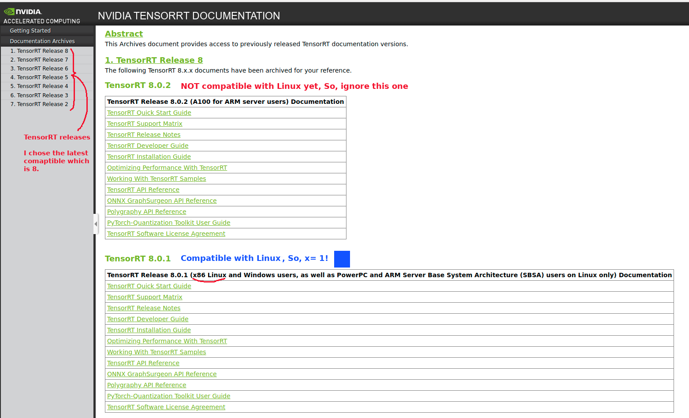
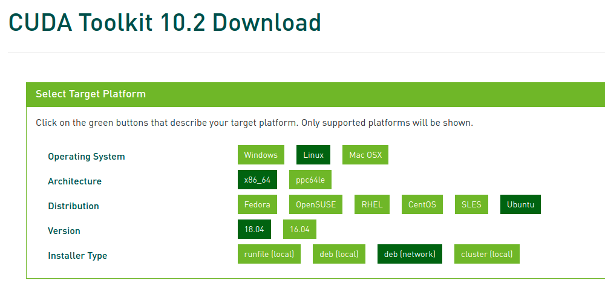

# setup_my_pc_for_my_work
This is how I setup my PC config (fresh Ubuntu 18.04.5 installed) in order to use for my work developments.

## Pc Info
Name: Dell Alienware;\
CPU:  Intel(R) Core(TM) i7-9750H @2.60 GHz;\
GPU:  Geforce RTX 2070 with Max-Q Design ([Turing NVIDIA GPU architecture/Hardware](https://en.wikipedia.org/wiki/CUDA));\
RAM:  16.0 GB;\
OS type: 64-bit;\
Disk: 1Tb SSD;\
OS names: Ubuntu 18.04.5 & Windows 10.

## Target:
Current: Have just installed Ubuntu 18.04.5 LTS.  
Target:  Setup all the Apps and settings for my work developments.

## Reference:
[configMyPC](https://github.com/jinshengye-git/configMyPC)


## Procedure
### Make "app" folder:
A good habbit is to keep all the "git" cloned folder in a directory named **app**. I usually keep it under my home directory.
1.  `mkdir /home/$USER/app`.

### Setup Nvidia Driver and Reboot PC:
1. Activities ➡️ Software & Updates ➡️ Additional Drivers ➡️ Using Nvidia driver metapackage from nvidia-driver-470 (open source/proprietary , better to use latest tested one) ➡️ Apply Changes ➡️ Restart PC
2. Also, if there is a part said "Intel Corporation: Unknown". You can ignore it.

Before


After


### Install git:
```
sudo add-apt-repository ppa:git-core/ppa
sudo apt install git git-lfs
```

### Install useful things
```
sudo apt update
sudo apt upgrade
sudo apt -y install  cmake cmake-gui zsh snap vim htop terminator gimp gawk build-essential dkms ccze
sudo snap install ttyplot
sudo snap install chromium
sudo snap install code --classic
sudo snap install slack --classic
sudo snap install skype
sudo apt autoremove
```
### Add the languages you want
1. Activities ➡️ Language Setup

### Install CUDA and cuDNN, and TensorRT

**Target:**  install "zed sdk 3.4.2" (needs CUDA 10.2) ➡️ So, install "CUDA Toolkit 10.2" ➡️ install "cuDNN" & TensorRT (should be compatible with "CUDA Toolkit 10.2")

For installing CUDA, I usually check which version we currenty use on the robots we have. This gives me a feeling to not be worry about the possible future problems while I am working with the packages installed/used on the robots we have. Currently, we are using "zed sdk 3.4.2" on the robots. "[zed sdk 3.4.2](https://www.stereolabs.com/developers/release/3.4/)" depends on the (>= CUDA 10.2). I will use "CUDA 10.2" but you can install other versions. However, on the robots, we are using "CUDA 10.2" now (Aug 20, 2021).

However, I will explain a more general way here to be used by more cases. I mean to show how to choose a proper CUDA version for your **customized** settings on your PC. Let's start.

First, run the followings:

```
nvidia-smi

    Thu Aug 19 14:55:49 2021       
    +-----------------------------------------------------------------------------+
    | NVIDIA-SMI 470.57.02    Driver Version: 470.57.02    CUDA Version: 11.4     |
    |-------------------------------+----------------------+----------------------+
    | GPU  Name        Persistence-M| Bus-Id        Disp.A | Volatile Uncorr. ECC |
    | Fan  Temp  Perf  Pwr:Usage/Cap|         Memory-Usage | GPU-Util  Compute M. |
    |                               |                      |               MIG M. |
    |===============================+======================+======================|
    |   0  NVIDIA GeForce ...  Off  | 00000000:01:00.0 Off |                  N/A |
    | N/A   52C    P0    31W /  N/A |    448MiB /  7982MiB |     23%      Default |
    |                               |                      |                  N/A |
    +-------------------------------+----------------------+----------------------+

    +-----------------------------------------------------------------------------+
    | Processes:                                                                  |
    |  GPU   GI   CI        PID   Type   Process name                  GPU Memory |
    |        ID   ID                                                   Usage      |
    |=============================================================================|
    |    0   N/A  N/A      1564      G   /usr/lib/xorg/Xorg                199MiB |
    |    0   N/A  N/A      1735      G   /usr/bin/gnome-shell              157MiB |
    |    0   N/A  N/A     16092      G   ...AAAAAAAAA= --shared-files       30MiB |
    |    0   N/A  N/A     16758      G   ...AAAAAAAAA= --shared-files       57MiB |
    +-----------------------------------------------------------------------------+
```
```

nvcc --version

    Command 'nvcc' not found, but can be installed with:
    sudo apt install nvidia-cuda-toolkit

```
As you can see:
  - Top panel: shows **"CUDA Version: 11.4"**. It's ok if it's not shown. But at least, you should see "Driver Version: XX" here. If not, you did not installed Nvidia dirvers correctly.
  - Bottom panel: shows **"Command 'nvcc' not found"**. This is because "nvcc" is coming by installing "CUDA Toolkit" which I have not installed upto this point!

👉 _nvidia-smi:_   (also NVSMI) stands for the "[NVIDIA System Management Interface](https://developer.nvidia.com/nvidia-system-management-interface)" and is a command line utility which provides monitoring and management capabilities for each of NVIDIA's Tesla, Quadro, GRID and GeForce GPU Cards from Fermi and higher architecture families.

👉 _nvcc:_   is the [NVIDIA CUDA Compiler](https://en.wikipedia.org/wiki/Nvidia_CUDA_Compiler). It is a proprietary (main) compiler by Nvidia intended for use with CUDA. CUDA code runs on both the CPU and GPU. NVCC separates these two parts and sends host code (the part of code which will be run on the CPU) to a C compiler like GCC or Intel C++ Compiler (ICC) or Microsoft Visual C Compiler, and sends the device code (the part which will run on the GPU) to the GPU. The device code is further compiled by NVCC. Any source file containing CUDA language extensions (.cu) must be compiled with nvcc.

The following is important to read: 
  - [Different CUDA versions shown by nvcc and NVIDIA-smi](https://stackoverflow.com/questions/53422407/different-cuda-versions-shown-by-nvcc-and-nvidia-smi)
  
    1. CUDA has 2 primary APIs, the "CUDA **Runtime** API" and the "CUDA **Driver** API". Both have a corresponding version (e.g. 8.0, 9.0, etc.)
    2. The necessary support for the "CUDA Driver API" (e.g. `libcuda.so` on linux, and also `nvidia-smi` tool) is installed by the `GPU Driver` installer. (We installed the `GPU Driver` in _"Setup Nvidia Driver and Reboot PC"_  part.)
    3. The necessary support for the "CUDA Runtime API" (e.g. `libcudart.so` on linux, and also `nvcc`) is installed by the `CUDA Toolkit` installer (which may also have a `GPU Driver` installer bundled in it). For my case, it was not installed by `GPU Driver` installer. So, I will install it here. 
    4. In any event, the (installed) "CUDA Driver API" version may not always match the (installed) "CUDA Runtime API" version, especially if you install a `GPU Driver` independently from installing CUDA (i.e. the `CUDA Toolkit` installer).
    5. The `nvidia-smi` tool gets installed by the `GPU Driver` installer, and generally has the `GPU Driver` in view, **NOT** anything installed by the `CUDA Toolkit` installer.
    6. Recently (somewhere between 410.48 and 410.73 GPU driver version on linux) the NVIDIA decided to add reporting of the "CUDA Driver API" version installed by the `GPU Driver` installer, in the output from `nvidia-smi`.
    7. This has no connection to the installed "CUDA Runtime API" version.
    8. `nvcc`, the NVIDIA CUDA Compiler tool that is installed with the `CUDA Toolkit`, will always report the "CUDA Runtime API" version that it was built to recognize. It doesn't know anything about what `GPU Driver` version is installed, or even if a `GPU Driver` is installed.
    9. Therefore, by design, these two numbers (**CUDA Driver API** version shown in `nvidia-smi` & **CUDA Runtime API** version shown in `nvcc`) don't necessarily match, as they are reflective of two different things.
    10. In most cases, if `nvidia-smi` reports a "CUDA Driver API" version that is numerically equal to or higher than the "CUDA Runtime API" reported by `nvcc -V`, this is not a cause for concern. 

So, we need to install the "CUDA Runtime API" using `CUDA Toolkit` installer.

**BUT, how to know which "CUDA Toolkit" should be installed?** 💁💁💁

The version of the [NVIDIA GPU Driver packaged in each CUDA Toolkit release](https://docs.nvidia.com/cuda/cuda-toolkit-release-notes/) is shown below: (you can also google this: _"CUDA Toolkit and Corresponding Driver Versions"_)


Base on the installed "NVIDIA GPU Driver", we can find the compatible "CUDA Toolkit" we can install. For example, my target **CUDA Toolkit** version is **10.2** today to match the version of the robots we have. I can see that the **CUDA Toolkit** version **10.2** is comaptible with my installed **"NVIDIA GPU Driver" (470.57.02)** (which is >= 440.33) on my PC.

You can check the above table to find the suitable "CUDA Toolkit" version for your installed "NVIDIA GPU Driver" version.

For cuDNN version compatible with your "CUDA Toolkit" version (CUDA Runtime API version), google this: [Supported NVIDIA hardware, CUDA, and CUDA driver](https://docs.nvidia.com/deeplearning/cudnn/support-matrix/index.html).\
Something like this can be found:


Based on the above image, cuDNN version 8.2.2 is compatible with my CUDA Toolkit version 10.2 and my NVIDIA GPU Driver 470.57.02.

Let's check the verison of "TensorRT" compatible with my config.\
If you google these terms [the latest TensorRT List of supported features per platform](https://docs.nvidia.com/deeplearning/tensorrt/support-matrix/index.html) and [Released TensorRT Archives](https://docs.nvidia.com/deeplearning/tensorrt/archives/index.html), you will probably find somethings like these:

TensorRT List of supported features per platform\


Released TensorRT Archives\


I found out that I may not be able to use the cuDNN version 8.2.2. So, I decided use cuDNN version 8.2.1 to be compatible with TenosrRT 8.0.1.\
I checked cuDNN version 8.2.1 is also compatible with CUDA Runtime API version 10.2. 


**Conclusion:**\
I will install:
  1. CUDA Runtime API 10.2 using CUDA Toolkit 10.2 installer
  2. cuDNN 8.2.1
  3. TenosrRT 8.0.1
  4. Zed SDK 3.4.2


#### 1. CUDA Runtime API 10.2 using CUDA Toolkit 10.2 installer
- You can download and install CUDA Runtime API from the [CUDA Toolkit](https://developer.nvidia.com/cuda-toolkit-archive) archive.
- Check the [CUDA Toolkit Archive](https://developer.nvidia.com/cuda-toolkit-archive) ➡️ "Versioned Online Documentation" ➡️ "Installation Guide Linux" ➡️ "[Pre-installation Actions](https://docs.nvidia.com/cuda/archive/10.2/cuda-installation-guide-linux/index.html#pre-installation-actions)"  
    - Especially, verify the System has the Correct Kernel Headers and Development Packages Installed. The version of the kernel your system must be the same as the version of the kernel headers and development packages prior to installing the CUDA Drivers. The following commands make it sure you have all you need:
        - `uname -r` 👉 The version of the kernel your system 
        - `sudo apt-get install linux-headers-$(uname -r)` 👇    
                ```
                $ Reading package lists... Done  
                Building dependency tree       
                Reading state information... Done  
                linux-headers-5.4.0-81-generic is already the newest version (5.4.0-81.91~18.04.1).  
                linux-headers-5.4.0-81-generic set to manually installed.  
                0 upgraded, 0 newly installed, 0 to remove and 0 not upgraded.
                ```

- Click "CUDA Toolkit 10.2" from the [CUDA Toolkit Archive](https://developer.nvidia.com/cuda-toolkit-archive). 
- On the CUDA download page, select the following options to see the "Installation Instructions". It's recommend to download a deb (network) version if you have a good internet connection. The difference between "deb (local)" and "deb (network)" is whether you download them all at once or during installation. 

 

- Install these options which are not necessary to use the CUDA Toolkit, but are available to provide additional features: 
```
sudo apt install g++ freeglut3-dev build-essential libx11-dev libxmu-dev libxi-dev libglu1-mesa libglu1-mesa-dev
```

- Then, do:
```
wget https://developer.download.nvidia.com/compute/cuda/repos/ubuntu1804/x86_64/cuda-ubuntu1804.pin
sudo mv cuda-ubuntu1804.pin /etc/apt/preferences.d/cuda-repository-pin-600
sudo apt-key adv --fetch-keys https://developer.download.nvidia.com/compute/cuda/repos/ubuntu1804/x86_64/7fa2af80.pub
sudo add-apt-repository "deb https://developer.download.nvidia.com/compute/cuda/repos/ubuntu1804/x86_64/ /"
sudo apt update
sudo apt -y install cuda-10-2
```
- Then restart.

- There are some [post-installation actions](https://docs.nvidia.com/cuda/archive/10.2/cuda-installation-guide-linux/index.html#post-installation-actions) that must be manually performed:
    1. Environment Setup: Add these lines to your ".bashrc" or other bash environment config files:
    ```
    CUDA_VERSION=10.2
    export PATH=/usr/local/cuda-$CUDA_VERSION/bin${PATH:+:${PATH}}
    export LD_LIBRARY_PATH=/usr/lib/x86_64-linux-gnu:/usr/local/cuda-$CUDA_VERSION/lib64${LD_LIBRARY_PATH:+:${LD_LIBRARY_PATH}}
    ```
    - 👉 I use [${PATH:+:${PATH}}](https://unix.stackexchange.com/questions/267506/what-does-pathpath-mean/267548) instead of "`:${PATH}`" to avoid adding an extra `:` when `$PATH` is not set. The same way I apply for "LD_LIBRARY_PATH".
    - 👉 The default installation locations for the toolkit and samples are: CUDA Toolkit `/usr/local/cuda-10.2` and CUDA Samples (NOT Installed here) `$(HOME)/NVIDIA_CUDA-10.2_Samples`.
    - 👉 As of CUDA 10.1 some libraries will be installed in the system standard locations rather than in the Toolkit installation directory. Depending on your distribution these installed locations can be either: `/usr/lib/x84_64-linux-gnu`, or `/usr/lib64`, or `/usr/lib`. For me, it is `/usr/lib/x84_64-linux-gnu`. You can check using `ls | grep cu`in those directories (if exists) if anything related to CUDA is available or not. If yes, you should include it.

    2. Also, the installation guide section pertaining to POWER 9 can be skipped/ignored. Power 9 is a high-end server CPU made by IBM. There are no laptops based on the Power 9 processor as of today (Aug 23, 2021). [Ref](https://forums.developer.nvidia.com/t/power9-for-ubuntu16-04/56795)

    3.  The installaion verification and the version of the CUDA Toolkit can be checked by running `nvcc -V` in a terminal window. The `nvcc` command runs the compiler driver that compiles CUDA programs. It calls the gcc compiler for C code and the NVIDIA PTX compiler for the CUDA code.
    ```
        nvcc -V   👇
        nvcc: NVIDIA (R) Cuda compiler driver
        Copyright (c) 2005-2019 NVIDIA Corporation
        Built on Wed_Oct_23_19:24:38_PDT_2019
        Cuda compilation tools, release 10.2, V10.2.89
    ```

    - **NOTE:** I did not use the "Nsight Eclipse Plugins". But If one day I decide to use these plugins, I first need to install the "standard Eclipse IDE for C++". Then, [intsall those plugins using scripts](https://docs.nvidia.com/cuda/nsightee-plugins-install-guide/index.html#script-install). This is because there is no longer a standalone fork of Eclipse for the Nsight IDE. Instead plugins are shipped which run inside in the standard Eclipse IDE for C++. Also, you need to include `/usr/local/cuda-10.2/NsightCompute-2019.1` to you [`PATH`variable](https://docs.nvidia.com/cuda/archive/10.2/cuda-installation-guide-linux/index.html#environment-setup) in `.bashrc`. e.g:
        - `$ export PATH=/usr/local/cuda-10.2/bin:/usr/local/cuda-10.2/NsightCompute-2019.1${PATH:+:${PATH}}`
            -  where `2019.1` is the `<tool-version>` refers to the version of Nsight Compute that ships with the CUDA toolkit you installed.

#### 2. cuDNN 8.2.1
- Check the [cuDNN Documentation Archives](https://docs.nvidia.com/deeplearning/cudnn/archives/index.html)
- Check "Release 8.2.1" ➡️ "[cuDNN Installation Guide](https://docs.nvidia.com/deeplearning/cudnn/archives/cudnn-821/install-guide/index.html#cudnn-package-manager-installation-overview)"

```
OS=ubuntu1804
wget https://developer.download.nvidia.com/compute/cuda/repos/${OS}/x86_64/cuda-${OS}.pin
sudo mv cuda-${OS}.pin /etc/apt/preferences.d/cuda-repository-pin-600
sudo apt-key adv --fetch-keys https://developer.download.nvidia.com/compute/cuda/repos/${OS}/x86_64/7fa2af80.pub
sudo add-apt-repository "deb https://developer.download.nvidia.com/compute/cuda/repos/${OS}/x86_64/ /"
sudo apt update

cudnn_version=8.2.1.*
cuda_version=cuda10.2

sudo apt install libcudnn8=${cudnn_version}-1+${cuda_version}
sudo apt install libcudnn8-dev=${cudnn_version}-1+${cuda_version}
```
- Hold the `libcudnn8` package at this version to prevent cuDNN from being updated to the latest CUDA version. 
```
sudo apt-mark hold libcudnn8 libcudnn8-dev
dpkg --get-selections|grep hold   ➡️ to check
```  
  - (SKIPPED) NOTE: If you want to upgrade to the latest version of cuDNN or the latest version of CUDA, then you can unhold the `libcudnn8` package using the following command.
    ```
    sudo apt-mark unhold libcudnn8 libcudnn8-dev
    ```

- The installaion verification and the version of the cuDNN can be checked by running:
```
cat /usr/include/x86_64-linux-gnu/cudnn_v*.h | grep CUDNN_MAJOR -A 2    👇
    #define CUDNN_MAJOR 8
    #define CUDNN_MINOR 2
    #define CUDNN_PATCHLEVEL 1
    --
    #define CUDNN_VERSION (CUDNN_MAJOR * 1000 + CUDNN_MINOR * 100 + CUDNN_PATCHLEVEL)

    #endif /* CUDNN_VERSION_H */
```

#### 3. TenosrRT 8.0.1
Because we have installed "CUDA Toolkit" and "cuDNN", then the NVIDIA CUDA network repository will already be set up and you can [skip step 1 below](https://docs.nvidia.com/deeplearning/tensorrt/archives/tensorrt-801/install-guide/index.html#maclearn-net-repo-install).\
1. (SKIPPED) This is the same as the installing part for "CUDA Toolkit 10.2":\ 
```
wget https://developer.download.nvidia.com/compute/cuda/repos/ubuntu1804/x86_64/cuda-ubuntu1804.pin
sudo mv cuda-ubuntu1804.pin /etc/apt/preferences.d/cuda-repository-pin-600
sudo apt-key adv --fetch-keys https://developer.download.nvidia.com/compute/cuda/repos/ubuntu1804/x86_64/7fa2af80.pub
sudo add-apt-repository "deb https://developer.download.nvidia.com/compute/cuda/repos/ubuntu1804/x86_64/ /"
sudo apt update
```
2. The following commands will install `libnvinfer8` for an specific CUDA version and hold the `libnvinfer8` package at this version. Replace `8.x.x` with your version of TensorRT and `cudax.x` with your CUDA version for your install.
```
version="8.0.1-1+cuda10.2"
sudo apt install libnvinfer8=${version} libnvonnxparsers8=${version} libnvparsers8=${version} libnvinfer-plugin8=${version} libnvinfer-dev=${version} libnvonnxparsers-dev=${version} libnvparsers-dev=${version} libnvinfer-plugin-dev=${version} python3-libnvinfer=${version}

sudo apt-mark hold libnvinfer8 libnvonnxparsers8 libnvparsers8 libnvinfer-plugin8 libnvinfer-dev libnvonnxparsers-dev libnvparsers-dev libnvinfer-plugin-dev python3-libnvinfer
dpkg --get-selections|grep hold   ➡️ to check
```  
  - (SKIPPED) NOTE: If you want to upgrade to the latest version of TensorRT or the latest version of CUDA, then you can unhold the `libnvinfer8` package using the following command.
    ```
    sudo apt-mark unhold libnvinfer8 libnvonnxparsers8 libnvparsers8 libnvinfer-plugin8 libnvinfer-dev libnvonnxparsers-dev libnvparsers-dev libnvinfer-plugin-dev python3-libnvinfer
    ```

3. The installaion verification and the version of the TenosrRT can be checked by running:
```
dpkg -l | grep TensorRT    👇
    hi  libnvinfer-dev                             8.0.1-1+cuda10.2                                 amd64        TensorRT development libraries and headers
    hi  libnvinfer-plugin-dev                      8.0.1-1+cuda10.2                                 amd64        TensorRT plugin libraries
    hi  libnvinfer-plugin8                         8.0.1-1+cuda10.2                                 amd64        TensorRT plugin libraries
    hi  libnvinfer8                                8.0.1-1+cuda10.2                                 amd64        TensorRT runtime libraries
    hi  libnvonnxparsers-dev                       8.0.1-1+cuda10.2                                 amd64        TensorRT ONNX libraries
    hi  libnvonnxparsers8                          8.0.1-1+cuda10.2                                 amd64        TensorRT ONNX libraries
    hi  libnvparsers-dev                           8.0.1-1+cuda10.2                                 amd64        TensorRT parsers libraries
    hi  libnvparsers8                              8.0.1-1+cuda10.2                                 amd64        TensorRT parsers libraries
    hi  python3-libnvinfer                         8.0.1-1+cuda10.2                                 amd64        Python 3 bindings for TensorRT
```

I run the following commands again:

```
nvidia-smi

    Thu Aug 19 14:55:49 2021       
    +-----------------------------------------------------------------------------+
    | NVIDIA-SMI 470.57.02    Driver Version: 470.57.02    CUDA Version: 11.4     |
    |-------------------------------+----------------------+----------------------+
    | GPU  Name        Persistence-M| Bus-Id        Disp.A | Volatile Uncorr. ECC |
    | Fan  Temp  Perf  Pwr:Usage/Cap|         Memory-Usage | GPU-Util  Compute M. |
    |                               |                      |               MIG M. |
    |===============================+======================+======================|
    |   0  NVIDIA GeForce ...  Off  | 00000000:01:00.0 Off |                  N/A |
    | N/A   52C    P0    31W /  N/A |    448MiB /  7982MiB |     23%      Default |
    |                               |                      |                  N/A |
    +-------------------------------+----------------------+----------------------+

    +-----------------------------------------------------------------------------+
    | Processes:                                                                  |
    |  GPU   GI   CI        PID   Type   Process name                  GPU Memory |
    |        ID   ID                                                   Usage      |
    |=============================================================================|
    |    0   N/A  N/A      1564      G   /usr/lib/xorg/Xorg                199MiB |
    |    0   N/A  N/A      1735      G   /usr/bin/gnome-shell              157MiB |
    |    0   N/A  N/A     16092      G   ...AAAAAAAAA= --shared-files       30MiB |
    |    0   N/A  N/A     16758      G   ...AAAAAAAAA= --shared-files       57MiB |
    +-----------------------------------------------------------------------------+
```
```
nvcc --version

    nvcc: NVIDIA (R) Cuda compiler driver
    Copyright (c) 2005-2019 NVIDIA Corporation
    Built on Wed_Oct_23_19:24:38_PDT_2019
    Cuda compilation tools, release 10.2, V10.2.89
```

```
dpkg -l |grep cuda   ➡️ List all installed cuda packages, along with package version and short description

    ii  cuda-10-2                                  10.2.89-1                                        amd64        CUDA 10.2 meta-package
    ii  cuda-command-line-tools-10-2               10.2.89-1                                        amd64        CUDA command-line tools
    ii  cuda-compiler-10-2                         10.2.89-1                                        amd64        CUDA compiler
    ii  cuda-cudart-10-2                           10.2.89-1                                        amd64        CUDA Runtime native Libraries
    ii  cuda-cudart-dev-10-2                       10.2.89-1                                        amd64        CUDA Runtime native dev links, headers
    ii  cuda-cufft-10-2                            10.2.89-1                                        amd64        CUFFT native runtime libraries
    ii  cuda-cufft-dev-10-2                        10.2.89-1                                        amd64        CUFFT native dev links, headers
    ii  cuda-cuobjdump-10-2                        10.2.89-1                                        amd64        CUDA cuobjdump
    ii  cuda-cupti-10-2                            10.2.89-1                                        amd64        CUDA profiling tools runtime libs.
    ii  cuda-cupti-dev-10-2                        10.2.89-1                                        amd64        CUDA profiling tools interface.
    ii  cuda-curand-10-2                           10.2.89-1                                        amd64        CURAND native runtime libraries
    ii  cuda-curand-dev-10-2                       10.2.89-1                                        amd64        CURAND native dev links, headers
    ii  cuda-cusolver-10-2                         10.2.89-1                                        amd64        CUDA solver native runtime libraries
    ii  cuda-cusolver-dev-10-2                     10.2.89-1                                        amd64        CUDA solver native dev links, headers
    ii  cuda-cusparse-10-2                         10.2.89-1                                        amd64        CUSPARSE native runtime libraries
    ii  cuda-cusparse-dev-10-2                     10.2.89-1                                        amd64        CUSPARSE native dev links, headers
    ii  cuda-demo-suite-10-2                       10.2.89-1                                        amd64        Demo suite for CUDA
    ii  cuda-documentation-10-2                    10.2.89-1                                        amd64        CUDA documentation
    ii  cuda-driver-dev-10-2                       10.2.89-1                                        amd64        CUDA Driver native dev stub library
    ii  cuda-drivers                               470.57.02-1                                      amd64        CUDA Driver meta-package, branch-agnostic
    ii  cuda-drivers-470                           470.57.02-1                                      amd64        CUDA Driver meta-package, branch-specific
    ii  cuda-gdb-10-2                              10.2.89-1                                        amd64        CUDA-GDB
    ii  cuda-libraries-10-2                        10.2.89-1                                        amd64        CUDA Libraries 10.2 meta-package
    ii  cuda-libraries-dev-10-2                    10.2.89-1                                        amd64        CUDA Libraries 10.2 development meta-package
    ii  cuda-license-10-2                          10.2.89-1                                        amd64        CUDA licenses
    ii  cuda-memcheck-10-2                         10.2.89-1                                        amd64        CUDA-MEMCHECK
    ii  cuda-misc-headers-10-2                     10.2.89-1                                        amd64        CUDA miscellaneous headers
    ii  cuda-npp-10-2                              10.2.89-1                                        amd64        NPP native runtime libraries
    ii  cuda-npp-dev-10-2                          10.2.89-1                                        amd64        NPP native dev links, headers
    ii  cuda-nsight-10-2                           10.2.89-1                                        amd64        CUDA nsight
    ii  cuda-nsight-compute-10-2                   10.2.89-1                                        amd64        NVIDIA Nsight Compute
    ii  cuda-nsight-systems-10-2                   10.2.89-1                                        amd64        NVIDIA Nsight Systems
    ii  cuda-nvcc-10-2                             10.2.89-1                                        amd64        CUDA nvcc
    ii  cuda-nvdisasm-10-2                         10.2.89-1                                        amd64        CUDA disassembler
    ii  cuda-nvgraph-10-2                          10.2.89-1                                        amd64        NVGRAPH native runtime libraries
    ii  cuda-nvgraph-dev-10-2                      10.2.89-1                                        amd64        NVGRAPH native dev links, headers
    ii  cuda-nvjpeg-10-2                           10.2.89-1                                        amd64        NVJPEG native runtime libraries
    ii  cuda-nvjpeg-dev-10-2                       10.2.89-1                                        amd64        NVJPEG native dev links, headers
    ii  cuda-nvml-dev-10-2                         10.2.89-1                                        amd64        NVML native dev links, headers
    ii  cuda-nvprof-10-2                           10.2.89-1                                        amd64        CUDA Profiler tools
    ii  cuda-nvprune-10-2                          10.2.89-1                                        amd64        CUDA nvprune
    ii  cuda-nvrtc-10-2                            10.2.89-1                                        amd64        NVRTC native runtime libraries
    ii  cuda-nvrtc-dev-10-2                        10.2.89-1                                        amd64        NVRTC native dev links, headers
    ii  cuda-nvtx-10-2                             10.2.89-1                                        amd64        NVIDIA Tools Extension
    ii  cuda-nvvp-10-2                             10.2.89-1                                        amd64        CUDA nvvp
    ii  cuda-runtime-10-2                          10.2.89-1                                        amd64        CUDA Runtime 10.2 meta-package
    ii  cuda-samples-10-2                          10.2.89-1                                        amd64        CUDA example applications
    ii  cuda-sanitizer-api-10-2                    10.2.89-1                                        amd64        CUDA Sanitizer API
    ii  cuda-toolkit-10-2                          10.2.89-1                                        amd64        CUDA Toolkit 10.2 meta-package
    ii  cuda-tools-10-2                            10.2.89-1                                        amd64        CUDA Tools meta-package
    ii  cuda-visual-tools-10-2                     10.2.89-1                                        amd64        CUDA visual tools
    ii  libcudnn8                                  8.2.1.32-1+cuda10.2                              amd64        cuDNN runtime libraries
    ii  libcudnn8-dev                              8.2.1.32-1+cuda10.2                              amd64        cuDNN development libraries and headers
    hi  libnvinfer-dev                             8.0.1-1+cuda10.2                                 amd64        TensorRT development libraries and headers
    hi  libnvinfer-plugin-dev                      8.0.1-1+cuda10.2                                 amd64        TensorRT plugin libraries
    hi  libnvinfer-plugin8                         8.0.1-1+cuda10.2                                 amd64        TensorRT plugin libraries
    hi  libnvinfer8                                8.0.1-1+cuda10.2                                 amd64        TensorRT runtime libraries
    hi  libnvonnxparsers-dev                       8.0.1-1+cuda10.2                                 amd64        TensorRT ONNX libraries
    hi  libnvonnxparsers8                          8.0.1-1+cuda10.2                                 amd64        TensorRT ONNX libraries
    hi  libnvparsers-dev                           8.0.1-1+cuda10.2                                 amd64        TensorRT parsers libraries
    hi  libnvparsers8                              8.0.1-1+cuda10.2                                 amd64        TensorRT parsers libraries
    hi  python3-libnvinfer                         8.0.1-1+cuda10.2                                 amd64        Python 3 bindings for TensorRT

```

Nice, let's continue. ☑️

### Install Zed SDK 3.4.2
Download zed sdk from https://www.stereolabs.com/developers/release/2.8/ choose the correct version of CUDA and your Ubuntu then install it

